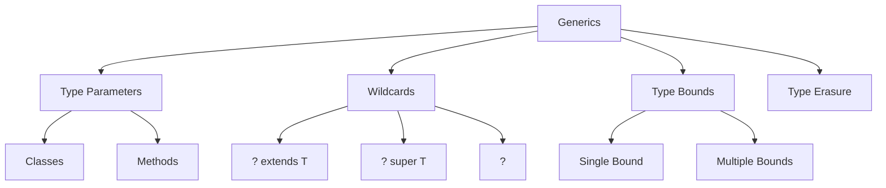
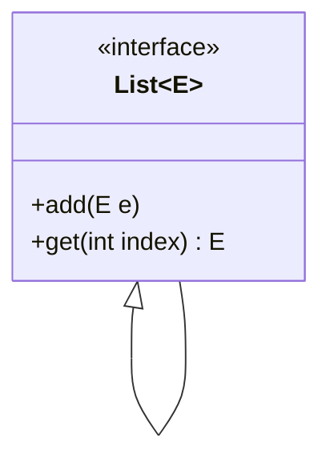
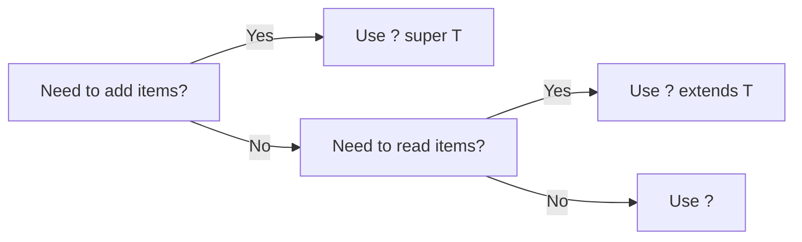

# 🧩 Java Generics - Complete Guide & Interview Questions



## 📚 Basic Concepts

### 1. What are Generics?
- **Definition**: Parameterized types that enable code reuse with type safety
- **Introduced**: Java 5 (J2SE 5.0)
- **Key Characteristics**:
  - Compile-time type safety
  - Elimination of explicit type casting
  - Enables implementation of generic algorithms
  - Part of Java's type system

### 2. Benefits of Generics

| Benefit | Description | Example |
|---------|-------------|----------|
| Type Safety | Catches invalid types at compile time | `List<String>` vs raw `List` |
| No Casting | Eliminates need for explicit type casting | `String s = list.get(0);` |
| Code Reuse | Write once, use with different types | Generic methods, classes |
| Better IDE Support | Improved code completion and refactoring | Type-aware suggestions |
| Algorithm Implementation | Enables type-safe generic algorithms | `Collections.sort()` |

### 3. Type Parameter Naming Conventions
- `E` - Element (used extensively by Java Collections Framework)
- `K` - Key
- `V` - Value
- `N` - Number
- `T` - Type
- `S`, `U`, `V` - Additional types

## Generic Classes and Methods

### Generic Class
```java
public class Box<T> {
    private T t;
    
    public void set(T t) { this.t = t; }
    public T get() { return t; }
}

// Usage
Box<Integer> integerBox = new Box<>();
integerBox.set(10);
Integer value = integerBox.get();
```

### Generic Method
```java
public <T> void printArray(T[] array) {
    for (T element : array) {
        System.out.printf("%s ", element);
    }
}

// Usage
Integer[] intArray = {1, 2, 3};
String[] stringArray = {"Hello", "World"};
printArray(intArray);
printArray(stringArray);
```

## Bounded Type Parameters

### Single Bound
```java
public <T extends Number> double sum(List<T> numbers) {
    double sum = 0.0;
    for (Number n : numbers) {
        sum += n.doubleValue();
    }
    return sum;
}
```

### Multiple Bounds
```java
public <T extends Number & Comparable<T>> T maximum(T x, T y, T z) {
    T max = x;
    if (y.compareTo(max) > 0) max = y;
    if (z.compareTo(max) > 0) max = z;
    return max;
}
```

## Type Inference
Java's ability to determine the type parameters from the context

```java
// Type inference with generic methods
List<String> list = new ArrayList<>();  // Diamond operator <>

// Type inference with generic class instantiation
Map<String, List<String>> myMap = new HashMap<>();
```

## Wildcards

### Unbounded Wildcard
```java
public void printList(List<?> list) {
    for (Object elem : list) {
        System.out.println(elem);
    }
}
```

### Upper Bounded Wildcard
```java
public static double sumOfList(List<? extends Number> list) {
    double s = 0.0;
    for (Number n : list) {
        s += n.doubleValue();
    }
    return s;
}
```

### Lower Bounded Wildcard
```java
public static void addNumbers(List<? super Integer> list) {
    for (int i = 1; i <= 10; i++) {
        list.add(i);
    }
}
```

## Type Erasure
- Process where Java compiler replaces type parameters with their bounds or Object
- Enables generic code to interoperate with legacy code
- All type parameters in generic types are replaced with their leftmost bound

```java
// Before type erasure
public class Box<T> {
    private T t;
    public void set(T t) { this.t = t; }
    public T get() { return t; }
}

// After type erasure
public class Box {
    private Object t;
    public void set(Object t) { this.t = t; }
    public Object get() { return t; }
}
```

## 🎯 Common Interview Questions

### 1. Type System Fundamentals
**Q: What is the difference between `List<Object>`, `List<?>`, and raw `List`?**



| Type | Can Add Elements | Type Safety | Use Case |
|------|------------------|-------------|-----------|
| `List<Object>` | ✅ Yes | ✅ Compile-time | When you need a list of any objects |
| `List<?>` | ❌ No | ✅ Compile-time | When you need to read but not modify |
| Raw `List` | ⚠️ Yes | ❌ Runtime | Legacy code, avoid in new code |

### 2. Advanced Type Erasure
**Q: How does type erasure work and what are its limitations?**

```java
// Before Type Erasure
public class Box<T extends Number> {
    private T value;
    public void set(T val) { this.value = val; }
    public T get() { return value; }
}

// After Type Erasure
public class Box {
    private Number value;  // Replaced with upper bound
    public void set(Number val) { this.value = val; }
    public Number get() { return value; }
}
```

**Limitations**:
1. Cannot create generic arrays (`new T[]`)
2. Cannot use `instanceof` with parameterized types
3. Cannot catch multiple exceptions of parameterized types
4. Cannot overload methods with same erasure

### 3. Wildcards and Bounds
**Q: Explain the difference between `List<Number>`, `List<? extends Number>`, and `List<? super Number>`**

| Type | Read | Write | Use Case |
|------|------|-------|-----------|
| `List<Number>` | Returns Number | Accepts Number | Exact type matching |
| `List<? extends Number>` | Returns Number | Accepts nothing | Producer of Numbers |
| `List<? super Number>` | Returns Object | Accepts Number or subtype | Consumer of Numbers |

### 4. PECS Principle Deep Dive
**Q: Explain PECS with practical examples**

**P**roducer **E**xtends, **C**onsumer **S**uper

```java
// Producer extends (read-only)
public double sum(Collection<? extends Number> nums) {
    return nums.stream()
              .mapToDouble(Number::doubleValue)
              .sum();
}

// Consumer super (write-only)
public void addIntegers(List<? super Integer> list) {
    for (int i = 1; i <= 10; i++) {
        list.add(i);
    }
}
```

### 5. Advanced Generic Programming
**Q: How would you implement a generic binary search tree in Java?**

```java
public class BinarySearchTree<T extends Comparable<T>> {
    private Node<T> root;
    
    private static class Node<T> {
        T data;
        Node<T> left, right;
        Node(T data) { this.data = data; }
    }
    
    public void insert(T data) { /* ... */ }
    public boolean contains(T data) { /* ... */ }
    // Other methods...
}
```

### 6. Type Tokens and Class Literals
**Q: What are type tokens and how are they used?**

```java
public class TypeSafeMap {
    private Map<Class<?>, Object> map = new HashMap<>();
    
    public <T> void put(Class<T> type, T instance) {
        map.put(Objects.requireNonNull(type), type.cast(instance));
    }
    
    public <T> T get(Class<T> type) {
        return type.cast(map.get(type));
    }
}
```

### 7. Generic Method Constraints
**Q: How to write a method that takes a collection of numbers and returns the maximum value?

```java
public static <T extends Number & Comparable<? super T>> T max(Collection<T> coll) {
    if (coll.isEmpty()) {
        throw new NoSuchElementException("Collection is empty");
    }
    Iterator<T> it = coll.iterator();
    T max = it.next();
    while (it.hasNext()) {
        T next = it.next();
        if (next.compareTo(max) > 0) {
            max = next;
        }
    }
    return max;
}
```

### 8. Recursive Type Bounds
**Q: What are recursive type bounds and when are they used?

```java
// T must be comparable to itself
public static <T extends Comparable<T>> T max(List<T> list) {
    // Implementation
}

// Example with multiple bounds
public static <T extends Number & Comparable<T>> T maxNumber(T x, T y) {
    return x.compareTo(y) > 0 ? x : y;
}
```

### 9. Bridge Methods
**Q: What are bridge methods and why does the compiler generate them?

```java
// Source code
public class Node<T> {
    public T data;
    public void setData(T data) {
        this.data = data;
    }
}

// After type erasure and bridge method generation
public class Node {
    public Object data;
    public void setData(Object data) {
        this.data = data;
    }
    // Bridge method for polymorphism
    public void setData(String data) {
        setData((Object) data);
    }
}
```

### 10. Generic Array Creation
**Q: Why can't we create generic arrays in Java?

```java
// This won't compile
T[] array = new T[10];

// Workaround using reflection
@SuppressWarnings("unchecked")
T[] createArray(Class<T> type, int size) {
    return (T[]) Array.newInstance(type, size);
}
```

## 🏆 Best Practices & Patterns

### 1. Type Safety
- Always use generic types instead of raw types
- Prefer `List<String>` over raw `List`
- Use `@SuppressWarnings("unchecked")` sparingly

### 2. Wildcard Guidelines


### 3. Common Pitfalls
1. **Array Creation**: `new T[]` is not allowed
2. **Primitive Types**: Can't use primitives as type parameters
3. **Instanceof**: Can't use `instanceof` with parameterized types
4. **Static Context**: Can't use type parameters in static context
5. **Exception Handling**: Can't catch generic exceptions

### 4. Performance Considerations
- Generics have no runtime overhead (type erasure)
- No code duplication for different type parameters
- Casts are inserted by compiler but don't affect performance

### 5. Testing Generic Code
- Test with different type arguments
- Check raw type compatibility
- Verify type safety at boundaries
- Test with null values
- Check serialization/deserialization if applicable

## 🛠️ Advanced Patterns & Techniques

### 1. Generic Singleton Factory
```java
public abstract class TypeSafeEnum<T extends TypeSafeEnum<T>> {
    private static final Map<Class<?>, Set<?>> ENUM_MAP = new ConcurrentHashMap<>();
    
    protected TypeSafeEnum() {
        @SuppressWarnings("unchecked")
        Set<T> set = (Set<T>) ENUM_MAP.computeIfAbsent(
            getClass(), k -> Collections.newSetFromMap(new ConcurrentHashMap<>())
        );
        set.add((T) this);
    }
    
    @SuppressWarnings("unchecked")
    public static <T extends TypeSafeEnum<T>> Set<T> values(Class<T> type) {
        return (Set<T>) ENUM_MAP.getOrDefault(type, Collections.emptySet());
    }
}
```

### 2. Type-Safe Heterogeneous Container
```java
public class Favorites {
    private Map<Class<?>, Object> favorites = new HashMap<>();
    
    public <T> void putFavorite(Class<T> type, T instance) {
        favorites.put(Objects.requireNonNull(type), type.cast(instance));
    }
    
    public <T> T getFavorite(Class<T> type) {
        return type.cast(favorites.get(type));
    }
}

// Usage
Favorites f = new Favorites();
f.putFavorite(String.class, "Java");
f.putFavorite(Integer.class, 42);
String s = f.getFavorite(String.class);
```

### 3. Generic Builder Pattern
```java
public class Pizza {
    private final Set<Topping> toppings;
    
    public static class Builder<T extends Builder<T>> {
        private final Set<Topping> toppings = EnumSet.noneOf(Topping.class);
        
        public T addTopping(Topping topping) {
            toppings.add(Objects.requireNonNull(topping));
            return self();
        }
        
        protected T self() {
            @SuppressWarnings("unchecked")
            T result = (T) this;
            return result;
        }
        
        public Pizza build() {
            return new Pizza(this);
        }
    }
    
    protected Pizza(Builder<?> builder) {
        toppings = builder.toppings.clone();
    }
}
```

### 4. Generic Visitor Pattern
```java
interface Visitor<T> {
    T visit(NumberExpression e);
    T visit(AdditionExpression e);
}

abstract class Expression {
    abstract <T> T accept(Visitor<T> visitor);
}

class NumberExpression extends Expression {
    public int value;
    
    @Override
    <T> T accept(Visitor<T> visitor) {
        return visitor.visit(this);
    }
}

class AdditionExpression extends Expression {
    public Expression left, right;
    
    @Override
    <T> T accept(Visitor<T> visitor) {
        return visitor.visit(this);
    }
}
```

### 5. Generic Utility Methods
```java
public final class CollectionUtils {
    // Merge two sorted collections
    public static <T extends Comparable<? super T>> List<T> merge(
            Collection<? extends T> c1, 
            Collection<? extends T> c2) {
        List<T> result = new ArrayList<>(c1.size() + c2.size());
        Iterator<? extends T> it1 = c1.iterator();
        Iterator<? extends T> it2 = c2.iterator();
        
        T x = it1.hasNext() ? it1.next() : null;
        T y = it2.hasNext() ? it2.next() : null;
        
        while (x != null || y != null) {
            if (y == null || (x != null && x.compareTo(y) <= 0)) {
                result.add(x);
                x = it1.hasNext() ? it1.next() : null;
            } else {
                result.add(y);
                y = it2.hasNext() ? it2.next() : null;
            }
        }
        
        return result;
    }
}
```

## 🔍 Real-world Examples

### 1. Java Collections Framework
- `Collections.sort()`
- `Optional<T>`
- `Stream<T>`
- `Function<T, R>`
- `Comparable<T>`

### 2. Spring Framework
- `ResponseEntity<T>`
- `Optional<T>` in repository methods
- `RestTemplate` type-safe methods
- `JdbcTemplate` with `RowMapper<T>`

### 3. Java Streams
```java
// Type-safe stream operations
List<String> names = people.stream()
    .filter(p -> p.getAge() > 30)
    .map(Person::getName)
    .collect(Collectors.toList());
```

## 📝 Final Tips for Interviews

1. **Understand Type Erasure**
   - Be prepared to explain how generics are implemented
   - Know the limitations it imposes

2. **Master Wildcards**
   - Be comfortable with `?`, `? extends T`, `? super T`
   - Understand when to use each

3. **Know the Collections Framework**
   - Be familiar with generic collections
   - Understand how they're used in practice

4. **Practice Common Patterns**
   - Generic methods
   - Bounded type parameters
   - Recursive type bounds

5. **Be Ready for Tricky Questions**
   - Array creation with generics
   - Bridge methods
   - Type tokens
   - Self-bounded types
