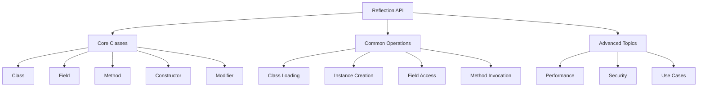

# 🔍 Java Reflection API - Complete Guide



## 🎯 Basic Concepts

### 1. What is Java Reflection?
Reflection is a powerful feature that enables:
- 🔍 **Inspection** of classes, interfaces, fields, and methods at runtime
- 🛠️ **Manipulation** of objects, fields, and methods dynamically
- 🔄 **Dynamic code** execution without compile-time dependencies

```java
// Example: Get class name at runtime
Object obj = "Hello, Reflection!";
System.out.println(obj.getClass().getName());  // Output: java.lang.String
```

### 2. Core Reflection API Classes

| Class | Package | Purpose |
|-------|---------|----------|
| `Class` | `java.lang` | Represents classes and interfaces |
| `Field` | `java.lang.reflect` | Represents fields (member variables) |
| `Method` | `java.lang.reflect` | Represents methods |
| `Constructor` | `java.lang.reflect` | Represents constructors |
| `Modifier` | `java.lang.reflect` | Provides access modifiers information |
| `Array` | `java.lang.reflect` | Provides static methods for array manipulation |
| `Parameter` | `java.lang.reflect` | Represents method parameters (Java 8+) |

### 3. When to Use Reflection?
- Building development tools (IDEs, debuggers)
- Creating frameworks (Spring, Hibernate, JUnit)
- Implementing plugin architectures
- Writing code analysis tools
- Dynamic proxy creation

## 🛠️ Common Operations

### 1. Getting Class Objects

```java
// 1. Using .class syntax (compile-time known)
Class<String> stringClass = String.class;

// 2. Using Class.forName() (fully qualified name)
Class<?> clazz = Class.forName("java.lang.String");

// 3. Using getClass() on an instance
String text = "Hello";
Class<? extends String> textClass = text.getClass();

// 4. For primitive types and arrays
Class<?> intClass = int.class;
Class<?> arrayClass = String[].class;
```

### 2. Creating Instances

```java
// 1. Using newInstance() - requires no-arg constructor
Class<?> clazz = Class.forName("com.example.User");
User user = (User) clazz.newInstance();  // Deprecated in Java 9+

// Java 9+ preferred way
User user = (User) clazz.getDeclaredConstructor().newInstance();

// 2. Using Constructor with parameters
Constructor<?> constructor = clazz.getConstructor(String.class, int.class);
User user = (User) constructor.newInstance("John", 30);

// 3. For private constructors
Constructor<?> privateConstructor = clazz.getDeclaredConstructor(String.class);
privateConstructor.setAccessible(true);
User user = (User) privateConstructor.newInstance("Private");
```

### 3. Working with Fields

```java
class Person {
    private String name;
    public int age;
}

// Get public fields (including inherited)
Field[] publicFields = Person.class.getFields();

// Get all declared fields (only this class)
Field[] allFields = Person.class.getDeclaredFields();

// Accessing field values
Person person = new Person();
Field nameField = Person.class.getDeclaredField("name");
nameField.setAccessible(true);  // Required for private fields

// Get value
String name = (String) nameField.get(person);

// Set value
nameField.set(person, "John");

// Working with static fields
Field staticField = SomeClass.class.getDeclaredField("STATIC_FIELD");
Object value = staticField.get(null);  // null for static fields
```

### 4. Method Invocation

```java
class Calculator {
    public int add(int a, int b) {
        return a + b;
    }
    
    private String greet(String name) {
        return "Hello, " + name;
    }
}

Calculator calc = new Calculator();

// Get public method
Method addMethod = Calculator.class.getMethod("add", int.class, int.class);
int result = (int) addMethod.invoke(calc, 5, 3);  // 8

// Get private method
Method greetMethod = Calculator.class.getDeclaredMethod("greet", String.class);
greetMethod.setAccessible(true);
String greeting = (String) greetMethod.invoke(calc, "John");  // "Hello, John"

// Invoking static methods
Method staticMethod = SomeClass.class.getMethod("staticMethod");
staticMethod.invoke(null);  // null for static methods
```

### 5. Working with Arrays

```java
// Create array
Object intArray = Array.newInstance(int.class, 5);

// Set values
Array.setInt(intArray, 0, 10);
Array.setInt(intArray, 1, 20);

// Get values
int value = Array.getInt(intArray, 0);  // 10

// Multi-dimensional arrays
int[][] matrix = (int[][]) Array.newInstance(int.class, 3, 3);
Array.setInt(Array.get(matrix, 0), 0, 1);
```

## 🚀 Advanced Topics

### 1. Performance Optimization

```mermaid
graph LR
    A[Reflection Performance] --> B[Slow Operations]
    A --> C[Optimization Techniques]
    B --> D[Method/Field Lookup]
    B --> E[Accessibility Checks]
    B --> F[Exception Handling]
    C --> G[Cache Reflection Objects]
    C --> H[Use setAccessible(true)]
    C --> I[Use MethodHandles]
    C --> J[Consider Alternatives]
```

#### Performance Tips:
- **Cache reflection objects** (Class, Method, Field, Constructor)
- **Set accessible flag** when possible:
  ```java
  field.setAccessible(true);  // Skip access checks after first call
  ```
- **Use MethodHandles** (Java 7+) for better performance
- **Consider alternatives** like:
  - Interface-based design
  - Dynamic proxies
  - Code generation (e.g., ByteBuddy, ASM)

### 2. Security Considerations

```java
// Example: Running with security manager
SecurityManager securityManager = System.getSecurityManager();
if (securityManager != null) {
    securityManager.checkPermission(new ReflectPermission("suppressAccessChecks"));
}
```

#### Security Best Practices:
1. Use `SecurityManager` to restrict reflection
2. Follow principle of least privilege
3. Validate all inputs when using reflection
4. Be cautious with `setAccessible(true)`
5. Consider using modules (Java 9+) for better encapsulation

### 3. Java Modules and Reflection (Java 9+)

```java
// Open modules/packages for reflection
module my.module {
    opens com.example.package1;  // Open for reflection
    opens com.example.package2 to hibernate.core;
    
    // Open all packages at runtime
    open module my.open.module {}
}
```

### 4. Method Handles (Java 7+)

```java
// Faster alternative to reflection
MethodHandles.Lookup lookup = MethodHandles.lookup();
MethodHandle mh = lookup.findVirtual(String.class, "length", MethodType.methodType(int.class));
int len = (int) mh.invokeExact("Hello");  // 5

// For private methods
MethodHandle privateMh = lookup.findSpecial(
    MyClass.class,
    "privateMethod",
    MethodType.methodType(void.class),
    MyClass.class
).bindTo(instance);
privateMh.invokeExact();
```

## 🎓 Interview Questions & Answers

### 1. Core Concepts

**Q: What are the main uses of Reflection in Java?**
- **Framework Development**: Spring, Hibernate, JUnit
- **IDEs and Tools**: Code analysis, autocompletion
- **Debugging and Testing**: Mocking frameworks, test runners
- **Dynamic Proxies**: AOP, transaction management
- **Serialization/Deserialization**: JSON/XML libraries

**Q: Explain the difference between Class.forName() and ClassLoader.loadClass()?**

| Feature | Class.forName() | ClassLoader.loadClass() |
|---------|----------------|-------------------------|
| Initialization | Performs initialization (runs static blocks) | Only loads the class, no initialization |
| Exception | ClassNotFoundException | ClassNotFoundException |
| Use Case | When you need the class to be initialized | When you just need the Class object |
| Example | JDBC driver loading | Plugin systems |

### 2. Advanced Reflection

**Q: How would you implement a dynamic proxy using Reflection?**
```java
interface Greeter {
    String greet(String name);
}

class GreeterImpl implements Greeter {
    public String greet(String name) {
        return "Hello, " + name;
    }
}

// Create proxy instance
Greeter proxy = (Greester) Proxy.newProxyInstance(
    Greeter.class.getClassLoader(),
    new Class<?>[] { Greeter.class },
    (proxy1, method, args) -> {
        System.out.println("Before method: " + method.getName());
        Object result = method.invoke(new GreeterImpl(), args);
        System.out.println("After method: " + method.getName());
        return result;
    }
);

System.out.println(proxy.greet("John"));
// Output:
// Before method: greet
// After method: greet
// Hello, John
```

**Q: How does Reflection handle generics due to type erasure?**

```java
class Box<T> {
    private T value;
    public T getValue() { return value; }
    public void setValue(T value) { this.value = value; }
}

// At runtime, generic type information is erased
Field field = Box.class.getDeclaredField("value");
System.out.println(field.getType());  // Object, not T

// To get generic type information:
Method getter = Box.class.getMethod("getValue");
Type returnType = getter.getGenericReturnType();
if (returnType instanceof ParameterizedType) {
    ParameterizedType type = (ParameterizedType) returnType;
    Type[] typeArgs = type.getActualTypeArguments();
    System.out.println(typeArgs[0]);  // The actual type parameter
}
```

### 3. Practical Scenarios

**Q: How would you implement a method that copies all properties from one object to another?**

```java
public static void copyProperties(Object source, Object target) throws Exception {
    Class<?> sourceClass = source.getClass();
    Class<?> targetClass = target.getClass();
    
    for (Field sourceField : sourceClass.getDeclaredFields()) {
        try {
            Field targetField = targetClass.getDeclaredField(sourceField.getName());
            if (targetField.getType().isAssignableFrom(sourceField.getType())) {
                sourceField.setAccessible(true);
                targetField.setAccessible(true);
                targetField.set(target, sourceField.get(source));
            }
        } catch (NoSuchFieldException e) {
            // Field doesn't exist in target, skip
        }
    }
}
```

**Q: How would you implement a simple dependency injection container?**

```java
class SimpleContainer {
    private Map<Class<?>, Object> instances = new HashMap<>();
    
    public <T> void register(Class<T> type, T instance) {
        instances.put(type, instance);
    }
    
    public <T> T resolve(Class<T> type) throws Exception {
        if (instances.containsKey(type)) {
            return type.cast(instances.get(type));
        }
        
        // Find a constructor with @Inject or the no-arg constructor
        Constructor<?>[] constructors = type.getConstructors();
        Constructor<?> constructor = constructors[0];  // Simplified
        
        // Resolve constructor parameters
        Class<?>[] paramTypes = constructor.getParameterTypes();
        Object[] params = new Object[paramTypes.length];
        for (int i = 0; i < paramTypes.length; i++) {
            params[i] = resolve(paramTypes[i]);
        }
        
        // Create instance and cache it
        T instance = type.cast(constructor.newInstance(params));
        instances.put(type, instance);
        return instance;
    }
}
```

## 🏆 Best Practices

### 1. Error Handling

```java
try {
    Method method = clazz.getMethod("methodName");
    method.invoke(instance);
} catch (NoSuchMethodException e) {
    // Method not found
} catch (IllegalAccessException e) {
    // Access denied to the method
} catch (InvocationTargetException e) {
    // Method threw an exception
    Throwable cause = e.getCause();
    // Handle the actual exception
}
```

### 2. Performance Optimization

```java
// Cache reflection objects
private static final Map<String, Method> METHOD_CACHE = new ConcurrentHashMap<>();

public static Method getCachedMethod(Class<?> clazz, String methodName, Class<?>... paramTypes) 
        throws NoSuchMethodException {
    String key = clazz.getName() + "#" + methodName + 
                 Arrays.toString(paramTypes);
    return METHOD_CACHE.computeIfAbsent(key, k -> 
        clazz.getMethod(methodName, paramTypes)
    );
}
```

### 3. Security Considerations

```java
// Check if the caller has permission to access the member
SecurityManager sm = System.getSecurityManager();
if (sm != null) {
    // Check if we can suppress access checks
    sm.checkPermission(new ReflectPermission("suppressAccessChecks"));
    
    // Check if we can access the member
    sm.checkMemberAccess(clazz, Member.PUBLIC);
}
```

### 4. Modern Alternatives

1. **Method Handles (Java 7+)**
   - Better performance than Reflection
   - More type safety
   - Can be used with `invokedynamic`

2. **VarHandles (Java 9+)**
   - For safe and efficient access to fields
   - Used by `java.util.concurrent`

3. **Java Compiler API**
   - For generating code at runtime
   - More complex but more powerful

## 📚 Real-world Examples

### 1. JSON Serialization/Deserialization
```java
public String toJson(Object obj) throws IllegalAccessException {
    StringBuilder json = new StringBuilder("{");
    boolean first = true;
    
    for (Field field : obj.getClass().getDeclaredFields()) {
        field.setAccessible(true);
        if (first) first = false;
        else json.append(",");
        
        json.append("\"").append(field.getName()).append("\":");
        Object value = field.get(obj);
        if (value instanceof String) {
            json.append("\"").append(value).append("\"");
        } else {
            json.append(value);
        }
    }
    
    return json.append("}").toString();
}
```

### 2. Plugin System
```java
public interface Plugin {
    void initialize();
    void execute();
}

public class PluginManager {
    private List<Plugin> plugins = new ArrayList<>();
    
    public void loadPlugins(String directory) throws Exception {
        File dir = new File(directory);
        for (File file : dir.listFiles((d, name) -> name.endsWith(".class"))) {
            String className = file.getName().replace(".class", "");
            Class<?> clazz = new URLClassLoader(new URL[]{dir.toURI().toURL()})
                .loadClass(className);
                
            if (Plugin.class.isAssignableFrom(clazz)) {
                Plugin plugin = (Plugin) clazz.getDeclaredConstructor().newInstance();
                plugins.add(plugin);
            }
        }
    }
    
    public void initializePlugins() {
        plugins.forEach(Plugin::initialize);
    }
    
    public void executePlugins() {
        plugins.forEach(Plugin::execute);
    }
}
```

## 🎓 Final Tips for Interviews

1. **Understand the Basics**
   - Know the core Reflection classes (Class, Method, Field, Constructor)
   - Understand the difference between getMethod() and getDeclaredMethod()
   - Know how to handle primitive types and arrays

2. **Be Prepared for Performance Questions**
   - Know that Reflection is slower than direct calls
   - Understand how to optimize Reflection usage
   - Be aware of MethodHandles as an alternative

3. **Security Implications**
   - Understand the security implications of using Reflection
   - Know how to use SecurityManager to restrict Reflection
   - Be aware of the modules system restrictions (Java 9+)

4. **Practical Applications**
   - Be ready to discuss real-world uses of Reflection
   - Understand how frameworks like Spring use Reflection
   - Be prepared to write code that uses Reflection

5. **Common Pitfalls**
   - Forgetting to call setAccessible(true) for non-public members
   - Not handling checked exceptions
   - Memory leaks from holding references to Classes or ClassLoaders
   - Performance issues from not caching Reflection objects
