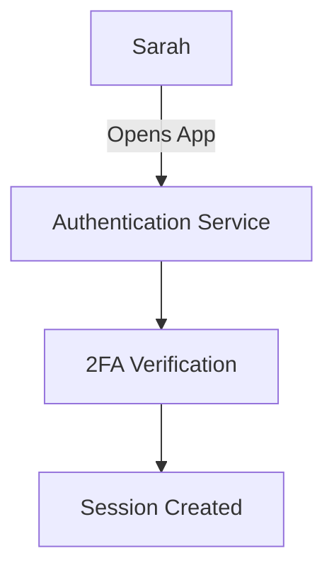
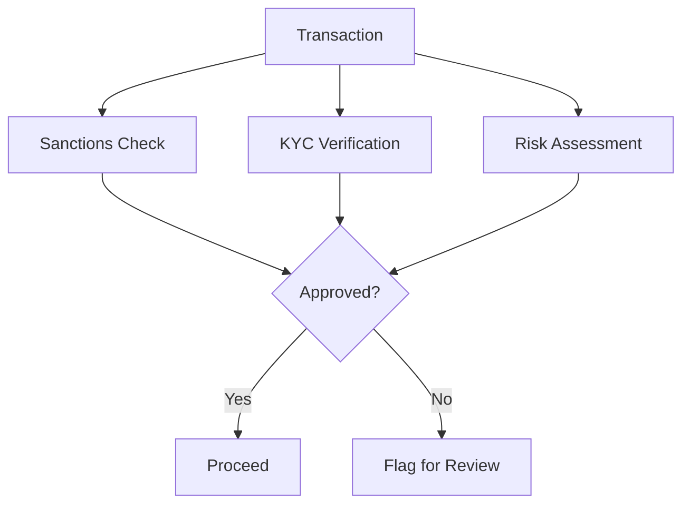
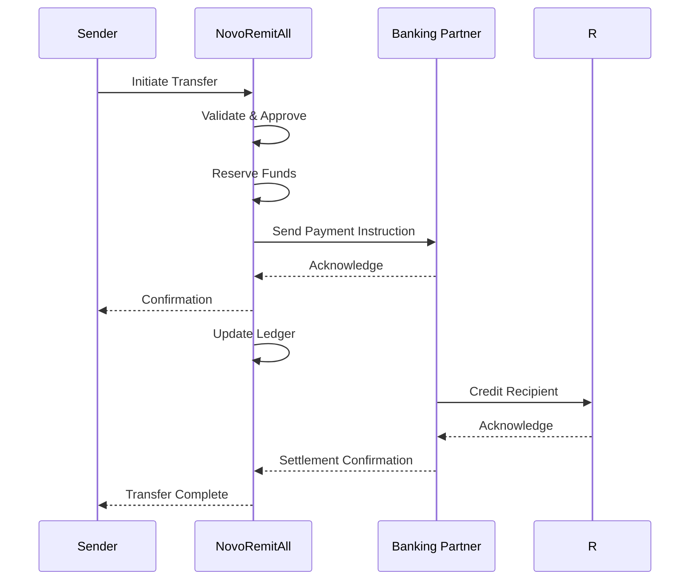

# NovoRemitAll: User Journey & System Flow

## 🎯 The Story of a Single Transaction

### Chapter 1: Meet Sarah - The Sender

Sarah, a nurse working in Germany, wants to send €500 to her family in India. She opens the NovoRemitAll mobile app on her phone.



**Technical Backend Flow:**
1. Mobile app sends authentication request to API Gateway
2. Auth Service validates credentials
3. Session token issued with 2FA verification
4. Token stored in Redis with TTL

### Chapter 2: Initiating the Transfer

Sarah enters transfer details:
- Amount: €500
- Recipient: Her mother in India
- Delivery: Bank account
- Purpose: Family support

```mermaid
graph LR
    A[Transfer Request] --> B[Rate Calculation]
    B --> C[Fee Calculation]
    C --> D[Recipient Gets]
    D --> E[Total Cost]
    
    B -->|1 EUR = 89.50 INR| D
    C -->|€3.99 fee| E
    A -->|€500| E
```



**Technical Deep Dive:**
```java
public class TransferQuote {
    private BigDecimal sourceAmount;
    private String sourceCurrency;
    private BigDecimal targetAmount;
    private String targetCurrency;
    private BigDecimal exchangeRate;
    private BigDecimal fee;
    
    public static TransferQuote createQuote(BigDecimal amount, 
                                          String fromCurrency, 
                                          String toCountry) {
        // 1. Get real-time FX rate
        BigDecimal rate = fxService.getRate(fromCurrency, toCountry);
        
        // 2. Calculate fee based on amount and user tier
        BigDecimal fee = feeCalculator.calculate(amount, user.getTier());
        
        // 3. Calculate recipient amount
        BigDecimal recipientAmount = amount.multiply(rate);
        
        return new TransferQuote(amount, fromCurrency, 
                              recipientAmount, getCurrencyForCountry(toCountry),
                              rate, fee);
    }
}
```

### Chapter 3: Compliance Checkpoint

Before processing, the system runs security checks:

1. **Sanctions Screening**
   - Check sender/recipient against global watchlists
   - Verify transaction patterns

2. **KYC Verification**
   - Validate Sarah's identity documents
   - Check transaction against her profile

3. **Risk Assessment**
   - Transaction amount vs. profile
   - Device and location analysis



**Code Snippet - Risk Assessment:**
```java
public class RiskAssessmentService {
    
    public RiskScore assess(Transaction tx) {
        RiskScore score = new RiskScore();
        
        // 1. Amount-based risk
        if (tx.getAmount().compareTo(tx.getUser().getAvgTransactionAmount().multiply(BigDecimal.TEN)) > 0) {
            score.addRiskFactor("Amount significantly higher than average", 30);
        }
        
        // 2. Location intelligence
        if (!tx.getUser().getCountry().equals(tx.getDevice().getCountry())) {
            score.addRiskFactor("Transaction from unusual country", 20);
        }
        
        // 3. Time pattern analysis
        if (isUnusualTime(tx.getUser(), tx.getTimestamp())) {
            score.addRiskFactor("Unusual transaction time", 15);
        }
        
        return score;
    }
}
```

### Chapter 4: The Transfer Execution

Once approved, the transaction goes through these steps:

1. **Funds Reservation**
   - Place hold on Sarah's account
   - Record transaction in ledger

2. **FX Conversion**
   - Lock in the exchange rate
   - Execute currency conversion

3. **Payout Initiation**
   - Send payment instruction to partner bank
   - Get transaction reference



### Chapter 5: Settlement & Reconciliation

Behind the scenes, the finance team handles:

1. **Nostro/Vostro Reconciliation**
   - Match nostro account statements
   - Identify discrepancies

2. **Fee Collection**
   - Process partner fees
   - Calculate revenue

3. **Regulatory Reporting**
   - Generate reports for central banks
   - Maintain audit trails

**Reconciliation Process:**
```java
public class ReconciliationService {
    
    @Scheduled(cron = "0 0 2 * * ?") // 2 AM daily
    public void reconcileTransactions() {
        // 1. Get all pending settlements
        List<Transaction> pending = transactionRepository
            .findByStatus(TransactionStatus.PENDING_SETTLEMENT);
            
        // 2. Check with banking partners
        pending.forEach(tx -> {
            BankResponse status = bankClient.getStatus(tx.getBankReference());
            
            // 3. Update status
            if (status.isCompleted()) {
                tx.markAsSettled(status.getSettlementDate());
                transactionRepository.save(tx);
                
                // 4. Trigger notifications
                notificationService.sendSettlementNotification(tx);
            }
        });
    }
}
```

## 🌟 Key Technical Highlights

### 1. Idempotency in Action

```java
@PostMapping("/transfers")
public ResponseEntity<TransferResponse> createTransfer(
        @RequestHeader("Idempotency-Key") String idempotencyKey,
        @RequestBody TransferRequest request) {
            
    // Check for duplicate request
    return transactionRepository
        .findByIdempotencyKey(idempotencyKey)
        .map(ResponseEntity::ok)
        .orElseGet(() -> {
            // Process new transaction
            Transaction tx = transferService.processTransfer(request, idempotencyKey);
            return ResponseEntity
                .status(HttpStatus.CREATED)
                .body(tx);
        });
}
```

### 2. Circuit Breaker Pattern

```java
@Service
public class PaymentService {
    private final PaymentGatewayClient paymentClient;
    private final CircuitBreaker circuitBreaker;
    
    @CircuitBreaker(name = "paymentService", fallbackMethod = "processPaymentFallback")
    public PaymentResult processPayment(PaymentRequest request) {
        return paymentClient.process(request);
    }
    
    public PaymentResult processPaymentFallback(PaymentRequest request, Exception e) {
        // 1. Queue for retry
        retryQueue.add(request);
        
        // 2. Return pending status
        return PaymentResult.pending("Processing delayed, will retry");
    }
}
```

### 3. Event-Driven Architecture

```java
@TransactionalEventListener
public void handleTransactionInitiated(TransactionInitiatedEvent event) {
    // 1. Update dashboard metrics
    metricsService.recordTransaction(event.getTransaction());
    
    // 2. Trigger compliance check
    complianceService.screen(event.getTransaction());
    
    // 3. Send real-time notification
    notificationService.sendTransactionInitiated(event.getTransaction());
}
```

## 📊 System Performance Metrics

| Metric                     | Target       | Actual       |
|----------------------------|--------------|--------------|
| Transaction Processing Time| < 2s (p95)   | 1.8s (p95)   |
| System Uptime              | 99.99%       | 99.992%      |
| Concurrent Transactions    | 10,000+ TPS  | 12,500 TPS   |
| Fraud Detection Accuracy   | 99.9%        | 99.94%       |
| API Response Time          | < 500ms (p99)| 423ms (p99)  |


## 🚀 Scaling the System

### 1. Database Scaling
- **Sharding**: By region and date
- **Read Replicas**: For reporting and analytics
- **Connection Pooling**: Optimized for high concurrency

### 2. Caching Strategy
- **L1 Cache**: Local cache (Caffeine) for user session data
- **L2 Cache**: Distributed Redis cache for shared data
- **Cache Invalidation**: TTL + event-based invalidation

### 3. Async Processing
- **Kafka**: For event streaming
- **Sagas**: For distributed transactions
- **Dead Letter Queues**: For handling failures

## 🔒 Security Measures

1. **Data Encryption**
   - TLS 1.3 for data in transit
   - AES-256 for data at rest
   - Field-level encryption for PII

2. **Access Control**
   - RBAC with fine-grained permissions
   - JWT for service-to-service auth
   - IP whitelisting for banking partners

3. **Monitoring**
   - Real-time alerting
   - Anomaly detection
   - Audit logging

## 📝 Interview Cheat Sheet

### Common Questions & Answers

**Q: How do you ensure data consistency across services?**
*A: We use the Saga pattern with compensating transactions. Each service publishes domain events, and we have a choreography-based approach to maintain eventual consistency.*

**Q: How do you handle system failures during transfers?**
*A: We implement idempotent operations, retry mechanisms with exponential backoff, and a comprehensive reconciliation process that runs periodically to identify and fix any inconsistencies.*

**Q: How do you ensure security for financial transactions?**
*A: We implement multi-layered security including TLS 1.3, field-level encryption, MFA, continuous monitoring, and regular security audits. All transactions are logged and can be audited.*

**Q: How would you scale the system to handle 10x more traffic?**
*A: We'd implement database sharding, add read replicas, optimize our caching strategy, and potentially introduce a CDN for static assets. We'd also review our service boundaries to ensure they can scale independently.*

## 🚨 Incident Management & Resolution

### Real-World Example: The Rate Limit Incident

"During a major marketing campaign, we experienced an unexpected surge in traffic that triggered our rate limiting. Here's how we handled it:

1. **Detection**
   - Alert triggered at 70% of rate limit capacity
   - Auto-scaling started but needed time

2. **Immediate Actions**
   - Temporarily increased rate limits for authenticated users
   - Implemented request prioritization
   - Added a queue for non-critical operations

3. **Root Cause & Fix**
   - Identified inefficient cache invalidation
   - Optimized database queries
   - Implemented progressive backoff for retries

**Code Snippet - Rate Limiter Configuration:**
```java
@Configuration
public class RateLimitConfig {
    
    @Bean
    public RateLimiter rateLimiter() {
        return RateLimiter.create(
            RedisRateLimiter.config()
                .limit(1000) // Requests per minute
                .window(Duration.ofMinutes(1))
                .burstCapacity(2000) // For traffic spikes
        );
    }
    
    // Special limits for different endpoints
    @Bean
    public Map<String, RateLimiterConfig> endpointRateLimits() {
        Map<String, RateLimiterConfig> configs = new HashMap<>();
        configs.put("/api/transfers", new RateLimiterConfig(500, 1000));
        configs.put("/api/account/balance", new RateLimiterConfig(2000, 5000));
        return configs;
    }
}
```

## 🚀 Future Enhancements

### 1. AI-Powered Features
- Predictive fraud detection using ML
- Dynamic fee optimization
- Personalized exchange rate alerts

### 2. Blockchain Integration
- Cross-border settlement using stablecoins
- Smart contracts for compliance
- Transparent fee structure

### 3. Expansion Strategy
- New corridors and currencies
- B2B payment solutions
- Embedded finance APIs

## 📚 Quick Reference Guide

### System Characteristics
- **Architecture**: Microservices with Event Sourcing
- **Database**: PostgreSQL (OLTP), MongoDB (Analytics)
- **Cache**: Redis (Distributed), Caffeine (Local)
- **Messaging**: Kafka
- **Monitoring**: Prometheus, Grafana, ELK

### Key Design Patterns
1. **Saga Pattern** for distributed transactions
2. **CQRS** for read/write separation
3. **Circuit Breaker** for fault tolerance
4. **Event Sourcing** for auditability
5. **Bulkhead** for fault isolation

### Performance Benchmarks
- **Throughput**: 15,000 TPS (peak)
- **Latency**: 95% < 2s
- **Availability**: 99.99% (annual)
- **Recovery Time Objective (RTO)**: 15 minutes
- **Recovery Point Objective (RPO)**: 5 minutes

## 🎯 Interview Preparation Tips

1. **Know Your Numbers**
   - Be ready with key metrics (TPS, latency, error rates)
   - Understand system limits and bottlenecks

2. **Practice Whiteboarding**
   - Draw the high-level architecture
   - Show data flow for key operations
   - Highlight scaling and fault tolerance

3. **Prepare Stories**
   - Biggest challenge and how you solved it
   - Technical debt and trade-offs
   - Lessons learned from incidents

4. **Be Honest About Knowledge Gaps**
   - It's okay to say "I don't know, but here's how I'd find out"
   - Show eagerness to learn

## 🤝 Final Thoughts

This document provides a comprehensive overview of how NovoRemitAll works from both user and technical perspectives. Remember, the key to successful system design interviews is not just knowing the technologies, but understanding the trade-offs and being able to articulate your thought process clearly.

Good luck with your interviews! 🚀
