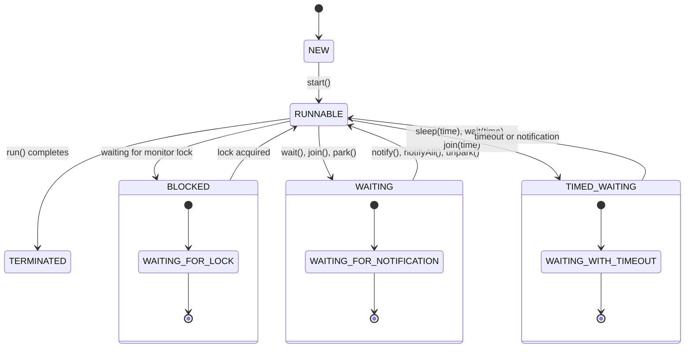
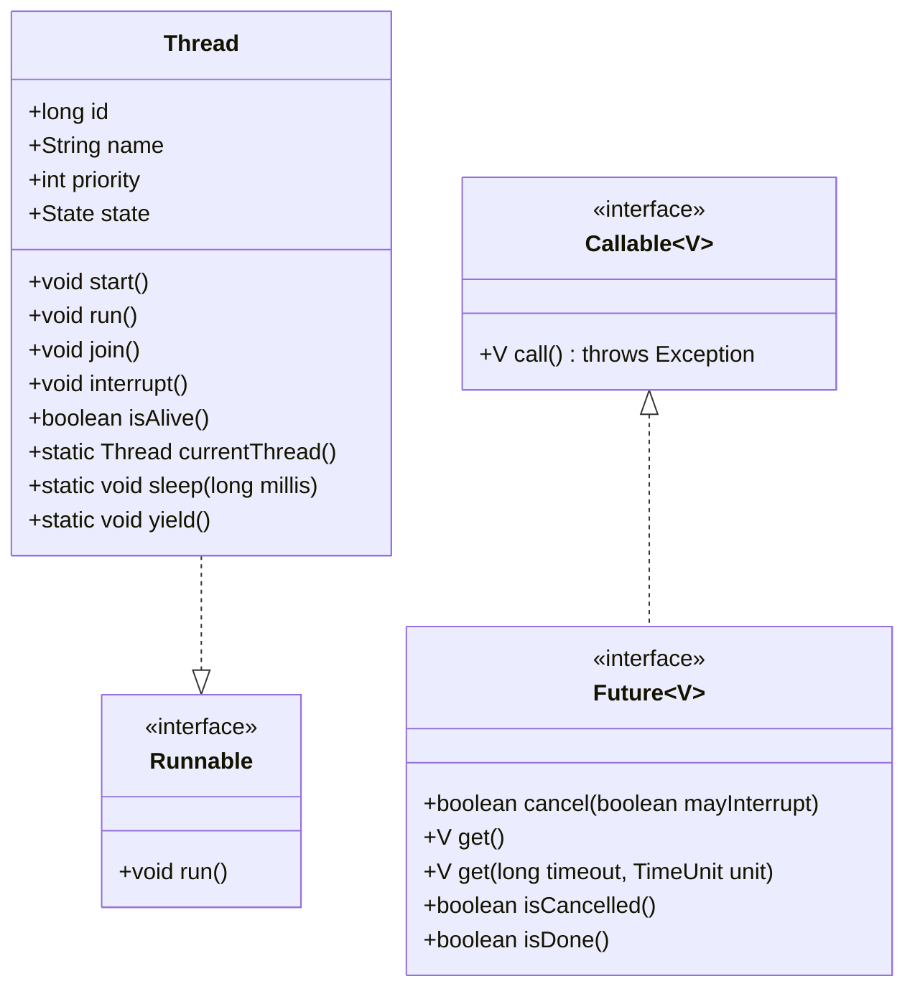

# 🚀 Java Multithreading - Complete Interview Guide

> *"Mastering Java Concurrency for Technical Interviews"*


This comprehensive guide covers all aspects of Java Multithreading with a focus on interview preparation, including visual aids, code examples, and detailed explanations.

## 🔍 Key Features
- **Visual Thread Lifecycle** diagrams
- **Comparison Tables** for quick reference
- **Common Interview Questions** with detailed answers
- **Practical Code Examples** with explanations
- **Best Practices** and **Common Pitfalls**

## 🧵 Thread Lifecycle Overview



## 📋 Table of Contents
1. [Thread Basics](#q1-what-is-a-thread-in-java)
2. [Thread Creation](#q2-what-are-the-different-ways-to-create-a-thread-in-java)
3. [Thread Lifecycle](#q3-what-are-the-different-states-of-a-thread)
4. [Thread Methods](#q4-what-are-the-important-methods-in-the-thread-class)
5. [Thread Synchronization](#q5-what-is-synchronization-in-java)
6. [Synchronized Keyword](#q6-how-does-the-synchronized-keyword-work)
7. [Volatile Keyword](#q7-what-is-the-volatile-keyword-in-java)
8. [Wait, Notify, and NotifyAll](#q8-explain-wait-notify-and-notifyall-methods)
9. [Thread Pool](#q9-what-is-a-thread-pool-and-why-is-it-used)
10. [Executor Framework](#q10-what-is-the-executor-framework-in-java)
11. [Callable and Future](#q11-what-are-callable-and-future-in-java)
12. [ThreadLocal](#q12-what-is-threadlocal-in-java)
13. [Deadlock](#q13-what-is-deadlock-and-how-to-prevent-it)
14. [Race Condition](#q14-what-is-a-race-condition)
15. [Concurrent Collections](#q15-what-are-concurrent-collections-in-java)

**For Advanced Topics (Questions 16-25), see: [Advanced Java Multithreading](AdvancedMultithreading.md)**

16. [Advanced Threading Concepts](#advanced-threading-concepts)
17. [Best Practices](#best-practices)
18. [Common Pitfalls](#common-pitfalls)
19. [Performance Considerations](#performance-considerations)

## 🔥 Common Interview Questions

### Q1: What is a thread in Java?



A thread in Java is the smallest unit of execution within a process. It represents an independent path of execution through program code, with its own program counter, JVM stack, and local variables.

### Thread vs Process

| Feature | Thread | Process |
|---------|--------|----------|
| Definition | Lightweight, smallest unit of execution | Independent program in execution |
| Resource Allocation | Shares resources with other threads | Has its own memory space |
| Communication | Direct communication (shared memory) | Requires IPC mechanisms |
| Context Switching | Faster (same address space) | Slower (different address spaces) |
| Creation | Less resource-intensive | More resource-intensive |
| Isolation | Less isolated (can affect other threads) | More isolated |
| Example | Multiple tabs in a browser | Multiple applications running |
3. **Independent Execution**: Each thread has its own execution path and can run concurrently with other threads
4. **Managed by JVM**: The Java Virtual Machine is responsible for thread scheduling and management

**Benefits of multithreading**:

1. **Improved Performance**: Utilizing multiple CPU cores for parallel execution
2. **Responsiveness**: Keeping the UI responsive while performing background tasks
3. **Resource Sharing**: Efficient use of system resources
4. **Simplified Program Structure**: Breaking complex tasks into simpler, concurrent units

**Challenges of multithreading**:

1. **Synchronization Issues**: Race conditions, deadlocks, and livelocks
2. **Complexity**: Multithreaded code is often more complex and harder to debug
3. **Overhead**: Thread creation and context switching have performance costs
4. **Resource Contention**: Threads competing for the same resources

**Example of a simple thread in Java**:
```java
public class ThreadExample {
    public static void main(String[] args) {
        // Display information about the main thread
        Thread mainThread = Thread.currentThread();
        System.out.println("Main thread: " + mainThread.getName());
        
        // Create and start a new thread
        Thread thread = new Thread(() -> {
            System.out.println("New thread running: " + Thread.currentThread().getName());
            try {
                // Simulate some work
                Thread.sleep(1000);
            } catch (InterruptedException e) {
                System.out.println("Thread interrupted");
            }
            System.out.println("New thread finished");
        });
        
        thread.setName("WorkerThread");
        System.out.println("Before starting new thread");
        thread.start();
        System.out.println("After starting new thread");
        
        try {
            // Wait for the thread to finish
            thread.join();
        } catch (InterruptedException e) {
            System.out.println("Main thread interrupted");
        }
        
        System.out.println("Main thread finished");
    }
}
```

Output:
```
Main thread: main
Before starting new thread
After starting new thread
New thread running: WorkerThread
New thread finished
Main thread finished
```

### Q2: What are the different ways to create a thread in Java?

In Java, there are several ways to create and start a thread. The two primary approaches are extending the `Thread` class and implementing the `Runnable` interface, but there are other methods as well.

**1. Extending the Thread class**:
- Create a subclass of `Thread` and override the `run()` method
- Create an instance of this subclass and call its `start()` method

```java
class MyThread extends Thread {
    @Override
    public void run() {
        System.out.println("Thread running: " + Thread.currentThread().getName());
    }
}

// Usage
MyThread thread = new MyThread();
thread.start();
```

**2. Implementing the Runnable interface**:
- Create a class that implements the `Runnable` interface and implement the `run()` method
- Create a `Thread` instance with your `Runnable` object and call its `start()` method

```java
class MyRunnable implements Runnable {
    @Override
    public void run() {
        System.out.println("Thread running: " + Thread.currentThread().getName());
    }
}

// Usage
Thread thread = new Thread(new MyRunnable());
thread.start();
```

**3. Using anonymous inner classes**:
- Create an anonymous class that either extends `Thread` or implements `Runnable`

```java
// Anonymous Thread subclass
Thread thread1 = new Thread() {
    @Override
    public void run() {
        System.out.println("Anonymous Thread subclass running");
    }
};
thread1.start();

// Anonymous Runnable implementation
Thread thread2 = new Thread(new Runnable() {
    @Override
    public void run() {
        System.out.println("Anonymous Runnable implementation running");
    }
});
thread2.start();
```

**4. Using lambda expressions (Java 8+)**:
- Use a lambda expression to implement the `Runnable` interface (which is a functional interface)

```java
Thread thread = new Thread(() -> {
    System.out.println("Lambda Runnable running");
});
thread.start();
```

**5. Using the Executor Framework**:
- Create thread pools and manage threads using the Executor Framework

```java
import java.util.concurrent.ExecutorService;
import java.util.concurrent.Executors;

ExecutorService executor = Executors.newSingleThreadExecutor();
executor.execute(() -> {
    System.out.println("Task executed by Executor");
});
executor.shutdown();
```

**6. Using Callable and Future (for tasks that return results)**:
- Implement the `Callable` interface for tasks that return a result
- Submit the task to an `ExecutorService` and get a `Future` object

```java
import java.util.concurrent.*;

Callable<String> task = () -> {
    Thread.sleep(1000);
    return "Task result";
};

ExecutorService executor = Executors.newSingleThreadExecutor();
Future<String> future = executor.submit(task);

try {
    String result = future.get();
    System.out.println(result);
} catch (Exception e) {
    e.printStackTrace();
}
executor.shutdown();
```

**Comparison of different approaches**:

| Approach | Advantages | Disadvantages |
|----------|------------|---------------|
| Extending Thread | Direct access to Thread methods | Single inheritance limitation |
| Implementing Runnable | Can extend other classes, better separation of concerns | No direct access to Thread methods without using Thread.currentThread() |
| Lambda expressions | Concise syntax, less boilerplate | Limited to simple implementations |
| Executor Framework | Thread pooling, task management, better performance | More complex API |
| Callable and Future | Can return results and throw checked exceptions | More complex than simple Runnable |

**Best practices**:

1. **Prefer Runnable over Thread**: Implementing `Runnable` is generally preferred as it separates the task from the thread mechanism and allows for more flexibility.

2. **Use Executor Framework for production code**: It provides better thread management, pooling, and task scheduling.

3. **Use lambda expressions for simple tasks**: They make the code more concise and readable.

4. **Use Callable when you need to return results**: It's designed specifically for tasks that produce results or throw checked exceptions.

### Q3: What are the different states of a thread?

In Java, a thread can exist in one of several states during its lifecycle. The `Thread.State` enum defines these states, and you can check a thread's current state using the `getState()` method.

**The six thread states in Java**:

1. **NEW**:
   - A thread that has been created but not yet started
   - The `start()` method has not been called yet

2. **RUNNABLE**:
   - A thread that is executing or ready to execute
   - The thread is either running or waiting for resource allocation from the operating system
   - In Java, the RUNNABLE state combines the "ready" and "running" states

3. **BLOCKED**:
   - A thread that is waiting to acquire a monitor lock
   - Typically occurs when a thread tries to enter a synchronized block/method while another thread is executing inside a synchronized block/method on the same object

4. **WAITING**:
   - A thread that is waiting indefinitely for another thread to perform a particular action
   - Caused by calling `Object.wait()`, `Thread.join()`, or `LockSupport.park()` without a timeout

5. **TIMED_WAITING**:
   - A thread that is waiting for another thread to perform an action for a specified time period
   - Caused by calling `Thread.sleep(long)`, `Object.wait(long)`, `Thread.join(long)`, `LockSupport.parkNanos()`, or `LockSupport.parkUntil()`

6. **TERMINATED**:
   - A thread that has completed execution
   - The `run()` method has exited, either normally or by throwing an exception

**Thread state transitions**:

- NEW → RUNNABLE: When `start()` is called
- RUNNABLE → BLOCKED: When trying to enter a synchronized block/method
- BLOCKED → RUNNABLE: When the monitor lock is acquired
- RUNNABLE → WAITING: When `wait()`, `join()`, or `LockSupport.park()` is called
- WAITING → RUNNABLE: When `notify()`, `notifyAll()` is called, or the joined thread completes
- RUNNABLE → TIMED_WAITING: When `sleep(long)`, `wait(long)`, `join(long)`, etc. are called
- TIMED_WAITING → RUNNABLE: When the timeout expires or `notify()`, `notifyAll()` is called
- RUNNABLE → TERMINATED: When the `run()` method completes

**Example demonstrating thread states**:
```java
public class ThreadStatesDemo {
    public static void main(String[] args) throws InterruptedException {
        // Create a new thread (NEW state)
        Thread thread = new Thread(() -> {
            try {
                // Thread enters RUNNABLE state when started
                
                // Synchronized block to demonstrate BLOCKED state
                synchronized (ThreadStatesDemo.class) {
                    System.out.println("Thread acquired lock");
                }
                
                // Demonstrate TIMED_WAITING state
                Thread.sleep(1000);
                
                // Demonstrate WAITING state
                synchronized (ThreadStatesDemo.class) {
                    ThreadStatesDemo.class.wait();
                    // This line won't be reached in this example
                }
            } catch (InterruptedException e) {
                System.out.println("Thread interrupted");
            }
        });
        
        // Thread is in NEW state
        System.out.println("After creation: " + thread.getState());
        
        thread.start();
        // Thread is now RUNNABLE
        System.out.println("After starting: " + thread.getState());
        
        // Give the thread time to execute
        Thread.sleep(100);
        
        // Create a second thread to block the first one
        Thread blocker = new Thread(() -> {
            synchronized (ThreadStatesDemo.class) {
                try {
                    // Hold the lock for 2 seconds
                    Thread.sleep(2000);
                } catch (InterruptedException e) {
                    e.printStackTrace();
                }
            }
        });
        
        blocker.start();
        // Give the blocker thread time to acquire the lock
        Thread.sleep(100);
        
        // Try to make the first thread enter the synchronized block
        // It should be BLOCKED now
        System.out.println("While blocked: " + thread.getState());
        
        // Wait for the blocker to release the lock
        blocker.join();
        
        // The first thread should now be in TIMED_WAITING due to sleep(1000)
        System.out.println("During sleep: " + thread.getState());
        
        // Wait for sleep to finish
        Thread.sleep(1000);
        
        // The first thread should now be in WAITING due to wait()
        System.out.println("After wait() call: " + thread.getState());
        
        // Notify the waiting thread
        synchronized (ThreadStatesDemo.class) {
            ThreadStatesDemo.class.notify();
        }
        
        // Give the thread time to terminate
        Thread.sleep(100);
        
        // Thread should be TERMINATED now
        System.out.println("After completion: " + thread.getState());
    }
}
```

**Thread state monitoring**:

You can monitor thread states in a Java application using:

1. **JVisualVM**: A visual tool for monitoring Java applications
2. **JStack**: A command-line utility to print Java thread stack traces
3. **ThreadMXBean**: A management interface for the thread system

```java
import java.lang.management.ManagementFactory;
import java.lang.management.ThreadInfo;
import java.lang.management.ThreadMXBean;

public class ThreadMonitoring {
    public static void main(String[] args) {
        ThreadMXBean threadMXBean = ManagementFactory.getThreadMXBean();
        ThreadInfo[] threadInfos = threadMXBean.dumpAllThreads(false, false);
        
        for (ThreadInfo info : threadInfos) {
            System.out.println("Thread ID: " + info.getThreadId() + 
                               ", Name: " + info.getThreadName() + 
                               ", State: " + info.getThreadState());
        }
    }
}
```

### Q4: What are the important methods in the Thread class?

The `Thread` class in Java provides several important methods for thread management and control. Understanding these methods is crucial for effective multithreaded programming.

**Core Thread Methods**:

1. **start()**:
   - Starts the thread by calling the run() method
   - A thread can be started only once; calling start() again throws IllegalThreadStateException
   - The JVM creates a new thread of execution and calls the thread's run() method

2. **run()**:
   - Contains the code that constitutes the new thread
   - Usually overridden in subclasses or provided via a Runnable
   - If called directly (without start()), it runs in the current thread, not a new thread

3. **sleep(long millis)** and **sleep(long millis, int nanos)**:
   - Causes the currently executing thread to pause for the specified time
   - Doesn't release any locks the thread holds
   - Throws InterruptedException if another thread interrupts the sleeping thread

4. **join()**, **join(long millis)**, and **join(long millis, int nanos)**:
   - Waits for the thread to die
   - The calling thread waits until the thread on which join() is called completes
   - Useful for waiting for the completion of other threads

5. **interrupt()**:
   - Interrupts the thread
   - If the thread is blocked in a method that throws InterruptedException, the thread's interrupted status is cleared and the exception is thrown
   - If the thread is not blocked, only the interrupted status is set

6. **isInterrupted()**:
   - Tests whether the thread has been interrupted
   - Returns the interrupted status without changing it

7. **interrupted()** (static method):
   - Tests whether the current thread has been interrupted
   - Clears the interrupted status of the thread

8. **yield()** (static method):
   - Suggests that the scheduler should give other threads a chance to execute
   - Only a hint to the scheduler, no guarantee of behavior

9. **setDaemon(boolean on)**:
   - Marks the thread as a daemon thread or a user thread
   - Must be called before the thread is started
   - JVM exits when all user threads (non-daemon threads) finish

10. **setPriority(int newPriority)**:
    - Sets the thread's priority
    - Values range from Thread.MIN_PRIORITY (1) to Thread.MAX_PRIORITY (10)
    - Default is Thread.NORM_PRIORITY (5)
    - Higher priority threads are generally executed in preference to lower priority threads

11. **setName(String name)**:
    - Changes the name of the thread
    - Useful for debugging and thread identification

12. **currentThread()** (static method):
    - Returns a reference to the currently executing thread object

**Example demonstrating various Thread methods**:
```java
public class ThreadMethodsDemo {
    public static void main(String[] args) throws InterruptedException {
        // Create a thread
        Thread thread = new Thread(() -> {
            try {
                System.out.println("Thread started: " + Thread.currentThread().getName());
                
                // Check if thread is interrupted
                System.out.println("Is interrupted? " + Thread.currentThread().isInterrupted());
                
                // Sleep for 2 seconds
                System.out.println("Sleeping for 2 seconds...");
                Thread.sleep(2000);
                
                // This will not execute if the thread is interrupted during sleep
                System.out.println("Woke up normally");
            } catch (InterruptedException e) {
                System.out.println("Thread was interrupted during sleep");
                // Note: interrupt status is cleared when InterruptedException is thrown
                System.out.println("Is interrupted after catching exception? " + 
                                   Thread.currentThread().isInterrupted());
            }
        });
        
        // Set thread name
        thread.setName("WorkerThread");
        
        // Set thread priority
        thread.setPriority(Thread.MAX_PRIORITY);
        System.out.println("Thread priority: " + thread.getPriority());
        
        // Set as daemon thread
        thread.setDaemon(true);
        System.out.println("Is daemon? " + thread.isDaemon());
        
        // Start the thread
        thread.start();
        
        // Get thread state
        System.out.println("Thread state after starting: " + thread.getState());
        
        // Sleep for 1 second
        Thread.sleep(1000);
        
        // Interrupt the thread
        System.out.println("Interrupting the thread...");
        thread.interrupt();
        
        // Wait for the thread to finish
        thread.join();
        
        System.out.println("Thread state after completion: " + thread.getState());
        
        // Demonstrate yield
        Thread yieldThread = new Thread(() -> {
            for (int i = 0; i < 5; i++) {
                System.out.println("YieldThread: " + i);
                Thread.yield();  // Hint to give other threads a chance
            }
        });
        
        Thread normalThread = new Thread(() -> {
            for (int i = 0; i < 5; i++) {
                System.out.println("NormalThread: " + i);
            }
        });
        
        yieldThread.start();
        normalThread.start();
        
        // Wait for both threads to finish
        yieldThread.join();
        normalThread.join();
    }
}
```

**Thread State Management Methods**:

| Method | Description | Throws InterruptedException | Releases Locks |
|--------|-------------|----------------------------|----------------|
| start() | Starts the thread | No | N/A |
| run() | Contains thread's execution code | No | N/A |
| sleep() | Pauses thread execution | Yes | No |
| join() | Waits for thread to die | Yes | No |
| yield() | Suggests yielding to other threads | No | No |
| interrupt() | Interrupts the thread | No | N/A |

**Best Practices**:

1. **Always use start() to begin thread execution**, not run()
2. **Handle InterruptedException properly** - either rethrow it or restore the interrupted status
3. **Use join() to wait for thread completion** rather than polling thread state
4. **Be cautious with setPriority()** as its effect is platform-dependent
5. **Avoid using stop(), suspend(), and resume()** as they are deprecated and unsafe
6. **Use meaningful thread names** to aid debugging
7. **Be careful with daemon threads** as they might not complete their work before JVM exits

### Q5: What is synchronization in Java?

Synchronization in Java is a mechanism that ensures that only one thread can access a shared resource at a time. It helps prevent thread interference and memory consistency errors in multithreaded programs.

**Need for Synchronization**:

When multiple threads access shared data concurrently, it can lead to:

1. **Thread Interference**: When multiple threads access the same data and interfere with each other's operations
2. **Memory Consistency Errors**: When different threads have inconsistent views of the same data
3. **Race Conditions**: When the outcome depends on the relative timing of events in different threads

**Synchronization Mechanisms in Java**:

1. **Synchronized Methods**:
   - Entire method is synchronized on the object (instance method) or class (static method)
   - Only one thread can execute a synchronized method on the same object at a time

```java
public synchronized void increment() {
    count++;
}

public static synchronized void staticIncrement() {
    staticCount++;
}
```

2. **Synchronized Blocks**:
   - Only a specific block of code is synchronized
   - More fine-grained control than synchronized methods
   - Can specify the object to synchronize on

```java
public void increment() {
    synchronized(this) {
        count++;
    }
}

public static void staticIncrement() {
    synchronized(MyClass.class) {
        staticCount++;
    }
}
```

3. **Locks (java.util.concurrent.locks)**:
   - More flexible than synchronized blocks/methods
   - Support timed waiting, interruptible locks, non-block-structured locking
   - Examples: ReentrantLock, ReadWriteLock

```java
private final Lock lock = new ReentrantLock();

public void increment() {
    lock.lock();
    try {
        count++;
    } finally {
        lock.unlock();  // Always release lock in finally block
    }
}
```

4. **Atomic Variables (java.util.concurrent.atomic)**:
   - Thread-safe operations on single variables without locks
   - Examples: AtomicInteger, AtomicLong, AtomicReference

```java
private AtomicInteger count = new AtomicInteger(0);

public void increment() {
    count.incrementAndGet();  // Atomic operation
}
```

5. **Volatile Keyword**:
   - Ensures visibility of changes to variables across threads
   - Does not provide atomicity for compound operations

```java
private volatile boolean flag = false;

public void setFlag() {
    flag = true;  // Visible to all threads immediately
}
```

**Example demonstrating synchronization issues and solutions**:
```java
public class SynchronizationDemo {
    // Shared counter without synchronization
    private int unsafeCounter = 0;
    
    // Shared counter with synchronized method
    private int safeCounter1 = 0;
    
    // Shared counter with synchronized block
    private int safeCounter2 = 0;
    
    // Shared counter with lock
    private int safeCounter3 = 0;
    private final Lock lock = new ReentrantLock();
    
    // Shared counter with atomic variable
    private AtomicInteger atomicCounter = new AtomicInteger(0);
    
    // Unsafe increment (not synchronized)
    public void incrementUnsafe() {
        unsafeCounter++;  // Not atomic: read, increment, write
    }
    
    // Safe increment with synchronized method
    public synchronized void incrementSafe1() {
        safeCounter1++;
    }
    
    // Safe increment with synchronized block
    public void incrementSafe2() {
        synchronized(this) {
            safeCounter2++;
        }
    }
    
    // Safe increment with lock
    public void incrementSafe3() {
        lock.lock();
        try {
            safeCounter3++;
        } finally {
            lock.unlock();
        }
    }
    
    // Safe increment with atomic variable
    public void incrementAtomic() {
        atomicCounter.incrementAndGet();
    }
    
    public static void main(String[] args) throws InterruptedException {
        SynchronizationDemo demo = new SynchronizationDemo();
        
        // Create multiple threads to increment counters
        int numThreads = 10;
        int incrementsPerThread = 1000;
        
        // Test each counter type
        testCounter(demo, numThreads, incrementsPerThread, "unsafeCounter", 
                    demo::incrementUnsafe, () -> demo.unsafeCounter);
        
        testCounter(demo, numThreads, incrementsPerThread, "safeCounter1 (synchronized method)", 
                    demo::incrementSafe1, () -> demo.safeCounter1);
        
        testCounter(demo, numThreads, incrementsPerThread, "safeCounter2 (synchronized block)", 
                    demo::incrementSafe2, () -> demo.safeCounter2);
        
        testCounter(demo, numThreads, incrementsPerThread, "safeCounter3 (lock)", 
                    demo::incrementSafe3, () -> demo.safeCounter3);
        
        testCounter(demo, numThreads, incrementsPerThread, "atomicCounter", 
                    demo::incrementAtomic, () -> demo.atomicCounter.get());
    }
    
    private static void testCounter(SynchronizationDemo demo, int numThreads, int incrementsPerThread,
                                   String counterName, Runnable incrementMethod, Supplier<Integer> getCounterValue) 
                                   throws InterruptedException {
        // Reset counter (for demo purposes)
        Field field;
        try {
            field = SynchronizationDemo.class.getDeclaredField(counterName.split(" ")[0]);
            field.setAccessible(true);
            if (field.getType() == AtomicInteger.class) {
                ((AtomicInteger)field.get(demo)).set(0);
            } else {
                field.set(demo, 0);
            }
        } catch (Exception e) {
            // Ignore for demo
        }
        
        // Create and start threads
        Thread[] threads = new Thread[numThreads];
        for (int i = 0; i < numThreads; i++) {
            threads[i] = new Thread(() -> {
                for (int j = 0; j < incrementsPerThread; j++) {
                    incrementMethod.run();
                }
            });
            threads[i].start();
        }
        
        // Wait for all threads to finish
        for (Thread thread : threads) {
            thread.join();
        }
        
        // Check final counter value
        int expectedValue = numThreads * incrementsPerThread;
        int actualValue = getCounterValue.get();
        
        System.out.println(counterName + ": expected=" + expectedValue + 
                           ", actual=" + actualValue + 
                           (expectedValue == actualValue ? " ✓" : " ✗"));
    }
}
```

**Synchronization Characteristics**:

1. **Reentrant**: A thread can acquire the same lock multiple times without deadlocking itself
2. **Mutual Exclusion**: Only one thread can hold a lock at a time
3. **Visibility**: Changes made by one thread are visible to other threads that acquire the same lock
4. **Ordering**: Establishes happens-before relationships between actions

**Synchronization Performance Considerations**:

1. **Overhead**: Synchronization introduces performance overhead
2. **Contention**: High contention for locks can significantly reduce performance
3. **Granularity**: Fine-grained locking can improve concurrency but increases complexity
4. **Lock Alternatives**: Consider lock-free alternatives like atomic variables when appropriate

**Best Practices**:

1. **Synchronize only when necessary** - avoid over-synchronization
2. **Keep synchronized blocks as small as possible**
3. **Avoid synchronizing on publicly accessible objects**
4. **Always release locks in finally blocks** when using explicit locks
5. **Consider using higher-level concurrency utilities** instead of low-level synchronization
6. **Be aware of deadlock possibilities** when acquiring multiple locks
7. **Use immutable objects** when possible to avoid synchronization needs

### Q6: How does the synchronized keyword work?

The `synchronized` keyword in Java is a built-in mechanism for controlling access to critical sections of code. It provides mutual exclusion and memory visibility guarantees, ensuring that only one thread can execute a synchronized block or method at a time.

**How Synchronized Works Internally**:

1. **Monitor/Lock Acquisition**:
   - Every object in Java has an associated intrinsic lock or monitor
   - When a thread enters a synchronized block/method, it acquires the lock
   - If the lock is already held by another thread, the current thread blocks until the lock is released

2. **Memory Synchronization**:
   - Synchronized provides not just mutual exclusion but also memory synchronization
   - When a thread acquires a lock, it sees all changes made by previous threads that released the same lock
   - When a thread releases a lock, all its changes become visible to threads that subsequently acquire the lock

3. **Reentrant Nature**:
   - Java locks are reentrant, meaning a thread can acquire the same lock multiple times
   - The lock is only released when the outermost synchronized block exits

**Synchronized Methods**:

1. **Instance Methods**:
   - Synchronized on the instance (this)
   - Only one thread can execute any synchronized instance method on the same object at a time

```java
public synchronized void increment() {
    count++;
}
```

Equivalent to:

```java
public void increment() {
    synchronized(this) {
        count++;
    }
}
```

2. **Static Methods**:
   - Synchronized on the class object
   - Only one thread can execute any synchronized static method in the class at a time

```java
public static synchronized void staticIncrement() {
    staticCount++;
}
```

Equivalent to:

```java
public static void staticIncrement() {
    synchronized(MyClass.class) {
        staticCount++;
    }
}
```

**Synchronized Blocks**:

- More flexible than synchronized methods
- Can specify which object to synchronize on
- Allows for finer-grained locking

```java
public void increment() {
    // Other non-synchronized code
    
    synchronized(lockObject) {
        // Critical section
        count++;
    }