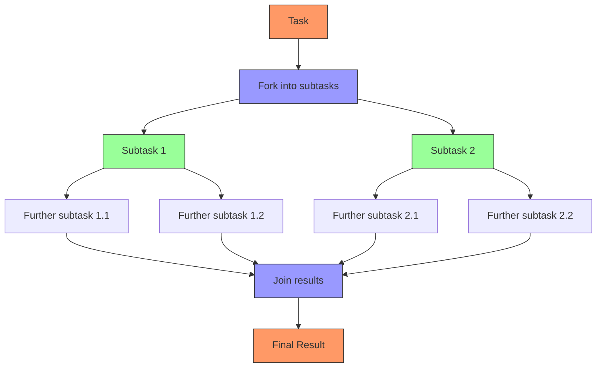
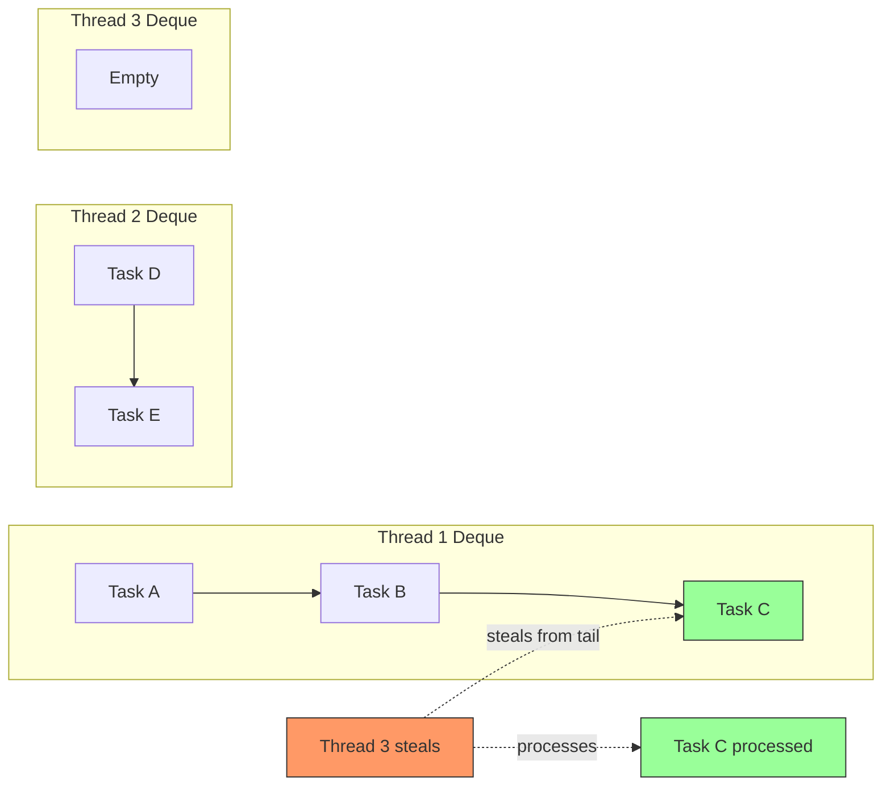

### Q17: Explain ForkJoinPool and the work-stealing algorithm

The ForkJoinPool, introduced in Java 7, is a specialized implementation of the ExecutorService designed to efficiently run a large number of tasks using a limited number of threads. It's particularly effective for recursive, divide-and-conquer algorithms that can be broken down into smaller subtasks.



**Key Concepts of ForkJoinPool**:

1. **Work-Stealing Algorithm**:
   - When a worker thread completes its assigned tasks from its own queue, it can "steal" tasks from other busy threads' queues
   - This load balancing happens automatically, improving efficiency
   - Tasks are stolen from the end of another thread's queue (the largest tasks)

2. **Fork/Join Framework Classes**:
   - `ForkJoinPool`: The executor service implementation
   - `ForkJoinTask`: Abstract base class for tasks that run within the pool
   - `RecursiveTask<V>`: A ForkJoinTask that returns a result
   - `RecursiveAction`: A ForkJoinTask with no result (void)
   - `CountedCompleter`: A ForkJoinTask with completion actions

3. **Common Pool**:
   - Singleton pool available via `ForkJoinPool.commonPool()`
   - Shared across the entire application
   - Used by parallel streams, CompletableFuture, etc.

**Work-Stealing Algorithm Visualization**:



**Example: Parallel Merge Sort Implementation**:

```java
import java.util.Arrays;
import java.util.concurrent.ForkJoinPool;
import java.util.concurrent.RecursiveAction;

public class ParallelMergeSort {
    private static final int THRESHOLD = 500;
    
    public static void main(String[] args) {
        int[] arr = new int[10000];
        // Fill with random values
        for (int i = 0; i < arr.length; i++) {
            arr[i] = (int) (Math.random() * 10000);
        }
        
        ForkJoinPool pool = ForkJoinPool.commonPool();
        
        // Create the task
        MergeSortTask task = new MergeSortTask(arr, 0, arr.length - 1);
        
        // Start the task
        pool.invoke(task);
        
        System.out.println("Array is sorted: " + isSorted(arr));
        System.out.println("Pool parallelism: " + pool.getParallelism());
        System.out.println("Steal count: " + pool.getStealCount());
    }
    
    private static boolean isSorted(int[] arr) {
        for (int i = 0; i < arr.length - 1; i++) {
            if (arr[i] > arr[i + 1]) {
                return false;
            }
        }
        return true;
    }
    
    static class MergeSortTask extends RecursiveAction {
        private final int[] array;
        private final int start;
        private final int end;
        
        MergeSortTask(int[] array, int start, int end) {
            this.array = array;
            this.start = start;
            this.end = end;
        }
        
        @Override
        protected void compute() {
            if (end - start <= THRESHOLD) {
                // For small arrays, use sequential sort
                Arrays.sort(array, start, end + 1);
                return;
            }
            
            // Divide the array in half
            int mid = start + (end - start) / 2;
            
            // Create tasks for the two halves
            MergeSortTask leftTask = new MergeSortTask(array, start, mid);
            MergeSortTask rightTask = new MergeSortTask(array, mid + 1, end);
            
            // Fork both tasks
            invokeAll(leftTask, rightTask);
            
            // Merge the sorted halves
            merge(array, start, mid, end);
        }
        
        private void merge(int[] arr, int start, int mid, int end) {
            int[] temp = new int[end - start + 1];
            
            int i = start;      // Index for the left subarray
            int j = mid + 1;    // Index for the right subarray
            int k = 0;          // Index for the temporary array
            
            // Merge the two subarrays
            while (i <= mid && j <= end) {
                if (arr[i] <= arr[j]) {
                    temp[k++] = arr[i++];
                } else {
                    temp[k++] = arr[j++];
                }
            }
            
            // Copy remaining elements
            while (i <= mid) {
                temp[k++] = arr[i++];
            }
            
            while (j <= end) {
                temp[k++] = arr[j++];
            }
            
            // Copy back to the original array
            for (i = 0; i < temp.length; i++) {
                arr[start + i] = temp[i];
            }
        }
    }
}
```

**Example: Computing Fibonacci Numbers with RecursiveTask**:

```java
import java.util.concurrent.ForkJoinPool;
import java.util.concurrent.RecursiveTask;

public class FibonacciTask extends RecursiveTask<Long> {
    private static final long THRESHOLD = 10;
    private final long n;
    
    public FibonacciTask(long n) {
        this.n = n;
    }
    
    @Override
    protected Long compute() {
        if (n <= THRESHOLD) {
            // Compute directly for small values
            return computeSequentially(n);
        }
        
        // Split into smaller tasks
        FibonacciTask f1 = new FibonacciTask(n - 1);
        FibonacciTask f2 = new FibonacciTask(n - 2);
        
        // Fork f1 - push to worker queue
        f1.fork();
        
        // Compute f2 directly on this thread
        Long f2Result = f2.compute();
        
        // Join f1 - wait for its result
        Long f1Result = f1.join();
        
        // Combine results
        return f1Result + f2Result;
    }
    
    private long computeSequentially(long n) {
        if (n <= 1) {
            return n;
        }
        long fib1 = 0, fib2 = 1, result = 0;
        for (long i = 2; i <= n; i++) {
            result = fib1 + fib2;
            fib1 = fib2;
            fib2 = result;
        }
        return result;
    }
    
    public static void main(String[] args) {
        ForkJoinPool pool = new ForkJoinPool();
        FibonacciTask task = new FibonacciTask(45);
        long result = pool.invoke(task);
        System.out.println("Fibonacci(45) = " + result);
    }
}
```

**Key Performance Metrics**:

1. **Parallelism Level**:
   - Default: Number of available processors
   - Can be configured via constructor or system property `java.util.concurrent.ForkJoinPool.common.parallelism`

2. **Work Stealing Statistics**:
   - `getStealCount()`: Returns the total number of tasks stolen from one thread's queue by another
   - `getQueuedTaskCount()`: The approximate number of tasks in queues
   - `getActiveThreadCount()`: The approximate number of active threads

3. **Task Characteristics**:
   - **Task Granularity**: Tasks should be neither too small (overhead) nor too large (poor parallelism)
   - **Locality of Reference**: Tasks should work on adjacent memory areas for better cache performance
   - **Independence**: Tasks should be independent to avoid synchronization

**Best Practices for ForkJoinPool**:

1. **Task Design**:
   - Avoid synchronization between tasks
   - Use a threshold to switch to sequential processing for small tasks
   - Keep the fork-join pattern balanced (equivalent subtasks)

2. **Pool Usage**:
   - Reuse the common pool for most applications
   - Create a custom pool only when needed for isolation or different parallelism levels
   - Avoid blocking operations in pool threads

3. **Runtime Tuning**:
   - Monitor steal counts to validate effectiveness
   - Adjust thresholds based on measured performance
   - Consider the number of processors and memory constraints

**When to Use ForkJoinPool**:

1. **Divide-and-Conquer Algorithms**:
   - Merge sort, quick sort
   - Matrix multiplication
   - Graph algorithms

2. **Recursive Data Processing**:
   - File system traversal
   - Tree processing
   - Document parsing

3. **Parallel Stream Operations**:
   - When using `parallelStream()` or `stream().parallel()`
   - For large data sets with independent operations

**When NOT to Use ForkJoinPool**:

1. **I/O-Bound Operations**:
   - Network requests
   - Database queries
   - File operations

2. **Blocking Operations**:
   - Tasks that wait for locks
   - Tasks that use blocking queues

3. **Small Data Sets**:
   - Overhead may exceed benefits
   - Sequential processing often faster for small tasks

**Comparison with Other Executors**:

| Feature | ForkJoinPool | ThreadPoolExecutor | Single Thread Executor |
|---------|--------------|--------------------|-----------------------|
| Task Type | Recursive, divide-and-conquer | Independent tasks | Sequential tasks |
| Thread Management | Work-stealing, self-balancing | Fixed or bounded queue | Single thread |
| Memory Efficiency | Low overhead per task | One thread per active task | One thread total |
| Task Submission | Fork/join pattern | Submit/execute | Submit/execute |
| Best Use Case | CPU-intensive parallel algorithms | Mixed workloads | Sequential processing |
| Java Version | Java 7+ | Java 5+ | Java 5+ |

**Real-World Scenario: Document Processing Pipeline**

```java
public class DocumentProcessingPipeline {
    private final ForkJoinPool pool;
    
    public DocumentProcessingPipeline(int parallelism) {
        this.pool = new ForkJoinPool(parallelism);
    }
    
    public List<ProcessedDocument> processDocuments(List<RawDocument> documents) {
        return pool.invoke(new DocumentProcessingTask(documents, 0, documents.size() - 1));
    }
    
    private class DocumentProcessingTask 
            extends RecursiveTask<List<ProcessedDocument>> {
        private static final int THRESHOLD = 10;
        private final List<RawDocument> documents;
        private final int start;
        private final int end;
        
        DocumentProcessingTask(List<RawDocument> documents, int start, int end) {
            this.documents = documents;
            this.start = start;
            this.end = end;
        }
        
        @Override
        protected List<ProcessedDocument> compute() {
            int size = end - start + 1;
            
            if (size <= THRESHOLD) {
                return processSequentially();
            }
            
            int mid = start + size / 2;
            
            // Create subtasks
            DocumentProcessingTask leftTask = 
                new DocumentProcessingTask(documents, start, mid - 1);
            DocumentProcessingTask rightTask = 
                new DocumentProcessingTask(documents, mid, end);
            
            // Fork right task
            rightTask.fork();
            
            // Compute left task
            List<ProcessedDocument> leftResult = leftTask.compute();
            
            // Join right task
            List<ProcessedDocument> rightResult = rightTask.join();
            
            // Combine results
            List<ProcessedDocument> result = new ArrayList<>(leftResult);
            result.addAll(rightResult);
            return result;
        }
        
        private List<ProcessedDocument> processSequentially() {
            List<ProcessedDocument> result = new ArrayList<>();
            for (int i = start; i <= end; i++) {
                RawDocument doc = documents.get(i);
                // Multiple processing steps
                String content = extractText(doc);
                List<String> tokens = tokenize(content);
                Map<String, Integer> wordFrequency = calculateWordFrequency(tokens);
                List<String> keywords = extractKeywords(wordFrequency);
                
                result.add(new ProcessedDocument(
                    doc.getId(),
                    content,
                    tokens,
                    wordFrequency,
                    keywords
                ));
            }
            return result;
        }
        
        // Document processing methods...
        private String extractText(RawDocument doc) { /* implementation */ }
        private List<String> tokenize(String content) { /* implementation */ }
        private Map<String, Integer> calculateWordFrequency(List<String> tokens) { /* implementation */ }
        private List<String> extractKeywords(Map<String, Integer> frequency) { /* implementation */ }
    }
}
```

**Practical Tips for Interview Questions**:

1. **Explain the core principle**: "Work-stealing allows idle threads to help busy ones by taking tasks from their queues."
2. **Highlight the performance aspects**: "ForkJoinPool shines for recursive divide-and-conquer algorithms with minimal synchronization needs."
3. **Discuss common use cases**: "Java's parallel streams and CompletableFuture implementations use the ForkJoinPool.commonPool()."
4. **Be prepared to differentiate**: "Unlike traditional thread pools, ForkJoinPool is designed specifically for tasks that create subtasks."
5. **Understand the limitations**: "ForkJoinPool is not ideal for I/O bound operations or small workloads where the overhead exceeds benefits."
