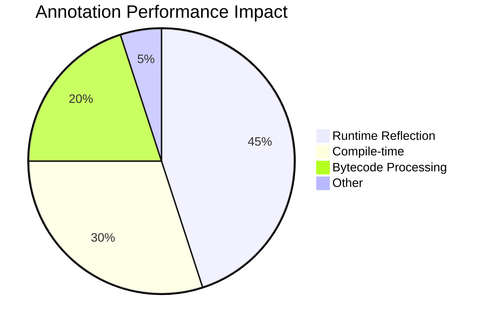

# Java Annotations - Complete Guide & Interview Questions

```mermaid
graph TD
    A[Java Annotations] --> B[Built-in]
    A --> C[Custom]
    B --> B1[Standard]
    B --> B2[Meta]
    B1 --> @Override
    B1 --> @Deprecated
    B1 --> @SuppressWarnings
    B2 --> @Retention
    B2 --> @Target
    C --> C1[Runtime]
    C --> C2[Compile-time]
```

## 📚 Basic Concepts

### 1. What are Annotations?
- **Definition**: Special form of metadata that provides data about a program
- **Introduced**: Java 5 (1.5)
- **Key Characteristics**:
  - Don't directly affect code execution
  - Can be processed at compile-time or runtime
  - Can be applied to classes, methods, fields, parameters, etc.
  - Can include elements (like methods) that can have default values

### 2. Built-in Annotations

| Annotation | Purpose | Scope |
|------------|---------|--------|
| `@Override` | Indicates method overriding | Method |
| `@Deprecated` | Marks deprecated elements | Any declaration |
| `@SuppressWarnings` | Suppresses compiler warnings | Any declaration |
| `@SafeVarargs` | Suppresses varargs warnings | Methods/constructors |
| `@FunctionalInterface` | Indicates a functional interface | Interfaces |
| `@Native` | Indicates a field may be referenced from native code | Fields |

## Creating Custom Annotations

### Annotation Declaration
```java
import java.lang.annotation.*;

@Retention(RetentionPolicy.RUNTIME)
@Target(ElementType.METHOD)
public @interface MyAnnotation {
    String value() default "";
    int count() default 0;
    String[] tags() default {};
}
```

### Meta-annotations
- `@Retention`: Specifies how long the annotation is retained
  - `SOURCE`: Discarded during compilation
  - `CLASS`: Recorded in class file but not retained at runtime
  - `RUNTIME`: Available at runtime via reflection

- `@Target`: Where the annotation can be applied
  - `TYPE`: Class, interface, enum
  - `FIELD`: Field declaration
  - `METHOD`: Method declaration
  - `PARAMETER`: Parameter declaration
  - `CONSTRUCTOR`: Constructor declaration
  - `LOCAL_VARIABLE`: Local variable
  - `ANNOTATION_TYPE`: Annotation type
  - `PACKAGE`: Package declaration
  - `TYPE_PARAMETER`: Type parameter (Java 8+)
  - `TYPE_USE`: Type use (Java 8+)

## Common Use Cases

### 1. Compile-time Processing
```java
@Retention(RetentionPolicy.SOURCE)
public @interface BuilderProperty {}
```

### 2. Runtime Processing
```java
@Retention(RetentionPolicy.RUNTIME)
@Target(ElementType.METHOD)
public @interface Test {
    boolean enabled() default true;
}
```

### 3. Framework Integration
```java
@Retention(RetentionPolicy.RUNTIME)
@Target(ElementType.FIELD)
public @interface Autowired {
    boolean required() default true;
}
```

## Processing Annotations at Runtime

```java
// Get annotation from method
Method method = obj.getClass().getMethod("methodName");
if (method.isAnnotationPresent(MyAnnotation.class)) {
    MyAnnotation annotation = method.getAnnotation(MyAnnotation.class);
    System.out.println("Value: " + annotation.value());
}

// Get all annotations
Annotation[] annotations = method.getAnnotations();
```

## Java 8+ Features

### Repeating Annotations
```java
@Repeatable(Schedules.class)
public @interface Schedule {
    String dayOfWeek() default "Mon";
    int hour() default 0;
}

@Retention(RetentionPolicy.RUNTIME)
public @interface Schedules {
    Schedule[] value();
}

// Usage
@Schedule(dayOfWeek="Mon", hour=9)
@Schedule(dayOfWeek="Wed", hour=10)
public void doSomething() {}
```

### Type Annotations (Java 8+)
```java
@NotNull String name;
List<@Email String> emails;
void process(@ReadOnly List<@Valid String> data);
```

## 🔍 Common Interview Questions

### 1. Spring Stereotype Annotations
**Q: What is the difference between @Component, @Repository, @Service, and @Controller?**
```java
// All these are specializations of @Component
@Repository    // Data access layer
@Service       // Business logic layer
@Controller    // Web controller layer
@Component     // Generic component
```
- **Technical Differences**:
  - `@Repository` includes `@PersistentExceptionTranslationPostProcessor`
  - `@Controller` is a specialization for web controllers
  - `@Service` is semantically different but technically same as `@Component`

### 2. Custom Annotation Processing
**Q: How would you create a custom annotation processor?**
```java
@SupportedAnnotationTypes("com.example.CustomAnnotation")
@SupportedSourceVersion(SourceVersion.RELEASE_11)
public class CustomProcessor extends AbstractProcessor {
    @Override
    public boolean process(Set<? extends TypeElement> annotations, 
                         RoundEnvironment roundEnv) {
        // Processing logic here
        return true;
    }
}
```
- **Registration**: Create `META-INF/services/javax.annotation.processing.Processor`
- **Build Tools**: Maven/Gradle configuration for annotation processing

### 3. Dependency Injection Annotations
**Q: Compare @Autowired vs @Inject vs @Resource**

| Feature | @Autowired | @Inject | @Resource |
|---------|------------|---------|------------|
| Package | org.springframework | javax.inject | javax.annotation |
| Required | required=true (default) | No required attribute | name attribute |
| Type | By type | By type | By name then type |
| Order | @Order | @Priority | N/A |

### 4. Transaction Management
**Q: Explain @Transactional attributes**
```java
@Transactional(
  propagation = Propagation.REQUIRED,
  isolation = Isolation.DEFAULT,
  timeout = 30,
  readOnly = false,
  rollbackFor = {Exception.class},
  noRollbackFor = {RuntimeException.class}
)
```
- **Propagation Types**: REQUIRED, REQUIRES_NEW, NESTED, etc.
- **Isolation Levels**: READ_UNCOMMITTED, READ_COMMITTED, etc.
- **Common Pitfalls**: Self-invocation, private methods, different beans

### 5. Advanced Annotation Questions
**Q: How do annotations work internally in Java?**
- **Retention Policies**: SOURCE, CLASS, RUNTIME
- **Proxy Generation**: How Spring creates proxies for @Transactional
- **Annotation Processors**: Compile-time vs runtime processing
- **Performance Impact**: Reflection overhead of runtime annotations

### 6. Spring Boot Specific
**Q: Explain @SpringBootApplication**
```java
@SpringBootApplication  // Combines:
@SpringBootConfiguration // @Configuration
@EnableAutoConfiguration // Auto-configuration
@ComponentScan          // Component scanning
public class MyApp {}
```

### 7. Testing Annotations
**Q: Key testing annotations in Spring Boot**
- `@SpringBootTest`: Full context loading
- `@WebMvcTest`: Slice test for web layer
- `@DataJpaTest`: Slice test for JPA components
- `@MockBean`: Add mock beans to ApplicationContext
- `@TestConfiguration`: Test-specific configuration

### 8. Security Annotations
**Q: Common Spring Security annotations**
- `@PreAuthorize`/`@PostAuthorize`
- `@Secured`
- `@RolesAllowed`
- `@EnableGlobalMethodSecurity`

### 9. Performance Considerations
**Q: How to optimize annotation usage?**
- Use `@Indexed` for faster component scanning
- Prefer constructor injection over field injection
- Use `@Lazy` for expensive beans
- Consider compile-time annotation processing

### 10. Common Pitfalls
- Circular dependencies with `@Autowired`
- `@Transactional` not working in self-invocation
- Missing `@Configuration` on configuration classes
- Incorrect component scanning paths

## 🏆 Best Practices & Patterns

### 1. Annotation Design
- **Documentation**: Always use `@Documented` for custom annotations
- **Retention Policy**: Choose the least powerful retention that works
  - `SOURCE` for compile-time only
  - `CLASS` for bytecode manipulation
  - `RUNTIME` only when reflection is needed
- **Target Constraints**: Be specific with `@Target`

### 2. Performance Optimization


### 3. Common Patterns
- **Builder Pattern**: `@Builder` (Lombok)
- **Immutable Objects**: `@Value` (Lombok)
- **Validation**: `@Valid`, `@NotNull`
- **Mapping**: `@Mapping` (MapStruct)
- **Caching**: `@Cacheable`, `@CacheEvict`

### 4. Testing Strategy
- Use `@TestPropertySource` for test properties
- Leverage `@MockBean` for isolated testing
- Consider `@TestConfiguration` for test-specific beans
- Use `@Sql` for database setup

### 5. Maintainability Tips
- Group related annotations using `@AliasFor`
- Create composed annotations for common combinations
- Document annotation attributes with Javadoc
- Consider backward compatibility when modifying annotations
