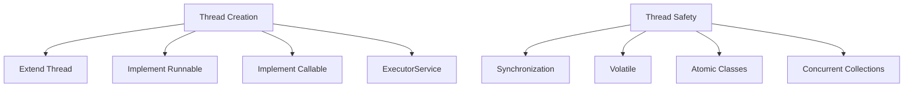
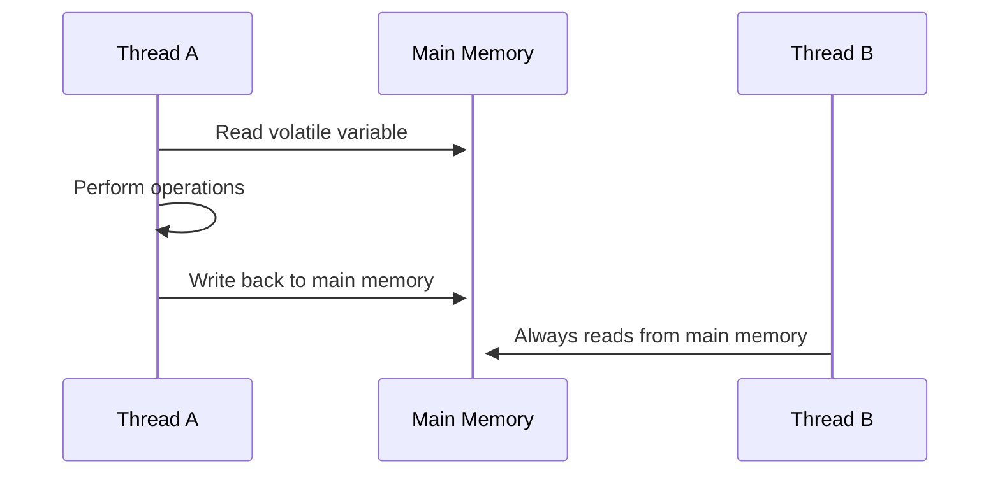
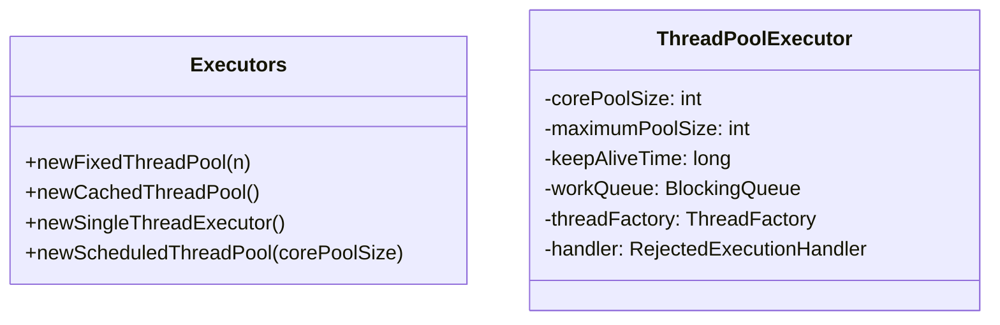
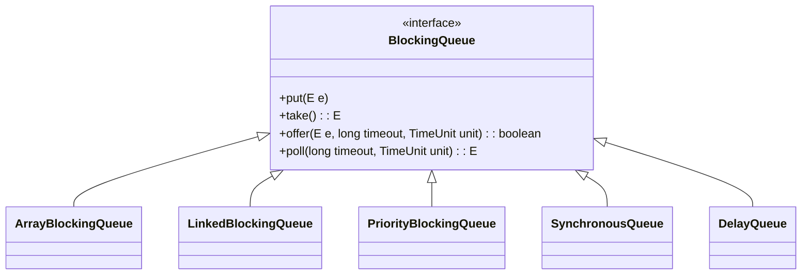

# 🚀 Java Concurrency - Complete Guide & Interview Questions



## 📚 Basic Concepts

### 1. Process vs Thread
| Aspect | Process | Thread |
|--------|---------|--------|
| Memory | Separate memory space | Shared memory space |
| Creation | Heavyweight | Lightweight |
| Communication | IPC (sockets, pipes) | Shared memory |
| Context Switch | Slower | Faster |
| Isolation | More secure | Less secure |

### 2. Thread Creation Methods

#### Comparison Table
| Method | Returns Value | Exception Handling | Java Version |
|--------|--------------|-------------------|--------------|
| Extend Thread | No | UncaughtExceptionHandler | 1.0 |
| Implement Runnable | No | UncaughtExceptionHandler | 1.0 |
| Implement Callable | Yes | Future.get() | 1.5 |
| ExecutorService | Yes | Future.get() | 1.5 |

#### Best Practice
```java
// Preferred way - Using ExecutorService
ExecutorService executor = Executors.newFixedThreadPool(Runtime.getRuntime().availableProcessors());
Future<Result> future = executor.submit(new CallableTask());
Result result = future.get();
```

## Thread Creation Examples

### Extending Thread class
```java
class MyThread extends Thread {
    public void run() {
        System.out.println("Thread is running");
    }
}

// Usage
MyThread t1 = new MyThread();
t1.start();
```

### Implementing Runnable
```java
class MyRunnable implements Runnable {
    public void run() {
        System.out.println("Thread is running");
    }
}

// Usage
Thread t1 = new Thread(new MyRunnable());
t1.start();

// With lambda (Java 8+)
Thread t2 = new Thread(() -> System.out.println("Lambda thread"));
t2.start();
```

### Using Callable and Future
```java
class MyCallable implements Callable<String> {
    public String call() throws Exception {
        return "Task completed";
    }
}

// Usage
ExecutorService executor = Executors.newSingleThreadExecutor();
Future<String> future = executor.submit(new MyCallable());
String result = future.get(); // blocks until result is available
executor.shutdown();
```

## Thread Lifecycle
1. **New**: Thread created but not started
2. **Runnable**: Thread is ready to run, waiting for CPU
3. **Running**: Thread is executing
4. **Blocked/Waiting**: Thread is waiting for a monitor lock
5. **Timed Waiting**: Thread waits for a specified time
6. **Terminated**: Thread has completed execution

## Synchronization

### Synchronized Methods
```java
public synchronized void increment() {
    count++;
}
```

### Synchronized Blocks
```java
public void increment() {
    synchronized(this) {
        count++;
    }
}
```

### Static Synchronization
```java
public static synchronized void staticIncrement() {
    staticCount++;
}
```

## Thread Safety

### Volatile
- Ensures visibility of changes across threads
- Prevents compiler optimizations of the variable
- Doesn't provide atomicity

```java
private volatile boolean running = true;

public void stop() {
    running = false;
}
```

### Atomic Classes
- Provide atomic operations for single variables
- Part of `java.util.concurrent.atomic`
- Examples: `AtomicInteger`, `AtomicLong`, `AtomicReference`

```java
private AtomicInteger counter = new AtomicInteger(0);

public void increment() {
    counter.incrementAndGet();
}
```

## 🔒 Thread Safety Deep Dive

### 1. Volatile

- **Use Cases**:
  - Single writer, multiple readers pattern
  - Status flags (like shutdown flag)
  - Immutable objects with volatile references

### 2. Atomic Classes
```java
// Atomic operations example
private AtomicInteger counter = new AtomicInteger(0);

public int increment() {
    return counter.incrementAndGet();  // Atomic operation
}

public int get() {
    return counter.get();
}
```

#### Comparison: Volatile vs Atomic
| Feature | Volatile | Atomic |
|---------|----------|--------|
| Visibility | Yes | Yes |
| Atomicity | No | Yes |
| Performance | Faster | Slightly slower |
| Use Case | Single variable | Counter, flags, references |

### 3. Memory Model & Happens-Before
- **Happens-Before Relationship**
  - Program order rule
  - Monitor lock rule
  - Volatile variable rule
  - Thread start rule
  - Thread join rule

```java
// Example of happens-before
class Example {
    int x = 0;
    volatile boolean v = false;
    
    public void writer() {
        x = 42;  // (1)
        v = true; // (2) - write to volatile
    }
    
    public void reader() {
        if (v) { // (3) - read of volatile
            // x is guaranteed to be 42 here
            System.out.println(x); // (4)
        }
    }
}
```

## 🧵 Thread Pools & Executors

### 1. Thread Pool Types


### 2. Choosing the Right Pool
| Pool Type | Core Threads | Max Threads | Queue Type | When to Use |
|-----------|--------------|-------------|------------|-------------|
| Fixed | Fixed | Fixed | LinkedBlockingQueue | CPU-bound tasks |
| Cached | 0 | Integer.MAX_VALUE | SynchronousQueue | Short-lived async tasks |
| Single | 1 | 1 | LinkedBlockingQueue | Sequential task execution |
| Scheduled | Core | Integer.MAX_VALUE | DelayedWorkQueue | Delayed or periodic tasks |

### 3. Best Practices
```java
// Recommended way to create thread pool
ThreadPoolExecutor executor = new ThreadPoolExecutor(
    Runtime.getRuntime().availableProcessors(), // core pool size
    Runtime.getRuntime().availableProcessors() * 2, // max pool size
    60L, TimeUnit.SECONDS, // keep alive time
    new LinkedBlockingQueue<>(1000), // work queue
    new ThreadPoolExecutor.CallerRunsPolicy() // rejection policy
);

// Graceful shutdown
void shutdownAndAwaitTermination(ExecutorService pool) {
    pool.shutdown();
    try {
        if (!pool.awaitTermination(60, TimeUnit.SECONDS)) {
            pool.shutdownNow();
            if (!pool.awaitTermination(60, TimeUnit.SECONDS))
                System.err.println("Pool did not terminate");
        }
    } catch (InterruptedException ie) {
        pool.shutdownNow();
        Thread.currentThread().interrupt();
    }
}
```

### ThreadPoolExecutor
More control over thread pool parameters:
```java
int corePoolSize = 5;
int maxPoolSize = 10;
long keepAliveTime = 5000;

ExecutorService threadPool = new ThreadPoolExecutor(
    corePoolSize,
    maxPoolSize,
    keepAliveTime,
    TimeUnit.MILLISECONDS,
    new LinkedBlockingQueue<Runnable>()
);
```

## 🔄 Concurrent Collections

### 1. ConcurrentHashMap Deep Dive
```java
ConcurrentMap<String, Integer> map = new ConcurrentHashMap<>(32, 0.75f, 16);

// Atomic operations
map.compute("key", (k, v) -> v == null ? 1 : v + 1);
map.merge("key", 1, Integer::sum);

// Search with parallelism threshold
map.forEach(2, // parallelism threshold
    (k, v) -> "Key: " + k + " Value: " + v, // transformer
    System.out::println // consumer
);
```

#### ConcurrentHashMap vs Hashtable
| Feature | ConcurrentHashMap | Hashtable |
|---------|-------------------|-----------|
| Locking | Segment/Node level | Object level |
| Nulls | No null keys/values | No null keys/values |
| Iteration | Weakly consistent | Fail-fast |
| Performance | High concurrency | Single lock |

### 2. BlockingQueue Implementations


### 3. Concurrent Collections Cheat Sheet
| Interface | Non-Thread-Safe | Thread-Safe |
|-----------|------------------|-------------|
| List | ArrayList | CopyOnWriteArrayList |
| Set | HashSet | CopyOnWriteArraySet |
| Map | HashMap | ConcurrentHashMap |
| Queue | PriorityQueue | ArrayBlockingQueue |
| Deque | ArrayDeque | LinkedBlockingDeque |
| Map | TreeMap | ConcurrentSkipListMap |
| Set | TreeSet | ConcurrentSkipListSet |

### 4. Advanced Patterns
#### Producer-Consumer with BlockingQueue
```java
public class ProducerConsumer {
    private final BlockingQueue<Item> queue = new LinkedBlockingQueue<>(100);
    
    class Producer implements Runnable {
        public void run() {
            while (true) {
                Item item = produceItem();
                queue.put(item); // blocks if queue is full
            }
        }
    }
    
    class Consumer implements Runnable {
        public void run() {
            while (true) {
                Item item = queue.take(); // blocks if queue is empty
                processItem(item);
            }
        }
    }
}
```

#### Concurrent Collections Performance Tips
1. **Initial Capacity**: Set appropriate initial capacity
2. **Concurrency Level**: For ConcurrentHashMap, set based on expected threads
3. **Batch Operations**: Use `putAll()`, `addAll()` when possible
4. **Iterators**: Use `iterator()` for weakly consistent iteration
5. **Bulk Operations**: Prefer `search()`, `reduce()`, `forEach()` for bulk operations

## 🔗 Advanced Synchronizers

### 1. CountDownLatch vs CyclicBarrier vs Phaser
| Feature | CountDownLatch | CyclicBarrier | Phaser |
|---------|----------------|---------------|--------|
| Reusable | ❌ No | ✅ Yes | ✅ Yes |
| Parties | Fixed | Fixed | Dynamic |
| Advance | Single thread | All threads | Any thread |
| Waiting | await() | await() | arriveAndAwaitAdvance() |
| Use Case | One-time actions | Reusable barriers | Complex synchronization |

### 2. CountDownLatch Example
```java
// Initialize with count of 3
CountDownLatch latch = new CountDownLatch(3);

// Worker threads
for (int i = 0; i < 3; i++) {
    new Thread(() -> {
        try {
            // Do work
            latch.countDown();
        } catch (Exception e) {
            Thread.currentThread().interrupt();
        }
    }).start();
}

// Main thread waits for all workers
latch.await();
```

### 3. CyclicBarrier Example
```java
// Create barrier for 3 threads with optional barrier action
CyclicBarrier barrier = new CyclicBarrier(3, 
    () -> System.out.println("All threads reached barrier"));

// Worker threads
for (int i = 0; i < 3; i++) {
    new Thread(() -> {
        try {
            // Phase 1
            barrier.await();
            
            // Phase 2
            barrier.await();
        } catch (Exception e) {
            Thread.currentThread().interrupt();
        }
    }).start();
}
```

### 4. Phaser Example
```java
Phaser phaser = new Phaser(1); // Register self

// Worker threads
for (int i = 0; i < 3; i++) {
    phaser.register();
    new Thread(() -> {
        // Phase 1
        doWork();
        phaser.arriveAndAwaitAdvance();
        
        // Phase 2
        doMoreWork();
        phaser.arriveAndDeregister();
    }).start();
}

// Main thread deregisters self
phaser.arriveAndDeregister();
```

### 5. Exchanger Example
```java
Exchanger<String> exchanger = new Exchanger<>();

// Thread 1
String data1 = "Data from Thread 1";
String received = exchanger.exchange(data1);

// Thread 2
String data2 = "Data from Thread 2";
String received = exchanger.exchange(data2);
```

## 🎯 Common Interview Questions

### 1. Deadlock Prevention
**Q: How to prevent deadlocks?**
- **Lock Ordering**: Always acquire locks in a consistent order
- **Lock Timeout**: Use `tryLock()` with timeout
- **Deadlock Detection**: Periodic checks for cycles in wait-for graph
- **Avoid Nested Locks**: Don't hold locks when calling external code

### 2. ThreadLocal Usage
**Q: What is ThreadLocal and when to use it?**
```java
private static final ThreadLocal<SimpleDateFormat> dateFormat = 
    ThreadLocal.withInitial(() -> new SimpleDateFormat("yyyy-MM-dd"));

// Each thread gets its own instance
String date = dateFormat.get().format(new Date());
```
- **Use Cases**:
  - Per-thread context (e.g., user sessions)
  - Performance optimization for thread-unsafe classes
  - Avoiding parameter passing in deeply nested calls

### 3. CompletableFuture
**Q: How to chain async operations?**
```java
CompletableFuture.supplyAsync(() -> fetchUser(userId))
    .thenApply(user -> fetchUserDetails(user))
    .thenAccept(details -> updateUI(details))
    .exceptionally(ex -> {
        logger.error("Error:", ex);
        return null;
    });
```

### 4. Fork/Join Framework
**Q: How to implement parallel processing?**
```java
class Fibonacci extends RecursiveTask<Long> {
    final long n;
    Fibonacci(long n) { this.n = n; }
    
    protected Long compute() {
        if (n <= 1) return n;
        Fibonacci f1 = new Fibonacci(n - 1);
        f1.fork();
        Fibonacci f2 = new Fibonacci(n - 2);
        return f2.compute() + f1.join();
    }
}

// Usage
ForkJoinPool pool = new ForkJoinPool();
long result = pool.invoke(new Fibonacci(10));
```

### 5. Thread Dump Analysis
**Q: How to analyze thread dumps?**
1. **Deadlocks**: Look for "Found one Java-level deadlock"
2. **Contention**: Look for BLOCKED threads and monitor owners
3. **Performance Issues**: Look for RUNNABLE threads in native code
4. **Tools**:
   - jstack
   - VisualVM
   - YourKit
   - JProfiler

## 🏆 Best Practices

### 1. Thread Naming
```java
ThreadFactory namedThreadFactory = new ThreadFactoryBuilder()
    .setNameFormat("worker-%d")
    .setDaemon(true)
    .build();
```

### 2. Exception Handling
```java
Thread.setDefaultUncaughtExceptionHandler((t, e) -> 
    logger.error("Uncaught exception in thread: " + t.getName(), e)
);
```

### 3. Resource Cleanup
```java
try (ExecutorService executor = Executors.newCachedThreadPool()) {
    // Use executor
} // Automatically calls shutdown()
```

### 4. Performance Tips
- **Thread Pool Sizing**:
  - CPU-bound: N_threads = N_cores
  - I/O-bound: N_threads = N_cores * (1 + (wait_time / compute_time))
- **Avoid**:
  - `Thread.stop()`
  - `Thread.suspend()`
  - `Thread.resume()`
  - `Thread.destroy()`

### 5. Testing Concurrent Code
- Use `java.util.concurrent.atomic.LongAdder` for counters
- Test with more threads than processors
- Use `Thread.sleep()` carefully in tests
- Consider using `CountDownLatch` for test synchronization
- `await()` blocks until count reaches zero

```java
CountDownLatch latch = new CountDownLatch(3);

// In worker threads
public void run() {
    // Do work
    latch.countDown();
}

// In main thread
latch.await(); // Blocks until count reaches zero
```

## CyclicBarrier
- Similar to CountDownLatch but can be reused
- Multiple threads wait for each other at a common barrier point
- Takes a Runnable that runs when the barrier is tripped

```java
CyclicBarrier barrier = new CyclicBarrier(3, () -> 
    System.out.println("All threads reached barrier"));

// In worker threads
public void run() {
    // Do work
    barrier.await();
    // Continue after all threads reach barrier
}
```

## Semaphore
- Controls access to a shared resource through permits
- `acquire()` gets a permit, `release()` returns it
- Can be used for resource pooling or to limit concurrency

```java
Semaphore semaphore = new Semaphore(3); // 3 permits

// In worker threads
try {
    semaphore.acquire();
    // Access shared resource
} finally {
    semaphore.release();
}
```

## Common Interview Questions

1. **What is the difference between `sleep()` and `wait()`?**
   - `sleep()` is a static method of Thread, `wait()` is an instance method of Object
   - `sleep()` doesn't release the lock, `wait()` releases the lock
   - `sleep()` is used for time-based waiting, `wait()` is used for inter-thread communication

2. **What is a deadlock? How can you prevent it?**
   - Deadlock occurs when two or more threads are blocked forever
   - Prevention:
     - Avoid nested locks
     - Lock only what is needed
     - Use timeout in `tryLock()`
     - Acquire locks in a specific order

3. **What is the `volatile` keyword?**
   - Ensures visibility of changes to variables across threads
   - Prevents compiler optimizations that involve the variable
   - Doesn't provide atomicity (use `Atomic` classes for that)

4. **What is the difference between `synchronized` and `ReentrantLock`?**
   - `synchronized` is a keyword, `ReentrantLock` is a class
   - `ReentrantLock` provides more features:
     - Try lock with timeout
     - Fair lock acquisition
     - Multiple condition variables
     - Interruptible lock acquisition

5. **What is the `ThreadLocal` class?**
   - Provides thread-local variables
   - Each thread has its own, independently initialized copy of the variable
   - Commonly used for per-thread context or to avoid sharing

6. **What is the `Fork/Join` framework?**
   - Framework for parallelizing recursive algorithms
   - Uses work-stealing algorithm
   - Main classes: `ForkJoinPool`, `RecursiveTask`, `RecursiveAction`

7. **What is the `CompletableFuture` class?**
   - Represents a future result of an asynchronous computation
   - Allows chaining of operations
   - Supports combining multiple futures
   - Exception handling support

## Best Practices
1. Prefer `ExecutorService` over manual thread creation
2. Use higher-level concurrency utilities from `java.util.concurrent`
3. Document thread-safety of your classes
4. Prefer immutable objects
5. Use `ThreadLocal` variables carefully (can cause memory leaks)
6. Always release resources in `finally` blocks
7. Be aware of the "double-checked locking" anti-pattern
8. Use appropriate concurrent collections instead of external synchronization
9. Prefer `ReentrantLock` over `synchronized` when you need its features
10. Use thread pools to limit resource consumption
