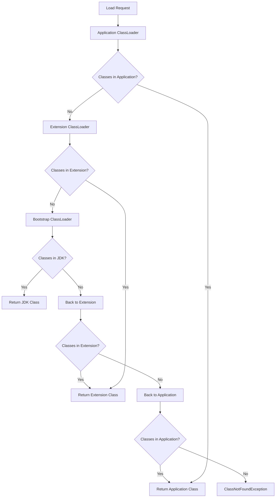

# Java Basics - Interview Guide

> *"Mastering Java Fundamentals for Technical Interviews"*


This comprehensive guide covers essential Java concepts with a focus on interview preparation, including visual aids, code examples, and detailed explanations.

## Key Features
- **Visual Concept Maps** for better understanding
- **Comparison Tables** for quick reference
- **Common Interview Questions** with detailed answers
- **Code Examples** with explanations
- **Best Practices** and **Common Pitfalls**


## Table of Contents


## 🔥 Common Interview Questions

### Q1: What is the difference between JDK, JRE, and JVM?


- **JDK (Java Development Kit)**:
  - Complete development package
  - Includes JRE + Development tools (compiler, debugger, etc.)
  - Used by developers to create Java applications
  
- **JRE (Java Runtime Environment)**:
  - Contains JVM + Core libraries
  - Only needed to run Java applications
  - No development tools included
  
- **JVM (Java Virtual Machine)**:
  - Executes Java bytecode
  - Platform-dependent implementation
  - Provides memory management and garbage collection

### Q2: Explain public static void main(String[] args)

```java
public class Main {
    // The main method - entry point of any Java application
    public static void main(String[] args) {
        System.out.println("Hello, World!");
    }
}
```

- `public`: Accessible from anywhere
- `static`: Can be called without creating an instance of the class
- `void`: Doesn't return any value
- `main`: Method name recognized by JVM
- `String[] args`: Command-line arguments

### Q3: What is the difference between == and .equals()?

| == | .equals() |
|----|-----------|
| Compares references | Compares values |
| For primitives, compares values | Only works with objects |
| Cannot be overridden | Can be overridden |
| Faster | Slower due to method call |

```java
String s1 = new String("Hello");
String s2 = new String("Hello");

System.out.println(s1 == s2);        // false (different objects)
System.out.println(s1.equals(s2));   // true (same content)
```

### Q4: What is the difference between String, StringBuilder, and StringBuffer?

| Feature | String | StringBuilder | StringBuffer |
|---------|--------|---------------|--------------|
| Mutable | ❌ No | ✅ Yes | ✅ Yes |
| Thread-safe | ✅ Yes | ❌ No | ✅ Yes |
| Performance | Slowest | Fastest | Moderate |
| Since | Java 1.0 | Java 5 | Java 1.0 |

```java
// String (immutable)
String str = "Hello";
str += " World";  // Creates new object

// StringBuilder (not thread-safe)
StringBuilder sb = new StringBuilder();
sb.append("Hello").append(" World");  // Modifies same object

// StringBuffer (thread-safe)
StringBuffer sbf = new StringBuffer();
sbf.append("Hello").append(" World");  // Synchronized methods
```

### Q5: What is the difference between an Interface and an Abstract Class?


| Feature | Abstract Class | Interface |
|---------|----------------|-----------|
| Multiple Inheritance | ❌ No | ✅ Yes (since Java 8) |
| Constructor | ✅ Yes | ❌ No |
| Variables | Can have any visibility | Public static final by default |
| Methods | Can have implementation | Default/static methods since Java 8 |
| State | Can maintain state | Cannot maintain state |
| Use Case | IS-A relationship | CAN-DO relationship |

### Q6: Explain Java Memory Model

```mermaid
graph TB
    subgraph JVM_Memory
        A[Method Area] -->|Class Data|
        B[Heap] -->|Objects|
        C[Stack] -->|Frames|
        D[PC Registers] -->|Thread State|
        E[Native Method Stack] -->|Native Code|
    end
    
    subgraph Thread1
        C1[Stack Frame 1]
        C2[Stack Frame 2]
    end
    
    subgraph Thread2
        C3[Stack Frame 1]
    end
```

- **Method Area**: Class metadata, constants, static variables
- **Heap**: Object allocation
- **Stack**: Method calls, local variables
- **PC Registers**: Thread execution points
- **Native Method Stack**: Native code execution

### Q7: What are the different types of class loaders in Java?


1. **Bootstrap ClassLoader** (Primordial)
   - Loads core Java classes (rt.jar)
   - Written in native code
   - No parent (null)

2. **Extension ClassLoader**
   - Loads from JRE/lib/ext
   - Child of Bootstrap
   - Written in Java

3. **Application ClassLoader**
   - Loads from classpath
   - Child of Extension
   - Default class loader

4. **Custom ClassLoader**
   - User-defined
   - Can extend ClassLoader
   - Used for dynamic loading

### Q8: What is the difference between final, finally, and finalize()?

| final | finally | finalize() |
|-------|---------|------------|
| Keyword | Block | Method |
| Prevents inheritance/overriding | Always executes | Called by garbage collector |
| Compile-time | Runtime | Runtime |
| Variables, methods, classes | try-catch block | Object class method |

```java
// final variable
final int MAX_VALUE = 100;

// final method
public final void show() {}

// final class
final class ImmutableClass {}

try {
    // risky code
} catch (Exception e) {
    // handle exception
} finally {
    // cleanup code (always executes)
}

// finalize() method
@Override
protected void finalize() throws Throwable {
    // cleanup before garbage collection
}
```

### Q9: What is the difference between ArrayList and LinkedList?

| Feature | ArrayList | LinkedList |
|---------|-----------|------------|
| Underlying Data Structure | Dynamic Array | Doubly Linked List |
| Access Time | O(1) | O(n) |
| Insertion/Deletion | O(n) | O(1) |
| Memory Overhead | Less | More (pointers) |
| Implements | RandomAccess | Deque |
| Best For | Search operations | Frequent insertions/deletions |

```java
List<String> arrayList = new ArrayList<>();
arrayList.add("A");  // O(1) amortized
arrayList.get(0);    // O(1)
arrayList.remove(0); // O(n)

List<String> linkedList = new LinkedList<>();
linkedList.add("A");  // O(1)
linkedList.get(0);    // O(n)
linkedList.remove(0); // O(1)
```

### Q10: What is the difference between HashMap and HashTable?

| Feature | HashMap | HashTable |
|---------|---------|-----------|
| Synchronization | Not synchronized | Synchronized |
| Null Keys/Values | Allows one null key, multiple null values | Doesn't allow null |
| Performance | Faster | Slower due to synchronization |
| Iteration | Fail-fast iterator | Fail-safe iterator |
| Since | Java 1.2 | Java 1.0 |
| Subclass | Extends AbstractMap | Extends Dictionary |

```java
// HashMap (not synchronized)
Map<String, Integer> hashMap = new HashMap<>();
hashMap.put(null, 1);  // Allowed
hashMap.put("Key", null);  // Allowed

// HashTable (synchronized)
Map<String, Integer> hashTable = new Hashtable<>();
// hashTable.put(null, 1);  // NullPointerException
// hashTable.put("Key", null);  // NullPointerException
```

## Java Fundamentals

### Q1: What are the main features of Java?


Java is a high-level, class-based, object-oriented programming language with several key features:

1. **Platform Independence** 
   - Follows the "Write Once, Run Anywhere" (WORA) principle
   - Source code compiles to bytecode
   - Runs on any device with JVM
   - Example: Same .class file runs on Windows, Linux, and Mac

2. **Object-Oriented**: Java is based on the object-oriented programming paradigm, which organizes software design around objects rather than functions and logic.

3. **Simple and Familiar**: Java was designed to be easy to learn, especially for programmers familiar with C/C++. It removed complex features like pointers and operator overloading.

4. **Robust and Secure**: Java has strong memory management, automatic garbage collection, and exception handling. Its security features include the absence of pointers and a robust security manager.

5. **Multithreaded**: Java has built-in support for multithreaded programming, allowing developers to create applications that can perform multiple tasks simultaneously.

6. **Architecture-Neutral**: Java's bytecode is designed to be executable on any machine, regardless of the underlying hardware architecture.

7. **Portable**: Beyond platform independence, Java's primitive data types have standard sizes across all platforms, ensuring consistent behavior.

8. **High Performance**: Just-In-Time (JIT) compilers and adaptive optimization in modern JVMs make Java applications highly performant.

9. **Distributed**: Java has extensive libraries for networking and distributed computing, making it suitable for networked applications.

10. **Dynamic**: Java is designed to adapt to an evolving environment, with the ability to load classes as needed.

## 🔥 Common Interview Questions (Continued)

### Q11: Explain Java 8 Features


1. **Lambda Expressions**
   ```java
   // Before Java 8
   new Thread(new Runnable() {
       @Override
       public void run() {
           System.out.println("Hello");
       }
   }).start();
   
   // Java 8 Lambda
   new Thread(() -> System.out.println("Hello")).start();
   ```

2. **Stream API**
   ```java
   List<String> names = Arrays.asList("John", "Alice", "Bob");
   names.stream()
        .filter(name -> name.startsWith("A"))
        .map(String::toUpperCase)
        .forEach(System.out::println);
   ```

3. **Default Methods**
   ```java
   interface Vehicle {
       default void print() {
           System.out.println("I am a vehicle!");
       }
   }
   ```

### Q12: What is the difference between checked and unchecked exceptions?

| Checked Exceptions | Unchecked Exceptions |
|--------------------|----------------------|
| Checked at compile-time | Checked at runtime |
| Must be handled or declared | Not required to handle |
| Extends Exception | Extends RuntimeException |
| Example: IOException | Example: NullPointerException |
| For recoverable conditions | For programming errors |

```java
// Checked Exception (must be handled or declared)
try {
    FileReader file = new FileReader("file.txt");
} catch (FileNotFoundException e) {
    e.printStackTrace();
}

// Unchecked Exception (no need to handle)
String str = null;
// str.length();  // NullPointerException (unchecked)
```

### Q13: What is the difference between throw and throws?

| throw | throws |
|-------|--------|
| Used to explicitly throw an exception | Used to declare an exception |
| Used within a method | Used with method signature |
| Can throw only one exception at a time | Can declare multiple exceptions |
| Syntax: throw new Exception() | Syntax: void method() throws Exception |

```java
// throw example
void validate(int age) {
    if (age < 18) {
        throw new ArithmeticException("Not valid");
    }
}

// throws example
void method() throws IOException {
    // code that may throw IOException
}
```

### Q14: What is the difference between wait() and sleep()?

| wait() | sleep() |
|--------|---------|
| Object class method | Thread class method |
| Releases the lock | Keeps the lock |
| Used for inter-thread communication | Used to pause execution |
| Must be called from synchronized context | Can be called from anywhere |
| Wakes up on notify()/notifyAll() | Wakes up after timeout |

```java
// wait() example
synchronized(lock) {
    while (!condition) {
        lock.wait();  // releases lock
    }
    // do work
}

// sleep() example
Thread.sleep(1000);  // holds the lock
```

## Data Types in Java

### Q2: Explain the different data types in Java.


Java has two categories of data types:

**1. Primitive Data Types**:
- **byte**: 8-bit signed integer (-128 to 127)
- **short**: 16-bit signed integer (-32,768 to 32,767)
- **int**: 32-bit signed integer (-2^31 to 2^31-1)
- **long**: 64-bit signed integer (-2^63 to 2^63-1)
- **float**: 32-bit floating-point (single precision)
- **double**: 64-bit floating-point (double precision)
- **char**: 16-bit Unicode character (0 to 65,535)
- **boolean**: Represents true or false

**2. Reference Data Types**:
- **Classes**: User-defined types that define properties and behaviors
- **Interfaces**: Abstract types that define behavior specifications
- **Arrays**: Collections of elements of the same type
- **Enums**: Special classes that represent a group of constants

Example:
```java
// Primitive data types
int age = 30;
double salary = 50000.50;
char grade = 'A';
boolean isActive = true;

// Reference data types
String name = "John Doe";
int[] numbers = {1, 2, 3, 4, 5};
ArrayList<String> list = new ArrayList<>();
```

## 🔥 Common Interview Questions (Continued)

### Q15: What is the difference between ==, equals(), and hashCode()?

| == | equals() | hashCode() |
|----|----------|------------|
| Compares references | Compares values | Returns hash code |
| Cannot be overridden | Can be overridden | Can be overridden |
| Fast comparison | Slower than == | Very fast |
| No contract | Must be consistent with hashCode() | Must be consistent with equals() |

```java
String s1 = new String("Hello");
String s2 = new String("Hello");

System.out.println(s1 == s2);           // false
System.out.println(s1.equals(s2));      // true
System.out.println(s1.hashCode() == s2.hashCode());  // true
```

### Q16: What is the difference between ArrayList and Vector?

| Feature | ArrayList | Vector |
|---------|-----------|--------|
| Synchronization | Not synchronized | Synchronized |
| Performance | Faster | Slower |
| Growth | 50% of current size | 100% of current size |
| Iterator | Fail-fast | Fail-safe |
| Legacy | No | Yes (since Java 1.0) |

```java
// ArrayList (not synchronized)
List<String> arrayList = new ArrayList<>();

// Vector (synchronized)
List<String> vector = new Vector<>();

// Thread-safe alternative to ArrayList
List<String> syncList = Collections.synchronizedList(new ArrayList<>());
```

### Q17: What is the difference between HashMap and ConcurrentHashMap?

| Feature | HashMap | ConcurrentHashMap |
|---------|---------|-------------------|
| Thread Safety | No | Yes |
| Null Keys/Values | Allowed | Not Allowed |
| Concurrent Access | Not thread-safe | Thread-safe |
| Performance | Faster for single thread | Better for concurrent access |
| Locking | No | Segment level locking |

```java
// HashMap (not thread-safe)
Map<String, Integer> hashMap = new HashMap<>();

// ConcurrentHashMap (thread-safe)
Map<String, Integer> concurrentMap = new ConcurrentHashMap<>();

// Thread-safe iteration
for (Map.Entry<String, Integer> entry : concurrentMap.entrySet()) {
    // Safe iteration
}
```

### Q18: What is the difference between Comparable and Comparator?

| Comparable | Comparator |
|------------|------------|
| Single sorting sequence | Multiple sorting sequences |
| compareTo() method | compare() method |
| In the same class | Separate class |
| java.lang package | java.util package |
| Collections.sort(list) | Collections.sort(list, comparator) |

```java
// Using Comparable
class Person implements Comparable<Person> {
    private String name;
    private int age;
    
    @Override
    public int compareTo(Person p) {
        return this.name.compareTo(p.name);
    }
}

// Using Comparator
class AgeComparator implements Comparator<Person> {
    @Override
    public int compare(Person p1, Person p2) {
        return p1.getAge() - p2.getAge();
    }
}

// Usage
List<Person> people = new ArrayList<>();
Collections.sort(people);  // Uses Comparable
Collections.sort(people, new AgeComparator());  // Uses Comparator
```

## Variable Scopes in Java

### Q3: What are the different variable scopes in Java?

```mermaid
graph TD
    A[Variable Scopes] --> B[Class/Static]
    A --> C[Instance]
    A --> D[Local]
    A --> E[Method Parameters]
    A --> F[Block]
    
    B --> B1[Declared with 'static']
    B --> B2[Class level]
    B --> B3[One per class]
    
    C --> C1[Instance level]
    C --> C2[One per instance]
    
    D --> D1[Method/block level]
    D --> D2[Only within method]
    
    E --> E1[Method signature]
    F --> F1[Within {} blocks]
```

In Java, variables can have different scopes, which determine their visibility and lifetime:

1. **Class/Static Variables**:
   - Declared with the `static` keyword within a class but outside any method
   - Shared among all instances of the class
   - Exist for the lifetime of the class (loaded when the class is loaded)
   - Accessible throughout the class

2. **Instance Variables**:
   - Declared within a class but outside any method, without the `static` keyword
   - Each object of the class has its own copy
   - Exist as long as the object exists
   - Accessible throughout the class

3. **Local Variables**:
   - Declared within a method, constructor, or block
   - Exist only within the method, constructor, or block where they are declared
   - Created when the method is called and destroyed when the method exits
   - Not accessible outside the method

4. **Method Parameters**:
   - Variables declared in method signatures
   - Behave like local variables within the method
   - Initialized with the values passed during method invocation

5. **Block Scope Variables** (introduced in Java 8):
   - Variables declared within a pair of curly braces {}
   - Exist only within that block
   - Common in for loops, if statements, etc.

Example:
```java
public class ScopeExample {
    // Class/Static variable
    static int classVar = 10;
    
    // Instance variable
    int instanceVar = 20;
    
    public void method(int paramVar) { // Method parameter
        // Local variable
        int localVar = 30;
        
        if (true) {
            // Block scope variable
            int blockVar = 40;
            System.out.println(blockVar); // Accessible here
        }
        // System.out.println(blockVar); // Error: blockVar not accessible here
    }
}
```

## Java Operators

### Q4: Explain the different types of operators in Java.

| Operator Type | Operators | Description | Example |
|--------------|-----------|-------------|---------|
| **Arithmetic** | +, -, *, /, %, ++, -- | Basic math operations | `a + b` |
| **Relational** | ==, !=, >, <, >=, <= | Compare values | `a > b` |
| **Logical** | &&, \|\|, ! | Boolean operations | `a && b` |
| **Bitwise** | &, \|, ^, ~, <<, >>, >>> | Bit-level operations | `a & b` |
| **Assignment** | =, +=, -=, *=, /= | Assign values | `a += 5` |
| **Ternary** | ? : | Conditional expression | `a > b ? a : b` |
| **instanceof** | instanceof | Type comparison | `obj instanceof String` |

Java provides several types of operators:

1. **Arithmetic Operators**:
   - `+` (Addition)
   - `-` (Subtraction)
   - `*` (Multiplication)
   - `/` (Division)
   - `%` (Modulus)
   - `++` (Increment)
   - `--` (Decrement)

2. **Relational Operators**:
   - `==` (Equal to)
   - `!=` (Not equal to)
   - `>` (Greater than)
   - `<` (Less than)
   - `>=` (Greater than or equal to)
   - `<=` (Less than or equal to)

3. **Logical Operators**:
   - `&&` (Logical AND)
   - `||` (Logical OR)
   - `!` (Logical NOT)

4. **Bitwise Operators**:
   - `&` (Bitwise AND)
   - `|` (Bitwise OR)
   - `^` (Bitwise XOR)
   - `~` (Bitwise Complement)
   - `<<` (Left Shift)
   - `>>` (Right Shift)
   - `>>>` (Unsigned Right Shift)

5. **Assignment Operators**:
   - `=` (Simple assignment)
   - `+=`, `-=`, `*=`, `/=`, `%=` (Compound assignment)
   - `&=`, `|=`, `^=`, `<<=`, `>>=`, `>>>=` (Bitwise compound assignment)

6. **Conditional (Ternary) Operator**:
   - `? :` (condition ? expression1 : expression2)

7. **instanceof Operator**:
   - Tests if an object is an instance of a specific class or interface

Example:
```java
int a = 10, b = 5;

// Arithmetic
int sum = a + b;      // 15
int diff = a - b;     // 5
int product = a * b;  // 50
int quotient = a / b; // 2
int remainder = a % b; // 0

// Relational
boolean isEqual = (a == b);  // false
boolean isGreater = (a > b); // true

// Logical
boolean result = (a > 0) && (b > 0); // true

// Bitwise
int bitwiseAnd = a & b;  // 0 (1010 & 0101 = 0000)

// Assignment
int c = a;  // c = 10
c += b;     // c = 15

// Conditional
int max = (a > b) ? a : b;  // 10

// instanceof
String str = "Hello";
boolean isString = str instanceof String;  // true
```

## Control Flow in Java

### Q5: What are the control flow statements in Java?

Control flow statements in Java allow you to control the flow of program execution:

1. **Decision-Making Statements**:
   - **if statement**: Executes a block of code if a condition is true
   - **if-else statement**: Executes one block if condition is true, another if false
   - **if-else-if ladder**: Tests multiple conditions in sequence
   - **switch statement**: Selects one of many code blocks to execute based on a variable's value

2. **Loop Statements**:
   - **for loop**: Repeats a block of code a specified number of times
   - **enhanced for loop (for-each)**: Iterates through elements in an array or collection
   - **while loop**: Repeats a block of code while a condition is true (checks condition before execution)
   - **do-while loop**: Repeats a block of code while a condition is true (checks condition after execution)

3. **Jump Statements**:
   - **break**: Terminates a loop or switch statement
   - **continue**: Skips the current iteration of a loop and continues with the next iteration
   - **return**: Exits from a method, optionally returning a value

Example:
```java
// if-else statement
int age = 20;
if (age >= 18) {
    System.out.println("Adult");
} else {
    System.out.println("Minor");
}

// switch statement
int day = 3;
switch (day) {
    case 1:
        System.out.println("Monday");
        break;
    case 2:
        System.out.println("Tuesday");
        break;
    case 3:
        System.out.println("Wednesday");
        break;
    default:
        System.out.println("Other day");
}

// for loop
for (int i = 0; i < 5; i++) {
    System.out.println(i);
}

// enhanced for loop
int[] numbers = {1, 2, 3, 4, 5};
for (int num : numbers) {
    System.out.println(num);
}

// while loop
int count = 0;
while (count < 5) {
    System.out.println(count);
    count++;
}

// do-while loop
int j = 0;
do {
    System.out.println(j);
    j++;
} while (j < 5);
```

## Arrays in Java

### Q6: How do arrays work in Java?

Arrays in Java are objects that store multiple variables of the same type. They are used to store a fixed-size sequential collection of elements of the same type.

Key characteristics of Java arrays:

1. **Fixed Size**: Once created, the size of an array cannot be changed.
2. **Zero-Based Indexing**: The first element is at index 0, the second at index 1, and so on.
3. **Homogeneous**: All elements must be of the same type.
4. **Object Nature**: Arrays are objects in Java, so they're created on the heap.
5. **Length Property**: Arrays have a `length` property that gives the number of elements.

Ways to declare and initialize arrays:

```java
// Declaration
int[] numbers;  // Preferred way
int numbers[];  // Also valid but less common

// Initialization
numbers = new int[5];  // Creates array of 5 integers with default values (0)

// Declaration and initialization in one step
int[] numbers = new int[5];

// Declaration, creation, and initialization in one step
int[] numbers = {1, 2, 3, 4, 5};

// Accessing elements
numbers[0] = 10;  // Set first element to 10
int firstNumber = numbers[0];  // Get first element

// Multi-dimensional arrays
int[][] matrix = new int[3][3];  // 3x3 matrix
int[][] matrix = {{1, 2, 3}, {4, 5, 6}, {7, 8, 9}};  // Initialized 3x3 matrix
```

Common operations with arrays:

1. **Iterating through an array**:
```java
// Using for loop
for (int i = 0; i < numbers.length; i++) {
    System.out.println(numbers[i]);
}

// Using enhanced for loop
for (int num : numbers) {
    System.out.println(num);
}
```

2. **Array utilities**:
```java
// Sorting an array
Arrays.sort(numbers);

// Searching in a sorted array
int index = Arrays.binarySearch(numbers, 3);

// Copying an array
int[] copy = Arrays.copyOf(numbers, numbers.length);

// Comparing arrays
boolean areEqual = Arrays.equals(numbers, copy);

// Filling an array
Arrays.fill(numbers, 0);  // Fill with zeros
```

## String Handling in Java

### Q7: How are Strings handled in Java?

Strings in Java are immutable objects that represent sequences of characters. The `String` class is part of the `java.lang` package and is one of the most commonly used classes in Java.

Key characteristics of Strings in Java:

1. **Immutability**: Once created, a String object cannot be changed. Any operation that appears to modify a String actually creates a new String.

2. **String Pool**: Java maintains a special memory area called the "String Pool" where it stores unique String literals to optimize memory usage.

3. **Creation Methods**:
   - String literals: `String s = "Hello";`
   - Using the `new` keyword: `String s = new String("Hello");`
   - From character arrays: `String s = new String(charArray);`

4. **String Comparison**:
   - `==` compares object references (memory addresses)
   - `.equals()` compares the actual content of the strings
   - `.equalsIgnoreCase()` compares content ignoring case differences

5. **Common String Operations**:
   - Concatenation: `+` operator or `concat()` method
   - Substring extraction: `substring()`
   - Character access: `charAt()`
   - Length determination: `length()`
   - Case conversion: `toUpperCase()`, `toLowerCase()`
   - Trimming whitespace: `trim()`
   - Searching: `indexOf()`, `lastIndexOf()`
   - Replacement: `replace()`, `replaceAll()`
   - Splitting: `split()`

6. **Performance Considerations**:
   - For extensive string manipulations, use `StringBuilder` (not thread-safe) or `StringBuffer` (thread-safe)

Examples:

```java
// String creation
String s1 = "Hello";  // Goes to String Pool
String s2 = "Hello";  // References the same object as s1
String s3 = new String("Hello");  // Creates a new object in heap

// String comparison
System.out.println(s1 == s2);  // true (same reference)
System.out.println(s1 == s3);  // false (different references)
System.out.println(s1.equals(s3));  // true (same content)

// String operations
String str = "Hello, World!";
System.out.println(str.length());  // 13
System.out.println(str.charAt(0));  // H
System.out.println(str.substring(0, 5));  // Hello
System.out.println(str.indexOf("World"));  // 7
System.out.println(str.replace("World", "Java"));  // Hello, Java!
String[] parts = str.split(", ");  // ["Hello", "World!"]

// String concatenation
String firstName = "John";
String lastName = "Doe";
String fullName = firstName + " " + lastName;  // "John Doe"

// Using StringBuilder for efficient string manipulation
StringBuilder sb = new StringBuilder();
sb.append("Hello");
sb.append(" ");
sb.append("World");
String result = sb.toString();  // "Hello World"
```

## Wrapper Classes in Java

### Q8: What are wrapper classes in Java?

Wrapper classes in Java are used to convert primitive data types into objects. The Java API provides a wrapper class for each of the primitive data types.

Key wrapper classes:
- `Boolean` - wraps boolean
- `Byte` - wraps byte
- `Character` - wraps char
- `Short` - wraps short
- `Integer` - wraps int
- `Long` - wraps long
- `Float` - wraps float
- `Double` - wraps double

Purposes of wrapper classes:

1. **Collection Framework**: Java collections can only store objects, not primitives. Wrapper classes allow primitives to be stored in collections.

2. **Utility Methods**: Wrapper classes provide useful methods for conversion, parsing, and manipulation.

3. **Null Values**: Primitives cannot be null, but wrapper objects can, which is useful in databases and collections.

4. **Generics**: Java generics work only with objects, not primitives.

Common methods in wrapper classes:

1. **valueOf()**: Converts primitive or String to wrapper object
2. **parseXxx()**: Converts String to primitive (e.g., `parseInt()`)
3. **xxxValue()**: Converts wrapper object to primitive (e.g., `intValue()`)
4. **toString()**: Converts wrapper object to String

Example:
```java
// Creating wrapper objects
Integer num1 = new Integer(10);  // Deprecated since Java 9
Integer num2 = Integer.valueOf(10);  // Preferred way
Integer num3 = 10;  // Autoboxing

// Converting String to primitive
int x = Integer.parseInt("100");

// Converting wrapper to primitive
int y = num2.intValue();  // Explicit unboxing
int z = num2;  // Automatic unboxing

// Utility methods
System.out.println(Integer.MAX_VALUE);  // 2147483647
System.out.println(Integer.MIN_VALUE);  // -2147483648
System.out.println(Integer.sum(10, 20));  // 30
System.out.println(Double.isNaN(0.0/0.0));  // true

// Using in collections
ArrayList<Integer> list = new ArrayList<>();
list.add(10);  // Autoboxing happens here
```

## Autoboxing and Unboxing in Java

### Q9: What is autoboxing and unboxing in Java?

Autoboxing and unboxing are features introduced in Java 5 that automatically convert between primitive types and their corresponding wrapper classes.

**Autoboxing**: The automatic conversion of primitive types to their corresponding wrapper classes.
**Unboxing**: The automatic conversion of wrapper class objects to their corresponding primitive types.

Examples of autoboxing:
```java
// Without autoboxing (pre-Java 5)
Integer obj = Integer.valueOf(100);

// With autoboxing (Java 5 and later)
Integer obj = 100;  // Compiler automatically converts int to Integer
```

Examples of unboxing:
```java
// Without unboxing (pre-Java 5)
int num = obj.intValue();

// With unboxing (Java 5 and later)
int num = obj;  // Compiler automatically converts Integer to int
```

Common scenarios where autoboxing and unboxing occur:

1. **Collections**:
```java
ArrayList<Integer> list = new ArrayList<>();
list.add(10);  // Autoboxing: int to Integer
int value = list.get(0);  // Unboxing: Integer to int
```

2. **Method parameters and return values**:
```java
public Integer sum(Integer a, Integer b) {
    return a + b;  // Unboxing for addition, then autoboxing for return
}

Integer result = sum(5, 10);  // Autoboxing for parameters
```

3. **Assignments**:
```java
Integer i = 100;  // Autoboxing
int j = i;  // Unboxing
```

Performance considerations:
- Autoboxing and unboxing have a performance cost
- Excessive autoboxing/unboxing in loops or performance-critical code can impact performance
- For performance-critical applications, it's better to use primitives directly when possible

Potential issues:
```java
// NullPointerException risk
Integer obj = null;
int value = obj;  // Throws NullPointerException during unboxing

// Unexpected behavior with == operator
Integer a = 127;
Integer b = 127;
System.out.println(a == b);  // true (values in the range -128 to 127 are cached)

Integer c = 128;
Integer d = 128;
System.out.println(c == d);  // false (values outside the cache range)
```

## Type Casting in Java

### Q10: Explain type casting in Java.

Type casting in Java is the process of converting a variable from one data type to another. There are two types of casting:

1. **Implicit Casting (Widening Conversion)**:
   - Automatically done by the compiler
   - Conversion from a smaller data type to a larger data type
   - No data loss occurs
   - Example: byte → short → int → long → float → double

2. **Explicit Casting (Narrowing Conversion)**:
   - Must be done manually by the programmer
   - Conversion from a larger data type to a smaller data type
   - Potential data loss may occur
   - Syntax: `(targetType) expression`
   - Example: double → float → long → int → short → byte

Examples of primitive type casting:

```java
// Implicit casting (widening)
int i = 100;
long l = i;    // int to long
float f = l;   // long to float
double d = f;  // float to double

// Explicit casting (narrowing)
double d = 100.04;
float f = (float) d;    // double to float
long l = (long) f;      // float to long
int i = (int) l;        // long to int
short s = (short) i;    // int to short
byte b = (byte) s;      // short to byte
```

Reference type casting (for objects):

1. **Upcasting**:
   - Casting a subclass object to a superclass type
   - Always safe and done implicitly
   - Example: `Animal animal = new Dog();`

2. **Downcasting**:
   - Casting a superclass object to a subclass type
   - Must be done explicitly
   - Can cause ClassCastException if the object is not actually an instance of the target class
   - Example: `Dog dog = (Dog) animal;`

The `instanceof` operator can be used to check if an object is an instance of a specific class before downcasting:

```java
if (animal instanceof Dog) {
    Dog dog = (Dog) animal;  // Safe downcasting
}
```

Example with class hierarchy:

```java
class Animal { }
class Dog extends Animal { 
    void bark() { System.out.println("Woof!"); }
}
class Cat extends Animal { 
    void meow() { System.out.println("Meow!"); }
}

public class TypeCastingExample {
    public static void main(String[] args) {
        // Upcasting
        Animal animal1 = new Dog();  // Implicit upcasting
        Animal animal2 = new Cat();  // Implicit upcasting
        
        // Downcasting
        if (animal1 instanceof Dog) {
            Dog dog = (Dog) animal1;  // Explicit downcasting
            dog.bark();  // Woof!
        }
        
        if (animal2 instanceof Cat) {
            Cat cat = (Cat) animal2;  // Explicit downcasting
            cat.meow();  // Meow!
        }
        
        // This would cause ClassCastException
        // Dog badDog = (Dog) animal2;  // animal2 is actually a Cat
    }
}
```

## Access Modifiers in Java

### Q11: What are the access modifiers in Java?

Access modifiers in Java control the accessibility or scope of classes, interfaces, variables, methods, and constructors. There are four types of access modifiers in Java:

1. **public**:
   - Accessible from any class
   - Highest level of accessibility
   - A public class, method, or field can be accessed from any other class in the application

2. **protected**:
   - Accessible within the same package and by subclasses (even if they're in different packages)
   - Useful for allowing subclasses to access certain members while keeping them hidden from other classes

3. **default (no modifier)** (also called package-private):
   - Accessible only within the same package
   - If no access modifier is specified, this is the default

4. **private**:
   - Accessible only within the same class
   - Most restrictive access level
   - Private members cannot be accessed from outside the class, even by subclasses

Access levels from most restrictive to least restrictive: private → default → protected → public

Summary of accessibility:

| Modifier | Class | Package | Subclass | World |
|----------|-------|---------|----------|-------|
| public | Yes | Yes | Yes | Yes |
| protected | Yes | Yes | Yes | No |
| default | Yes | Yes | No | No |
| private | Yes | No | No | No |

Example:
```java
package com.example;

public class AccessModifiersExample {
    public int publicVar = 1;        // Accessible from anywhere
    protected int protectedVar = 2;  // Accessible in same package and subclasses
    int defaultVar = 3;              // Accessible only in same package
    private int privateVar = 4;      // Accessible only in this class
    
    public void publicMethod() {
        System.out.println("Public method");
    }
    
    protected void protectedMethod() {
        System.out.println("Protected method");
    }
    
    void defaultMethod() {
        System.out.println("Default method");
    }
    
    private void privateMethod() {
        System.out.println("Private method");
    }
}

// In another package
package com.another;

import com.example.AccessModifiersExample;

class Subclass extends AccessModifiersExample {
    void testAccess() {
        System.out.println(publicVar);      // OK
        System.out.println(protectedVar);   // OK (subclass)
        // System.out.println(defaultVar);   // Error: not visible
        // System.out.println(privateVar);   // Error: not visible
        
        publicMethod();      // OK
        protectedMethod();   // OK (subclass)
        // defaultMethod();   // Error: not visible
        // privateMethod();   // Error: not visible
    }
}

class OtherClass {
    void testAccess() {
        AccessModifiersExample obj = new AccessModifiersExample();
        
        System.out.println(obj.publicVar);      // OK
        // System.out.println(obj.protectedVar);   // Error: not visible
        // System.out.println(obj.defaultVar);     // Error: not visible
        // System.out.println(obj.privateVar);     // Error: not visible
        
        obj.publicMethod();      // OK
        // obj.protectedMethod();   // Error: not visible
        // obj.defaultMethod();     // Error: not visible
        // obj.privateMethod();     // Error: not visible
    }
}
```

## Static Keyword in Java

### Q12: What is the static keyword in Java?

The `static` keyword in Java is used to create class-level variables and methods that belong to the class itself rather than to instances of the class. Static members are shared among all instances of a class.

**Static Variables (Class Variables)**:
- Shared among all instances of a class
- Initialized only once, at the start of execution
- Exist even when no objects of the class have been created
- Accessed using the class name: `ClassName.variableName`

**Static Methods**:
- Belong to the class rather than to any instance
- Can be called without creating an instance of the class
- Cannot access non-static (instance) variables or methods directly
- Cannot use the `this` keyword (as there's no instance)
- Accessed using the class name: `ClassName.methodName()`

**Static Blocks**:
- Used for static initialization
- Executed when the class is loaded, before any static methods are called
- Useful for initializing static variables with complex logic

**Static Classes**:
- Only nested classes can be static
- A static nested class doesn't need an instance of the outer class to be instantiated
- Cannot access non-static members of the outer class directly

Example:
```java
public class StaticExample {
    // Static variable
    static int staticVar = 0;
    
    // Instance variable
    int instanceVar = 0;
    
    // Static block
    static {
        System.out.println("Static block executed");
        staticVar = 10;
    }
    
    // Static method
    static void staticMethod() {
        System.out.println("Static method called");
        System.out.println("Static variable: " + staticVar);
        // System.out.println(instanceVar); // Error: Cannot access instance variable
        // instanceMethod(); // Error: Cannot call instance method
    }
    
    // Instance method
    void instanceMethod() {
        System.out.println("Instance method called");
        System.out.println("Instance variable: " + instanceVar);
        System.out.println("Static variable: " + staticVar); // Can access static variable
        staticMethod(); // Can call static method
    }
    
    // Static nested class
    static class StaticNestedClass {
        void display() {
            System.out.println("Static nested class method");
            System.out.println("Static variable: " + staticVar); // Can access static members
            // System.out.println(instanceVar); // Error: Cannot access instance variable
        }
    }
    
    public static void main(String[] args) {
        // Accessing static members without instance
        System.out.println(StaticExample.staticVar);
        StaticExample.staticMethod();
        
        // Creating instance of static nested class without outer class instance
        StaticNestedClass nestedObj = new StaticNestedClass();
        nestedObj.display();
        
        // Creating instance of the class
        StaticExample obj = new StaticExample();
        obj.instanceMethod();
    }
}

## Advanced Java Questions (3+ Years Experience)

### Q11: What are effectively final variables in Java, and how do they relate to lambda expressions?

Effectively final variables were introduced in Java 8 and are critical for understanding lambda expressions and anonymous inner classes.

**Effectively Final Variables**:
- Variables that are not explicitly declared as `final` but are never modified after initialization
- The compiler treats them as if they were final
- Can be used inside lambda expressions or anonymous classes

```java
public void processData() {
    // Effectively final variable
    String prefix = "User-";
    
    // This is allowed because prefix is effectively final
    Consumer<String> processor = name -> {
        System.out.println(prefix + name);
    };
    
    // If we did this, prefix would no longer be effectively final
    // and the lambda above would not compile:
    // prefix = "Customer-";
    
    processor.accept("John");
}
```

**Why Effectively Final?**
1. **Thread Safety**: Variables captured by lambdas are often used in separate threads (e.g., streams) - making them effectively final prevents concurrency issues
2. **Functional Programming**: Encourages immutability and functional programming principles
3. **Implementation Details**: Lambda expressions are implemented using synthetic methods and need stability in the variables they reference

**Practical Example**:

```java
public void processTransaction(List<Transaction> transactions) {
    // Effectively final
    int threshold = 1000;
    BigDecimal totalFees = BigDecimal.ZERO;
    
    // Works fine, both variables are effectively final
    transactions.stream()
        .filter(t -> t.getAmount().compareTo(new BigDecimal(threshold)) > 0)
        .forEach(t -> {
            System.out.println("Processing transaction: " + t.getId());
            // Can't do this - would break effectively final:
            // totalFees = totalFees.add(t.getFee());
        });
    
    // Instead, you'd need an AtomicReference or a mutable container
    AtomicReference<BigDecimal> fees = new AtomicReference<>(BigDecimal.ZERO);
    transactions.stream()
        .forEach(t -> {
            // This works because we're modifying the content, not the reference
            fees.updateAndGet(current -> current.add(t.getFee()));
        });
}
```

### Q12: Explain the differences between pass-by-value and pass-by-reference in Java, with examples of how this affects mutable and immutable objects.

This question tests your deep understanding of Java's parameter passing mechanism and memory model.

**Key Concept**: Java is always pass-by-value, but the "value" passed depends on the type.

**Primitive Types**:
- The actual value is copied and passed to the method
- Changes to the parameter inside the method don't affect the original variable

```java
public void modifyInt(int x) {
    x = x + 10;  // Only modifies the local copy
    System.out.println("Inside method: " + x);
}

public void testPrimitive() {
    int a = 5;
    modifyInt(a);
    System.out.println("After method call: " + a);  // Still 5
}
```

**Reference Types**:
- The value of the reference (memory address) is copied
- Changes to the object's state affect the original object
- But reassigning the parameter doesn't affect the original reference

```java
public void modifyList(List<String> list) {
    // Modifies the object state - visible outside
    list.add("New Item");
    
    // Reassigns parameter - only affects local reference
    list = new ArrayList<>();
    list.add("Another list");
}

public void testReference() {
    List<String> myList = new ArrayList<>();
    myList.add("Original Item");
    modifyList(myList);
    
    // Contains ["Original Item", "New Item"]
    // Does NOT contain "Another list"
    System.out.println(myList);  
}
```

**Immutable Objects**:
- Objects whose state cannot be changed after creation (String, Integer, etc.)
- Gives an illusion of pass-by-value even for reference types

```java
public void modifyString(String s) {
    s = s + " World";  // Creates a new String object
    System.out.println("Inside method: " + s);
}

public void testImmutable() {
    String message = "Hello";
    modifyString(message);
    System.out.println("After method call: " + message);  // Still "Hello"
}
```

**Practical Implications**:

1. **Mutable objects** can be modified inside methods and changes will be visible
2. **Collection modification** in methods affects original collection
3. **Be careful with** loops that modify collections being iterated over - leads to `ConcurrentModificationException`

**Common Interview Trick Question**:

```java
public void tricky(Integer num, StringBuilder sb, String str) {
    num = num + 10;          // Autoboxing creates new Integer object
    sb.append(" World");     // Modifies StringBuilder content
    str = str + " World";    // Creates new String object
}

public void test() {
    Integer num = 10;
    StringBuilder sb = new StringBuilder("Hello");
    String str = "Hello";
    
    tricky(num, sb, str);
    
    System.out.println(num);  // 10 (unchanged)
    System.out.println(sb);   // "Hello World" (changed)
    System.out.println(str);  // "Hello" (unchanged)
}
```

### Q13: Explain the different class loaders in Java and how the delegation model works. What problems does this solve?

This question tests your understanding of the JVM's class loading mechanism, which is crucial for anyone working with frameworks, reflection, or dynamic class loading.

**The Three Main Class Loaders**:

1. **Bootstrap Class Loader**: 
   - Written in native code (C/C++), not a Java class
   - Loads core Java API classes from `<JAVA_HOME>/lib/rt.jar`
   - Parent of all other class loaders

2. **Extension Class Loader**:
   - Loads classes from JDK extension libraries
   - Loads from `<JAVA_HOME>/lib/ext` directory
   - Child of Bootstrap loader

3. **System/Application Class Loader**:
   - Loads application classes from the classpath
   - Child of Extension loader
   - Default loader for our application code

**Custom Class Loaders**:
- Applications can define custom class loaders for special needs
- Used by frameworks, application servers, and dynamic module systems

**Delegation Model**:



**The Process**:
1. When a class needs to be loaded, the JVM first delegates to the parent loader
2. If the parent cannot find the class, the child attempts to load it
3. This continues down the chain, ensuring system classes are loaded before application classes

```java
public class ClassLoaderExample {
    public static void main(String[] args) {
        // Getting the class loaders
        ClassLoader appLoader = ClassLoaderExample.class.getClassLoader();
        System.out.println("Application ClassLoader: " + appLoader);
        
        ClassLoader extLoader = appLoader.getParent();
        System.out.println("Extension ClassLoader: " + extLoader);
        
        ClassLoader bootstrapLoader = extLoader.getParent();
        System.out.println("Bootstrap ClassLoader: " + bootstrapLoader);
        
        // Loading core class
        try {
            Class<?> stringClass = Class.forName("java.lang.String");
            System.out.println("String's ClassLoader: " + stringClass.getClassLoader());
        } catch (ClassNotFoundException e) {
            e.printStackTrace();
        }
    }
}
```

**Problems Solved by Delegation Model**:

1. **Security**: Ensures system classes cannot be overridden by application classes with the same name
2. **Namespace Isolation**: Classes loaded by different loaders are in separate namespaces, preventing conflicts
3. **Visibility**: Classes can only see classes loaded by the same loader or ancestor loaders

**Practical Applications**:

1. **Application Servers**: Maintain isolation between applications while sharing common libraries
2. **OSGi Framework**: Uses custom class loaders for each bundle to manage modular applications
3. **Hot Deployment**: Dynamic reloading of classes without restarting the JVM
4. **Dynamic Plugin Systems**: Loading extensions at runtime

### Q14: How does the Java Memory Model define happens-before relationship, and why is it important for concurrent programming?

This question tests your understanding of concurrent programming and the underlying memory model in Java.

**Java Memory Model (JMM)**:
- Defines how threads interact through memory
- Specifies when changes made by one thread become visible to other threads
- Key to understanding subtle concurrency issues

**Happens-Before Relationship**:
- A formal relation between two operations in a program
- If operation A happens-before operation B, the effects of A are visible to B
- This guarantee is crucial for reasoning about concurrent code

**Key Happens-Before Rules**:

1. **Program Order Rule**: Each action in a thread happens-before every action in that thread that comes later in the program order

```java
int x = 1;  // Action 1
int y = x + 1;  // Action 2
// Action 1 happens-before Action 2
```

2. **Monitor Lock Rule**: An unlock on a monitor happens-before every subsequent lock on that same monitor

```java
synchronized(lock) {
    // Action 1
}  // Unlock

// ... potentially different thread ...

synchronized(lock) {
    // Action 2 - can see effects of Action 1
}  // Unlock
```

3. **Volatile Variable Rule**: A write to a volatile variable happens-before every subsequent read of that same variable

```java
class SharedData {
    private volatile boolean flag = false;
    private int data = 0;
    
    public void write() {
        data = 42;  // Action 1
        flag = true;  // Action 2 (volatile write)
    }
    
    public void read() {
        if (flag) {  // Action 3 (volatile read)
            // Action 4 - guaranteed to see data = 42
            System.out.println(data);
        }
    }
}
```

4. **Thread Start Rule**: A `start()` on a thread happens-before any actions in the started thread

```java
class ThreadExample {
    private int x = 0;
    
    public void main() {
        x = 42;  // Action 1
        Thread t = new Thread(() -> {
            // Action 2 - guaranteed to see x = 42
            System.out.println(x);
        });
        t.start();  // start() creates happens-before relationship
    }
}
```

5. **Thread Join Rule**: All actions in a thread happen-before any other thread successfully returns from a `join()` on that thread

```java
class JoinExample {
    private int result = 0;
    
    public void calculate() throws InterruptedException {
        Thread t = new Thread(() -> {
            // Complex calculation
            result = 42;  // Action 1
        });
        t.start();
        t.join();  // Wait for thread to complete
        
        // Action 2 - guaranteed to see result = 42
        System.out.println("Result: " + result);
    }
}
```

**Why Happens-Before is Important**:

1. **Memory Visibility**: It guarantees when changes to variables become visible across threads
2. **Reordering Control**: It constrains the optimizations that the compiler and CPU can perform
3. **Reasoning About Correctness**: It provides rules to reason about whether concurrent code is correct

**Common Concurrency Mistakes**:

```java
// BAD EXAMPLE - Race condition
class SharedCounter {
    private int counter = 0;
    
    // No happens-before relationship between threads accessing this method
    public void increment() {
        counter++;  // Read-modify-write operation is not atomic
    }
}

// FIXED EXAMPLE
class ThreadSafeCounter {
    private volatile int counter = 0;  // Volatile provides visibility but not atomicity
    
    // Synchronization establishes happens-before relationship
    public synchronized void increment() {
        counter++;
    }
    
    // Alternative with AtomicInteger
    private AtomicInteger atomicCounter = new AtomicInteger(0);
    
    public void incrementAtomic() {
        atomicCounter.incrementAndGet();  // Atomic operation with happens-before
    }
}
```

### Q15: What is a garbage collector in Java, and how do different garbage collection algorithms work? How can you tune the GC for performance-critical applications?

This question evaluates your understanding of memory management in Java and your ability to optimize applications for performance.

**Garbage Collection in Java**:

- Automatic memory management system that reclaims memory from unused objects
- Runs in the background to find and delete objects that are no longer reachable
- Different algorithms optimize for different scenarios (throughput, latency, memory efficiency)

**What Makes an Object Eligible for GC**:

- No references pointing to the object (unreachable from GC roots)
- GC roots include: local variables, active threads, static fields, JNI references

```java
public void createGarbage() {
    // Object eligible for GC when method exits
    MyLargeObject temp = new MyLargeObject();
    temp.process();
    
    // Explicitly removing reference (usually unnecessary)
    temp = null;
    
    // By the end of this method, the MyLargeObject instance is eligible for GC
}
```

**Main Garbage Collection Algorithms**:

1. **Serial GC** (-XX:+UseSerialGC)
   - Single-threaded, stop-the-world collector
   - Simple, low overhead, good for small applications
   - Poor for multi-core systems and large heaps

2. **Parallel GC** (-XX:+UseParallelGC)
   - Multiple threads for garbage collection
   - Higher throughput, still stop-the-world
   - Default for server-class machines in older JDKs

3. **Concurrent Mark Sweep (CMS)** (-XX:+UseConcMarkSweepGC)
   - Minimizes pause times by doing most work concurrently with application
   - Good for applications requiring low latency
   - Higher CPU usage, complex, can suffer from fragmentation

4. **G1 Garbage Collector** (-XX:+UseG1GC)
   - Divides heap into regions instead of contiguous generations
   - Concurrent global marking and incremental compaction
   - Predictable pause times, good for large heaps
   - Default since Java 9

5. **ZGC** (-XX:+UseZGC) and **Shenandoah** (-XX:+UseShenandoahGC)
   - Ultra-low latency collectors (pauses <10ms even with large heaps)
   - Concurrent compaction
   - Higher CPU overhead than G1
   - ZGC is default in JDK 15+ for large heaps

**Generational Garbage Collection**:

Java's heap is divided into generations based on the "generational hypothesis" that most objects die young:


- **Young Generation**: New objects are allocated here first
  - **Eden**: Initial allocation of most objects
  - **Survivor spaces**: Objects that survive Eden collections

- **Old Generation**: Objects that survive multiple garbage collections

- **Minor GC**: Collects only young generation, usually quick
- **Major/Full GC**: Collects entire heap, usually takes longer

**Memory Leaks in Java**:

Common patterns that cause memory leaks in Java:

1. **Unclosed resources**: Not closing streams, connections, etc.
2. **Improper caching**: Caches that grow unbounded without eviction policy
3. **Listeners and callbacks**: Registering listeners without unregistering
4. **Inner class references**: Anonymous inner classes holding implicit references to outer objects
5. **ThreadLocal variables**: Not removing when thread is done

```java
// Potential memory leak
class LeakyClass {
    private static final Map<Key, Object> cache = new HashMap<>();
    
    public void process(Key key, Object value) {
        // Adds to cache but never removes
        cache.put(key, value);
        // Process data
    }
}

// Fixed with WeakHashMap
class FixedLeakyClass {
    private static final Map<Key, Object> cache = new WeakHashMap<>();
    // Or use a cache library like Guava or Caffeine
}
```

**Tuning GC for Performance**:

1. **Heap size settings**:
   - Initial heap size: `-Xms2g`
   - Maximum heap size: `-Xmx2g`
   - Use same values for Xms and Xmx in production to avoid resizing

2. **Generation sizing**:
   - Young generation size: `-Xmn512m`
   - Survivor ratio: `-XX:SurvivorRatio=8`

3. **GC algorithm selection**:
   - G1GC for general use: `-XX:+UseG1GC`
   - ZGC for low latency: `-XX:+UseZGC`

4. **GC tuning parameters**:
   - Maximum GC pause target: `-XX:MaxGCPauseMillis=200`
   - Concurrent GC threads: `-XX:ConcGCThreads=5`

5. **GC logging for analysis**:
   - Enable GC logging: `-Xlog:gc*:file=gc.log:time,uptime,level,tags`
   - Use tools like GCViewer or JVisualVM to analyze logs
   
**Real-world performance tuning process**:

1. **Measure current performance**: Establish baseline with GC logs
2. **Identify bottlenecks**: Is it pause times? Throughput? Memory usage?
3. **Make targeted changes**: Adjust one parameter at a time
4. **Test and measure**: Validate improvements with real workloads
5. **Iterate**: Continue refining settings

### Q16: Explain the difference between `Callable` and `Runnable` interfaces in Java's concurrency API. When would you use one over the other?

This question tests your understanding of Java's concurrency APIs and asynchronous programming patterns.

**Runnable Interface**:

```java
public interface Runnable {
    void run();
}
```

**Callable Interface**:

```java
public interface Callable<V> {
    V call() throws Exception;
}
```

**Key Differences**:

| Feature | Runnable | Callable |
|---------|----------|----------|
| Return value | No (void) | Yes (generic type) |
| Exception handling | Cannot throw checked exceptions | Can throw checked exceptions |
| Usage with ExecutorService | submit(Runnable) | submit(Callable) |
| Introduced in | Java 1.0 | Java 1.5 |
| Future support | Requires extra wrapping | Direct support |

**When to Use Runnable**:

1. **Fire-and-forget tasks**: When you don't need a result
2. **Simple background processing**: When exceptions are handled internally
3. **UI event handlers**: When updating UI in response to events
4. **Legacy API compatibility**: For APIs that only accept Runnable

```java
// Simple Runnable example
ExecutorService executor = Executors.newSingleThreadExecutor();
executor.submit(() -> {
    System.out.println("Background task executed");
    // No result returned
});
executor.shutdown();
```

**When to Use Callable**:

1. **Tasks requiring return values**: When you need computation results
2. **Tasks that throw checked exceptions**: When external error handling is needed
3. **Complex processing with status**: When you need more control over execution
4. **Timeouts and cancellation**: When you need to manage task lifecycle

```java
// Callable with result and exception handling
ExecutorService executor = Executors.newSingleThreadExecutor();
Future<Integer> future = executor.submit(() -> {
    // Complex calculation
    if (Math.random() < 0.5) {
        throw new Exception("Calculation failed");
    }
    return 42;
});

try {
    // Get result with timeout
    Integer result = future.get(1, TimeUnit.SECONDS);
    System.out.println("Result: " + result);
} catch (TimeoutException e) {
    future.cancel(true);
    System.out.println("Calculation timed out");
} catch (ExecutionException e) {
    System.out.println("Calculation error: " + e.getCause().getMessage());
}
executor.shutdown();
```

**Practical Application Example**:

```java
public class DataProcessingService {
    private final ExecutorService executor = Executors.newFixedThreadPool(10);
    
    // Using Runnable for logging (fire-and-forget)
    public void logEvent(String event) {
        executor.submit(() -> {
            System.out.println("[" + new Date() + "] " + event);
            // No return value needed
        });
    }
    
    // Using Callable for data fetching (needs result and exception handling)
    public Future<List<User>> fetchUsers(int departmentId) {
        return executor.submit(() -> {
            try {
                // This could throw checked exceptions
                return userRepository.findByDepartmentId(departmentId);
            } catch (SQLException e) {
                // Transform to unchecked for cleaner use with ExecutorService
                throw new DataAccessException("Failed to fetch users", e);
            }
        });
    }
    
    // Combined approach with multiple Callables
    public List<Product> fetchTopProductsWithTimeout(int limit) throws InterruptedException {
        // Create multiple Callable tasks
        List<Callable<List<Product>>> tasks = Arrays.asList(
            () -> productService.fetchTopSelling(limit),
            () -> productService.fetchTopRated(limit),
            () -> productService.fetchFeatured(limit)
        );
        
        try {
            // Execute and get the first result that completes
            List<Product> products = executor.invokeAny(tasks, 500, TimeUnit.MILLISECONDS);
            return products;
        } catch (TimeoutException e) {
            // Return empty list if all tasks timeout
            return Collections.emptyList();
        } catch (ExecutionException e) {
            // If all tasks failed, throw exception
            throw new ServiceException("Failed to fetch products", e.getCause());
        }
    }
}
```

**Advanced Use Cases**:

1. **CompletableFuture with Runnable and Callable**:

```java
// Using Runnable with CompletableFuture
CompletableFuture<Void> future = CompletableFuture.runAsync(() -> {
    // Some long operation
});

// Using Callable-like function with CompletableFuture
CompletableFuture<String> future = CompletableFuture.supplyAsync(() -> {
    // Some operation that returns a value
    return "Result";
});
```

2. **Combining Tasks with Dependencies**:

```java
// First task (Callable)
Callable<Data> fetchDataTask = () -> dataService.fetchData();

// Second task (Runnable) depends on the first
RunnableWithParams<Data> processDataTask = data -> {
    // Process the data from the first task
    dataService.process(data);
};

// Execution with dependency management
Future<Data> dataFuture = executor.submit(fetchDataTask);
Data data = dataFuture.get();
executor.submit(() -> processDataTask.run(data));
```

### Q17: What are weak references, soft references and phantom references in Java? How can they help with memory management in advanced applications?

This question tests your understanding of Java's reference types and sophisticated memory management strategies.

**Types of References in Java**:

1. **Strong References**: Regular object references (`Object obj = new Object();`)
2. **Soft References**: Objects that are garbage collected only when memory is low
3. **Weak References**: Objects that are garbage collected in the next GC cycle if not strongly referenced
4. **Phantom References**: Objects that are already phantom-reachable and pending cleanup

**Reference Strength Hierarchy**:

Strongest → Weakest  
Strong > Soft > Weak > Phantom

**Soft References**:

```java
// Creating a soft reference
Object strongRef = new ExpensiveObject();
SoftReference<ExpensiveObject> softRef = new SoftReference<>((ExpensiveObject) strongRef);

// Later, the strong reference can be cleared
strongRef = null;

// The soft reference may still hold the object if memory is available
ExpensiveObject obj = softRef.get();
if (obj != null) {
    // Use the object
} else {
    // Object has been garbage collected, recreate it
}
```

**Use Cases for Soft References**:

1. **Memory-sensitive caches**: Objects that are expensive to create but can be recreated if necessary
2. **Image processing**: Keeping processed images in memory until memory is low
3. **Document editing**: Maintaining document history until memory pressure increases

**Weak References**:

```java
// Creating a weak reference
Object strongRef = new Object();
WeakReference<Object> weakRef = new WeakReference<>(strongRef);

// Once the strong reference is gone, the object is eligible for GC
strongRef = null;

// The weak reference may return null after the next GC cycle
Object obj = weakRef.get();
if (obj != null) {
    // Use the object if it's still available
} else {
    // The object has been garbage collected
}
```

**WeakHashMap Example**:

```java
// Cache that doesn't prevent objects from being garbage collected
WeakHashMap<Key, ExpensiveResource> resourceCache = new WeakHashMap<>();

// Adding to the cache doesn't prevent Key from being garbage collected
public ExpensiveResource getResource(Key key) {
    ExpensiveResource resource = resourceCache.get(key);
    if (resource == null) {
        resource = loadExpensiveResource(key);
        resourceCache.put(key, resource);
    }
    return resource;
}
```

**Use Cases for Weak References**:

1. **Caches**: Storing computed results without preventing garbage collection
2. **Listeners and callbacks**: Preventing memory leaks with event listeners
3. **Resource management**: Associating metadata with objects without affecting their lifecycle

**Phantom References**:

```java
// Phantom references require a reference queue
ReferenceQueue<Object> refQueue = new ReferenceQueue<>();
Object strongRef = new LargeObject();
PhantomReference<Object> phantomRef = new PhantomReference<>(strongRef, refQueue);

// The phantom reference NEVER returns the object
assert phantomRef.get() == null; // Always true

// Release the strong reference
strongRef = null;

// In a separate cleanup thread
public void cleanupResources() {
    Reference<?> ref;
    while ((ref = refQueue.poll()) != null) {
        // Resource cleanup for the object associated with this reference
        if (ref instanceof PhantomReference) {
            // Clean up any native resources associated with the phantom-reachable object
            ((ResourcePhantomReference) ref).cleanup();
        }
    }
}
```

**Use Cases for Phantom References**:

1. **Native resource cleanup**: Managing resources not controlled by GC
2. **Pre-mortem cleanup**: Performing actions before an object is finalized
3. **Memory usage monitoring**: Tracking when objects are collected by the GC

**Real-World Application Example**:

```java
public class ResourceManager {
    // Cache that uses soft references - objects remain as long as memory permits
    private final Map<String, SoftReference<Resource>> resourceCache = new ConcurrentHashMap<>();
    
    // Reference queue for tracking disposed resources
    private final ReferenceQueue<Resource> refQueue = new ReferenceQueue<>();
    
    // Track native resources using phantom references
    private final Set<ResourcePhantomReference> phantomReferences = 
        Collections.newSetFromMap(new ConcurrentHashMap<>());
    
    public ResourceManager() {
        // Start a cleanup thread
        Thread cleanupThread = new Thread(() -> {
            while (!Thread.currentThread().isInterrupted()) {
                try {
                    // This blocks until a reference is enqueued
                    Reference<?> ref = refQueue.remove();
                    if (ref instanceof ResourcePhantomReference) {
                        ResourcePhantomReference resourceRef = (ResourcePhantomReference) ref;
                        resourceRef.cleanup();
                        phantomReferences.remove(resourceRef);
                    }
                } catch (InterruptedException e) {
                    Thread.currentThread().interrupt();
                }
            }
        });
        cleanupThread.setDaemon(true);
        cleanupThread.start();
    }
    
    public Resource getResource(String key) {
        // Try to get from cache
        SoftReference<Resource> softRef = resourceCache.get(key);
        Resource resource = (softRef != null) ? softRef.get() : null;
        
        if (resource == null) {
            // If not in cache or has been collected, load it
            resource = loadResource(key);
            
            // Use a soft reference in the cache
            resourceCache.put(key, new SoftReference<>(resource));
            
            // Also track with a phantom reference for native resource cleanup
            ResourcePhantomReference phantomRef = 
                new ResourcePhantomReference(resource, refQueue, key);
            phantomReferences.add(phantomRef);
        }
        
        return resource;
    }
    
    private class ResourcePhantomReference extends PhantomReference<Resource> {
        private final String resourceKey;
        
        public ResourcePhantomReference(Resource referent, ReferenceQueue<? super Resource> q, 
                                        String resourceKey) {
            super(referent, q);
            this.resourceKey = resourceKey;
        }
        
        public void cleanup() {
            System.out.println("Cleaning up native resources for " + resourceKey);
            // Clean up native resources
            // e.g., close file handles, release memory, etc.
            resourceCache.remove(resourceKey);
        }
    }
    
    private Resource loadResource(String key) {
        // Load the resource - expensive operation
        return new Resource(key);
    }
}
```

**Best Practices and Considerations**:

1. **Reference Clearing**: Strong references inside weak/soft referenced objects can cause memory leaks
2. **WeakHashMap vs. CacheBuilder**: Consider using Guava's CacheBuilder for more sophisticated caching
3. **ThreadLocal Cleanup**: Using WeakReferences in ThreadLocal to prevent memory leaks in thread pools
4. **Reference Queues**: Always use reference queues with Phantom references for proper cleanup
5. **Mixing Reference Types**: Combine reference types for sophisticated memory management

### Q18: Explain how different Java method dispatch mechanisms work (static, dynamic, double dispatch). What implications do they have for design patterns?

This question tests your understanding of Java's type system, polymorphism, and design patterns.

**Method Dispatch in Java**:

Method dispatch refers to how Java decides which method implementation to execute at runtime. Understanding these mechanisms is crucial for effective OOP design.

**1. Static Dispatch (Compile-time Resolution)**:
- Resolved during compilation based on the reference type
- Used for overloaded methods and static methods
- Cannot be overridden at runtime

```java
class StaticDispatchExample {
    // Overloaded methods use static dispatch
    public void process(String text) {
        System.out.println("Processing string: " + text);
    }
    
    public void process(Integer number) {
        System.out.println("Processing integer: " + number);
    }
    
    public static void main(String[] args) {
        StaticDispatchExample example = new StaticDispatchExample();
        example.process("Hello");  // Calls process(String)
        example.process(42);       // Calls process(Integer)
        
        // The compiler determines which method to call based on the parameter type
    }
}
```

**2. Dynamic Dispatch (Runtime Resolution)**:
- Resolved at runtime based on the actual object type
- Used for overridden methods
- Allows polymorphic behavior

```java
class Animal {
    public void makeSound() {
        System.out.println("Animal makes a sound");
    }
}

class Dog extends Animal {
    @Override
    public void makeSound() {
        System.out.println("Dog barks");
    }
}

class Cat extends Animal {
    @Override
    public void makeSound() {
        System.out.println("Cat meows");
    }
}

public class DynamicDispatchExample {
    public static void main(String[] args) {
        Animal animal1 = new Dog();
        Animal animal2 = new Cat();
        
        animal1.makeSound();  // Outputs: "Dog barks"
        animal2.makeSound();  // Outputs: "Cat meows"
        
        // The actual method called depends on the runtime type of the object
    }
}
```

**3. Double Dispatch**:
- A technique to handle methods that depend on two objects' types
- Java doesn't directly support double dispatch
- Implemented using the Visitor pattern

```java
// Without double dispatch - problematic
class ShapeProcessor {
    public void process(Shape shape, Tool tool) {
        // Need to check both the shape and tool type
        if (shape instanceof Circle && tool instanceof Cutter) {
            // Circle-specific cutting logic
        } else if (shape instanceof Square && tool instanceof Cutter) {
            // Square-specific cutting logic
        } else if (shape instanceof Circle && tool instanceof Printer) {
            // Circle-specific printing logic
        }
        // And so on... combinatorial explosion!
    }
}

// With double dispatch using Visitor pattern
interface Shape {
    void acceptTool(Tool tool);
}

class Circle implements Shape {
    @Override
    public void acceptTool(Tool tool) {
        tool.processTool(this);  // Pass "this" Circle to the tool
    }
}

class Square implements Shape {
    @Override
    public void acceptTool(Tool tool) {
        tool.processTool(this);  // Pass "this" Square to the tool
    }
}

interface Tool {
    void processTool(Circle circle);
    void processTool(Square square);
}

class Cutter implements Tool {
    @Override
    public void processTool(Circle circle) {
        System.out.println("Cutting a circle");
    }
    
    @Override
    public void processTool(Square square) {
        System.out.println("Cutting a square");
    }
}

class Printer implements Tool {
    @Override
    public void processTool(Circle circle) {
        System.out.println("Printing a circle");
    }
    
    @Override
    public void processTool(Square square) {
        System.out.println("Printing a square");
    }
}

public class DoubleDispatchExample {
    public static void main(String[] args) {
        Shape circle = new Circle();
        Shape square = new Square();
        
        Tool cutter = new Cutter();
        Tool printer = new Printer();
        
        circle.acceptTool(cutter);   // Outputs: "Cutting a circle"
        square.acceptTool(printer);  // Outputs: "Printing a square"
    }
}
```

**Implications for Design Patterns**:

1. **Strategy Pattern**:
   - Uses dynamic dispatch to select algorithm implementation at runtime
   - The reference type is the strategy interface, but the actual object determines behavior

```java
interface SortStrategy {
    void sort(List<Integer> data);
}

class QuickSort implements SortStrategy {
    @Override
    public void sort(List<Integer> data) {
        System.out.println("Sorting using QuickSort");
        // QuickSort implementation
    }
}

class MergeSort implements SortStrategy {
    @Override
    public void sort(List<Integer> data) {
        System.out.println("Sorting using MergeSort");
        // MergeSort implementation
    }
}

class Sorter {
    private SortStrategy strategy;
    
    public void setStrategy(SortStrategy strategy) {
        this.strategy = strategy;
    }
    
    public void sortData(List<Integer> data) {
        strategy.sort(data);  // Dynamic dispatch based on strategy implementation
    }
}
```

2. **Visitor Pattern**:
   - Implements double dispatch to add operations to a class hierarchy without modifying it
   - Uses a combination of dynamic dispatch and method overloading

3. **Template Method Pattern**:
   - Uses dynamic dispatch to override specific steps of an algorithm
   - Parent class defines the algorithm structure, subclasses override specific steps

```java
abstract class DataProcessor {
    // Template method - uses dynamic dispatch for steps
    public final void processData() {
        readData();
        validateData();
        transform();
        analyze();
        writeResults();
    }
    
    // Common implementations
    protected void readData() {
        System.out.println("Reading data");
    }
    
    protected void validateData() {
        System.out.println("Validating data");
    }
    
    // Must be implemented by subclasses (dynamic dispatch)
    protected abstract void transform();
    protected abstract void analyze();
    
    protected void writeResults() {
        System.out.println("Writing results");
    }
}

class ImageProcessor extends DataProcessor {
    @Override
    protected void transform() {
        System.out.println("Applying image filters");
    }
    
    @Override
    protected void analyze() {
        System.out.println("Analyzing image patterns");
    }
}
```

4. **Command Pattern**:
   - Uses dynamic dispatch to execute different commands through a common interface
   - Encapsulates a request as an object

**Understanding Dispatch Limitations**:

1. **Static Methods**:
   - Cannot be overridden for dynamic dispatch
   - Always use static dispatch based on the reference type

```java
class Parent {
    public static void staticMethod() {
        System.out.println("Parent's static method");
    }
}

class Child extends Parent {
    // This doesn't override the parent method, it hides it
    public static void staticMethod() {
        System.out.println("Child's static method");
    }
}

Public class StaticMethodExample {
    public static void main(String[] args) {
        Parent.staticMethod();  // Outputs: "Parent's static method"
        Child.staticMethod();   // Outputs: "Child's static method"
        
        Parent parentRef = new Child();
        parentRef.staticMethod();  // Outputs: "Parent's static method"
                                  // Static method called based on reference type!
    }
}
```

2. **Private Methods**:
   - Cannot participate in dynamic dispatch
   - Always resolved statically at compile time

3. **Final Methods**:
   - Cannot be overridden, so always resolved using static dispatch

### Q19: What is Java's type erasure and how does it affect generic programming? How can you work around its limitations?

This question tests your understanding of Java's generics implementation and advanced type system concepts.

**Type Erasure in Java Generics**:

Type erasure is the process by which the Java compiler removes all type parameters and replaces them with their bounds or Object if unbounded. This was implemented to maintain backward compatibility with pre-generics Java code.

**How Type Erasure Works**:

1. Replace all type parameters with their upper bounds or Object if unbounded
2. Insert casts where necessary to preserve type safety
3. Generate bridge methods to preserve polymorphism in inheritance hierarchies

```java
// Before erasure
List<String> strings = new ArrayList<>();
strings.add("Hello");
String s = strings.get(0);

// After erasure (conceptually)
List strings = new ArrayList();
strings.add("Hello");
String s = (String) strings.get(0);
```

**Practical Implications of Type Erasure**:

1. **Cannot Check Generic Types at Runtime**:

```java
// This doesn't work as expected
public static void process(List<?> list) {
    if (list instanceof List<String>) {  // Compile error: Cannot perform instanceof check
        // Process string list
    }
}

// After erasure, both become just List
List<String> strings = new ArrayList<>();
List<Integer> integers = new ArrayList<>();
System.out.println(strings.getClass() == integers.getClass());  // true!
```

2. **Cannot Create Arrays of Parameterized Types**:

```java
// This doesn't compile
List<String>[] arrayOfLists = new List<String>[10];  // Error

// This compiles but gives a warning and is unsafe
List<String>[] arrayOfLists = (List<String>[]) new List[10];  // Unchecked cast warning
```

3. **Cannot Overload Methods with Different Generic Type Parameters**:

```java
// Doesn't compile - methods have same erasure
public void process(List<String> list) { ... }
public void process(List<Integer> list) { ... }  // Error: erasure conflict
```

4. **Type Parameters Cannot Be Used in Static Context**:

```java
public class Box<T> {
    // Cannot use the type parameter in a static context
    private static T defaultValue;  // Error
    
    // Cannot create a static method that uses the class's type parameter
    public static T getDefaultValue() {  // Error
        return null;
    }
}
```

**Workarounds for Type Erasure Limitations**:

1. **Using Class Objects for Runtime Type Information**:

```java
public class TypeSafeContainer<T> {
    private final Class<T> type;
    private final List<T> items = new ArrayList<>();
    
    public TypeSafeContainer(Class<T> type) {
        this.type = type;
    }
    
    public boolean isApplicable(Object obj) {
        return type.isInstance(obj);
    }
    
    public void add(Object item) {
        if (isApplicable(item)) {
            items.add(type.cast(item));
        } else {
            throw new IllegalArgumentException("Item is not of type " + type.getName());
        }
    }
}

// Usage
TypeSafeContainer<String> container = new TypeSafeContainer<>(String.class);
```

2. **Using Type Tokens with Super Type Tokens**:

```java
public abstract class TypeReference<T> {
    private final Type type;
    
    protected TypeReference() {
        Type superclass = getClass().getGenericSuperclass();
        type = ((ParameterizedType) superclass).getActualTypeArguments()[0];
    }
    
    public Type getType() {
        return type;
    }
    
    @Override
    public boolean equals(Object o) {
        if (this == o) return true;
        if (o == null || getClass().getSuperclass() != o.getClass().getSuperclass()) {
            return false;
        }
        
        TypeReference<?> that = (TypeReference<?>) o;
        return type.equals(that.type);
    }
    
    @Override
    public int hashCode() {
        return type.hashCode();
    }
}

// Usage
Map<TypeReference<?>, Object> typeMap = new HashMap<>();
typeMap.put(new TypeReference<List<String>>() {}, Arrays.asList("a", "b", "c"));
typeMap.put(new TypeReference<Map<Integer, String>>() {}, Map.of(1, "one"));
```

3. **Using Dynamic Proxies for Generic Interfaces**:

```java
interface Repository<T, ID> {
    T findById(ID id);
    List<T> findAll();
    void save(T entity);
}

class GenericProxy<T, ID> implements InvocationHandler {
    private final Class<T> entityType;
    
    public GenericProxy(Class<T> entityType) {
        this.entityType = entityType;
    }
    
    @Override
    public Object invoke(Object proxy, Method method, Object[] args) {
        // Can use entityType for runtime type operations
        System.out.println("Invoking " + method.getName() + " for entity type: " + entityType.getName());
        // Implementation logic here
        return null;
    }
    
    @SuppressWarnings("unchecked")
    public static <T, ID> Repository<T, ID> create(Class<T> entityType) {
        return (Repository<T, ID>) Proxy.newProxyInstance(
            Repository.class.getClassLoader(),
            new Class<?>[] { Repository.class },
            new GenericProxy<>(entityType)
        );
    }
}

// Usage
Repository<User, Long> userRepo = GenericProxy.create(User.class);
User user = userRepo.findById(1L);
```

4. **Using Reified Generics with Code Generation**:

```java
// Using libraries like ByteBuddy or annotation processors
@GenerateGenericImplementation
public interface GenericBox<T> {
    void put(T item);
    T get();
    boolean isInstanceOf(Object obj);
}

// Usage (after code generation)
GenericBox<String> stringBox = GenericBoxFactory.create(String.class);
stringBox.put("Hello");
boolean isString = stringBox.isInstanceOf("Test");  // true
```

5. **Using Type Tags for Generic Methods**:

```java
public class GenericUtil {
    public static <T> T convert(Object value, Class<T> type) {
        if (type.isInstance(value)) {
            return type.cast(value);
        }
        
        if (type == Integer.class && value instanceof String) {
            return type.cast(Integer.parseInt((String) value));
        }
        
        if (type == Double.class && value instanceof String) {
            return type.cast(Double.parseDouble((String) value));
        }
        
        // More conversion logic...
        throw new IllegalArgumentException("Cannot convert " + value + " to " + type);
    }
}

// Usage
Integer i = GenericUtil.convert("123", Integer.class);  // Returns 123 as Integer
```

**Real-World Implications**:

1. **Collection Libraries**:
   - Generic collections rely on type erasure + compile-time checking
   - Cannot reliably check element types at runtime without extra metadata

```java
// Libraries like Guava need to work around type erasure
TypeToken<List<String>> listToken = new TypeToken<List<String>>() {};
List<String> list = someMethod();

// Check if list really contains only strings
if (listToken.isSupertypeOf(TypeToken.of(list.getClass()))) {
    // Safe to process
}
```

2. **Serialization/Deserialization**:
   - JSON libraries need to use workarounds like Type Tokens

```java
// Jackson library example
ObjectMapper mapper = new ObjectMapper();
String json = "[\"a\", \"b\", \"c\"]";

// Using TypeReference to preserve generic type info
List<String> strings = mapper.readValue(json, new TypeReference<List<String>>() {});
```

3. **Dependency Injection Frameworks**:
   - Spring needs Class parameters or TypeRef to inject generics properly

```java
@Autowired
private Repository<User, Long> userRepository;

// vs more explicit for complex generic types:
@Bean
public List<Function<String, Integer>> getTransformers(ApplicationContext ctx) {
    return ctx.getBean("transformers", new ParameterizedTypeReference<List<Function<String, Integer>>>() {});
}
```

### Q20: Explain Java's Fork/Join framework and how it implements the work-stealing algorithm. When would you choose it over other concurrency approaches?

This question tests your advanced understanding of concurrent programming patterns and parallel processing in Java.

**Fork/Join Framework Overview**:

The Fork/Join framework is a parallel programming framework introduced in Java 7 for handling recursive, divide-and-conquer algorithms across multiple processor cores.

**Key Components**:

1. **ForkJoinPool**: An ExecutorService implementation that manages worker threads and task scheduling
2. **ForkJoinTask**: Abstract base class for tasks that run within a ForkJoinPool
3. **RecursiveTask**: A ForkJoinTask that returns a result
4. **RecursiveAction**: A ForkJoinTask with no result (void)

**Work-Stealing Algorithm**:

1. Each worker thread maintains a double-ended queue (deque) of tasks
2. Worker threads push and pop tasks from the front of their own deque
3. When a worker thread's deque is empty, it "steals" tasks from the back of another worker's deque
4. This balances work across threads and minimizes contention

**Basic Fork/Join Pattern**:

```java
public class SumTask extends RecursiveTask<Long> {
    private static final int THRESHOLD = 10_000;
    private final long[] array;
    private final int start;
    private final int end;
    
    public SumTask(long[] array, int start, int end) {
        this.array = array;
        this.start = start;
        this.end = end;
    }
    
    @Override
    protected Long compute() {
        int length = end - start;
        if (length <= THRESHOLD) {
            // Sequential computation for small enough chunks
            return computeSequentially();
        }
        
        // Split the task into two subtasks
        int mid = start + length / 2;
        SumTask leftTask = new SumTask(array, start, mid);
        SumTask rightTask = new SumTask(array, mid, end);
        
        // Fork the left task (execute asynchronously)
        leftTask.fork();
        
        // Compute the right task directly (current thread)
        Long rightResult = rightTask.compute();
        
        // Join with the left task (wait for its result)
        Long leftResult = leftTask.join();
        
        // Combine the results
        return leftResult + rightResult;
    }
    
    private long computeSequentially() {
        long sum = 0;
        for (int i = start; i < end; i++) {
            sum += array[i];
        }
        return sum;
    }
    
    public static long sum(long[] array) {
        return ForkJoinPool.commonPool().invoke(new SumTask(array, 0, array.length));
    }
}
```

**ForkJoinPool and Work-Stealing Implementation**:

1. **Creation and Thread Management**:

```java
// Using the common pool (default)
ForkJoinPool pool = ForkJoinPool.commonPool();

// Creating a custom pool
ForkJoinPool customPool = new ForkJoinPool(
    Runtime.getRuntime().availableProcessors(),  // parallelism level
    ForkJoinPool.defaultForkJoinWorkerThreadFactory,
    null,  // handler for uncaught exceptions
    true   // asynchronous mode
);
```

2. **Task Execution Methods**:

```java
// Execute and wait for result
Result result = pool.invoke(new MyTask());

// Execute asynchronously, returning a ForkJoinTask
ForkJoinTask<Result> task = pool.submit(new MyTask());
Result result = task.join();

// Execute asynchronously without caring about the result
pool.execute(new MyTask());
```

3. **Advanced Usage with Custom Pools**:

```java
public class ParallelProcessor {
    private final ForkJoinPool pool;
    
    public ParallelProcessor(int parallelism) {
        this.pool = new ForkJoinPool(parallelism);
    }
    
    public <T> List<T> processItems(List<T> items, Function<T, T> processor) {
        return pool.submit(() -> 
            items.parallelStream()
                .map(processor)
                .collect(Collectors.toList())
        ).join();
    }
    
    public void shutdown() {
        pool.shutdown();
    }
}
```

**Benefits of the Work-Stealing Algorithm**:

1. **Load Balancing**: Automatically balances work across available processors
2. **Efficiency**: Minimizes thread synchronization and contention
3. **Adaptability**: Adapts to different workloads and processor capacities
4. **Locality**: Initially processes tasks in the same thread that created them, improving cache efficiency

**When to Use Fork/Join vs. Other Concurrency Models**:

**Use Fork/Join When**:

1. **Divide-and-Conquer Algorithms**: Problems that can be recursively split into smaller tasks
2. **CPU-Bound Workloads**: Computation-heavy tasks benefit most from parallel processing
3. **Balanced Workload**: Tasks that can be fairly evenly divided
4. **Large Data Sets**: Processing large arrays, matrices, or trees

```java
// Good use case: Merge sort with Fork/Join
public class ParallelMergeSort extends RecursiveAction {
    private final int[] array;
    private final int start;
    private final int end;
    private final int[] temp;
    
    public ParallelMergeSort(int[] array, int start, int end, int[] temp) {
        this.array = array;
        this.start = start;
        this.end = end;
        this.temp = temp;
    }
    
    @Override
    protected void compute() {
        if (end - start <= 1000) {  // Sequential threshold
            sequentialSort(array, start, end);
            return;
        }
        
        int mid = start + (end - start) / 2;
        
        // Fork subtasks
        invokeAll(
            new ParallelMergeSort(array, start, mid, temp),
            new ParallelMergeSort(array, mid, end, temp)
        );
        
        // Merge results
        merge(array, start, mid, end, temp);
    }
    
    // Sequential sort and merge methods...
}
```

**Use Other Concurrency Models When**:

1. **I/O-Bound Tasks**: Use CompletableFuture or reactive programming for I/O operations

```java
// Better for I/O-bound tasks
CompletableFuture<String> future1 = CompletableFuture.supplyAsync(() -> callExternalApi("api1"));
CompletableFuture<String> future2 = CompletableFuture.supplyAsync(() -> callExternalApi("api2"));

CompletableFuture.allOf(future1, future2)
    .thenAccept(v -> {
        System.out.println("All APIs returned: " + future1.join() + ", " + future2.join());
    });
```

2. **Simple Parallelism**: Use Stream API for straightforward parallel operations

```java
// Simpler than Fork/Join for basic operations
List<Integer> result = numbers.parallelStream()
    .map(n -> n * 2)
    .filter(n -> n > 10)
    .collect(Collectors.toList());
```

3. **Task Scheduling**: Use ScheduledExecutorService for scheduled or periodic tasks

```java
ScheduledExecutorService scheduler = Executors.newScheduledThreadPool(4);
scheduler.scheduleAtFixedRate(this::generateReports, 0, 1, TimeUnit.HOURS);
```

4. **Low-Latency Requirements**: Use speciality frameworks like Disruptor for extreme performance

**Real-World Fork/Join Applications**:

1. **Parallel Array/Collection Operations**:

```java
// Java's parallel streams use Fork/Join under the hood
List<String> processed = strings.parallelStream()
    .map(this::processString)
    .collect(Collectors.toList());
```

2. **Image Processing**:

```java
public class ImageProcessor extends RecursiveAction {
    private final BufferedImage image;
    private final int startX, startY, endX, endY;
    private final BufferedImage resultImage;
    private final Function<Color, Color> filter;
    
    @Override
    protected void compute() {
        if ((endX - startX) * (endY - startY) <= 10000) {
            // Process small enough region directly
            processRegion();
            return;
        }
        
        // Split into quadrants and process in parallel
        int midX = (startX + endX) / 2;
        int midY = (startY + endY) / 2;
        
        invokeAll(
            new ImageProcessor(image, startX, startY, midX, midY, resultImage, filter),
            new ImageProcessor(image, midX, startY, endX, midY, resultImage, filter),
            new ImageProcessor(image, startX, midY, midX, endY, resultImage, filter),
            new ImageProcessor(image, midX, midY, endX, endY, resultImage, filter)
        );
    }
}
```

3. **Graph/Tree Processing**:

```java
public class TreeProcessor<T, R> extends RecursiveTask<R> {
    private final TreeNode<T> node;
    private final Function<TreeNode<T>, R> processor;
    private final Function<List<R>, R> combiner;
    
    @Override
    protected R compute() {
        // Process children in parallel
        List<TreeProcessor<T, R>> subtasks = new ArrayList<>();
        for (TreeNode<T> child : node.getChildren()) {
            TreeProcessor<T, R> task = 
                new TreeProcessor<>(child, processor, combiner);
            subtasks.add(task);
            task.fork();
        }
        
        // Process current node
        R nodeResult = processor.apply(node);
        
        // Collect and combine children results
        List<R> childResults = new ArrayList<>();
        for (TreeProcessor<T, R> subtask : subtasks) {
            childResults.add(subtask.join());
        }
        
        // Combine all results
        List<R> allResults = new ArrayList<>(childResults);
        allResults.add(nodeResult);
        return combiner.apply(allResults);
    }
}
```

**Performance Considerations and Best Practices**:

1. **Choose the Right Threshold**: Too small increases overhead, too large reduces parallelism
2. **Avoid Synchronized Methods**: They defeat the purpose of parallel execution
3. **Minimize Task Creation Overhead**: Reuse task objects when possible
4. **Use the Common Pool Carefully**: It's shared across the entire application
5. **Fork Right, Compute Left**: Fork the right-hand subtask and compute the left-hand subtask directly to reduce overhead