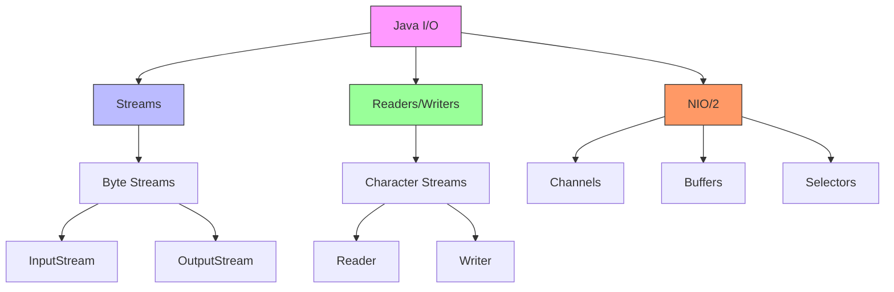
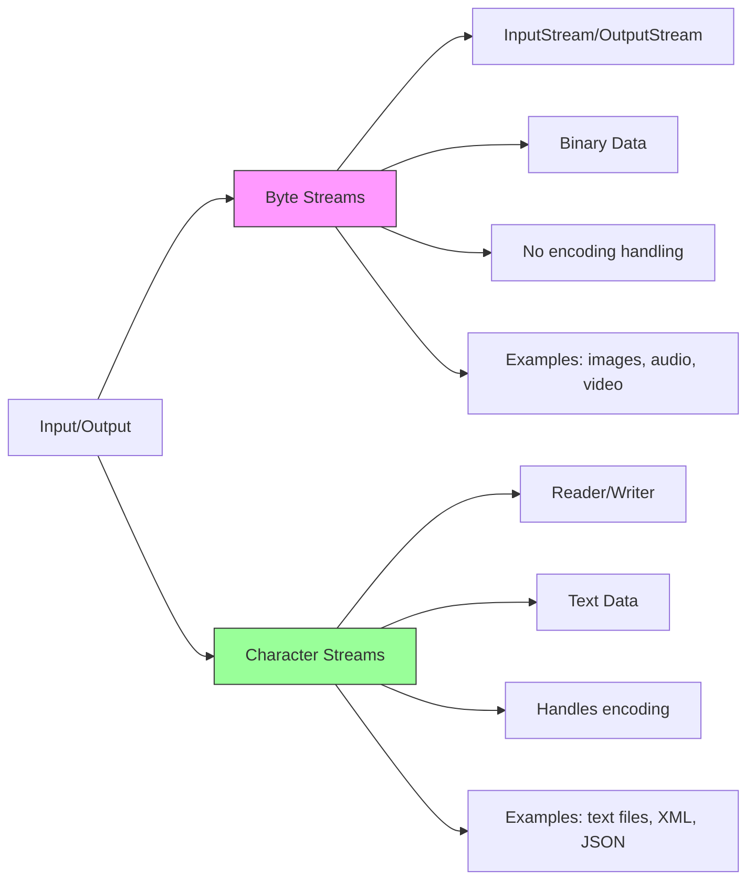
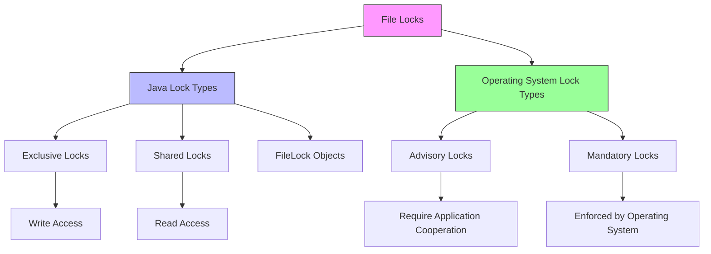
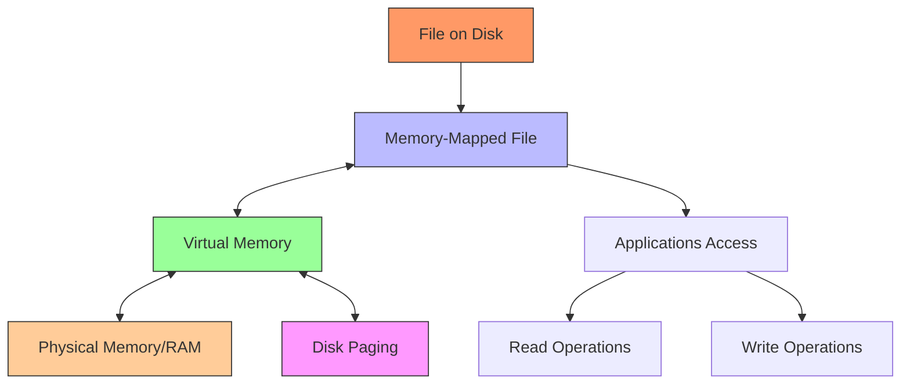
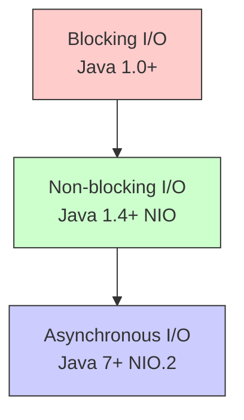
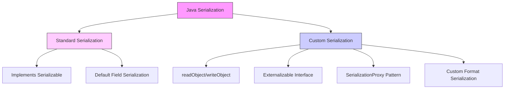

# 📁 Java I/O - Comprehensive Interview Guide

> *"Mastering Java I/O for Technical Interviews"*


This guide provides a thorough understanding of Java I/O concepts, focusing on interview preparation with detailed explanations, visual aids, and practical examples.

## 🔍 Key Features
- **Visual I/O Hierarchy** for better understanding
- **Comparison Tables** for quick reference
- **Common Interview Questions** with detailed answers
- **Practical Code Examples** with explanations
- **Performance Considerations** and **Best Practices**

## 🎯 Java I/O Overview



## Table of Contents
1. [I/O Basics](#q1-what-are-the-java-io-classes-and-interfaces)
2. [Streams vs Readers/Writers](#q2-what-is-the-difference-between-streams-and-readerswriters)
3. [Byte Streams](#q3-what-are-the-byte-stream-classes-in-java)
4. [Character Streams](#q4-what-are-the-character-stream-classes-in-java)
5. [Buffered Streams](#q5-what-are-buffered-streams-and-why-are-they-used)
6. [File Handling](#q6-how-do-you-read-and-write-files-in-java)
7. [Java NIO](#q7-what-is-java-nio-and-how-does-it-differ-from-io)
8. [Path and Files](#q8-what-are-path-and-files-classes-in-java-nio)
9. [Channels and Buffers](#q9-what-are-channels-and-buffers-in-java-nio)
10. [Serialization](#q10-what-is-serialization-in-java)
11. [Externalization](#q11-what-is-externalization-in-java)
12. [Scanner Class](#q12-what-is-the-scanner-class-and-how-is-it-used)
13. [PrintWriter](#q13-what-is-printwriter-and-how-is-it-used)
14. [Random Access Files](#q14-what-are-random-access-files-in-java)
15. [I/O Performance](#q15-what-are-the-best-practices-for-java-io-performance)
16. [NIO.2 File APIs](#q16-how-do-the-nio2-file-apis-improve-upon-the-legacy-file-class)
17. [File Locking](#q17-how-do-you-implement-file-locking-in-java)
18. [Memory-Mapped Files](#q18-what-are-memory-mapped-files-and-when-should-you-use-them)
19. [Asynchronous I/O](#q19-how-do-you-implement-asynchronous-io-in-java)
20. [Custom Serialization](#q20-how-would-you-implement-custom-serialization-in-java)
21. [Working with ZIP/JAR](#q21-how-do-you-work-with-zip-and-jar-files-in-java)
22. [Network I/O](#q22-explain-network-io-in-java-with-nio-channels)
23. [Handling Large Files](#q23-what-techniques-would-you-use-for-processing-very-large-files-in-java)
24. [Debugging I/O Issues](#q24-how-do-you-debug-common-io-performance-issues-in-java-applications)
25. [File Watching](#q25-how-do-you-implement-a-file-watcher-service-in-java)

## 🔥 Common Interview Questions

### Q1: Explain the Java I/O Stream Hierarchy

```mermaid
classDiagram
    class InputStream {
        <<abstract>>
        +read()
        +read(byte[])
        +close()
    }
    
    class OutputStream {
        <<abstract>>
        +write(int)
        +write(byte[])
        +flush()
        +close()
    }
    
    class Reader {
        <<abstract>>
        +read()
        +read(char[])
        +close()
    }
    
    class Writer {
        <<abstract>>
        +write(int)
        +write(char[])
        +write(String)
        +flush()
        +close()
    }
    
    %% Byte Streams
    InputStream <|-- FileInputStream
    InputStream <|-- ByteArrayInputStream
    InputStream <|-- FilterInputStream
    FilterInputStream <|-- BufferedInputStream
    FilterInputStream <|-- DataInputStream
    
    OutputStream <|-- FileOutputStream
    OutputStream <|-- ByteArrayOutputStream
    OutputStream <|-- FilterOutputStream
    FilterOutputStream <|-- BufferedOutputStream
    FilterOutputStream <|-- DataOutputStream
    
    %% Character Streams
    Reader <|-- FileReader
    Reader <|-- StringReader
    Reader <|-- BufferedReader
    Reader <|-- InputStreamReader
    
    Writer <|-- FileWriter
    Writer <|-- StringWriter
    Writer <|-- BufferedWriter
    Writer <|-- OutputStreamWriter
    
    %% NIO
    class Channel {
        <<interface>>
        +isOpen()
        +close()
    }
    
    class Buffer {
        <<abstract>>
        +capacity()
        +position()
        +limit()
        +flip()
        +clear()
        +rewind()
    }
    
    Channel <|.. FileChannel
    Channel <|.. SocketChannel
    Channel <|.. ServerSocketChannel
    Channel <|.. DatagramChannel
    
    Buffer <|-- ByteBuffer
    Buffer <|-- CharBuffer
    Buffer <|-- IntBuffer
    Buffer <|-- LongBuffer
```



Java I/O (Input/Output) provides a comprehensive set of classes and interfaces for handling input and output operations. The Java I/O API is primarily located in the `java.io` and `java.nio` packages and is designed around the concept of streams, which represent a flow of data.

### Key Components of Java I/O:

1. **File Handling**:
   - `File`: Represents a file or directory path
   - `FileDescriptor`: Represents a file descriptor (low-level)

2. **Byte Streams** (for binary data):
   - `InputStream`: Abstract class for reading binary data
   - `OutputStream`: Abstract class for writing binary data
   - Concrete implementations: `FileInputStream`, `FileOutputStream`, `ByteArrayInputStream`, `ByteArrayOutputStream`, etc.

3. **Character Streams** (for text data):
   - `Reader`: Abstract class for reading character data
   - `Writer`: Abstract class for writing character data
   - Concrete implementations: `FileReader`, `FileWriter`, `StringReader`, `StringWriter`, etc.

4. **Buffered Streams** (for improved performance):
   - `BufferedInputStream`, `BufferedOutputStream`
   - `BufferedReader`, `BufferedWriter`

5. **Data Streams** (for primitive data types):
   - `DataInputStream`, `DataOutputStream`

6. **Object Streams** (for serialization):
   - `ObjectInputStream`, `ObjectOutputStream`

7. **Print Streams** (for formatted output):
   - `PrintStream`, `PrintWriter`

8. **Piped Streams** (for thread communication):
   - `PipedInputStream`, `PipedOutputStream`
   - `PipedReader`, `PipedWriter`

**Class Hierarchy**:

```
                   InputStream                    OutputStream
                       |                               |
     +----------------+---+---------------+    +------+------+-------------+
     |                |   |               |    |      |      |             |
FileInputStream ByteArrayIS FilterIS ObjectIS FileOS ByteArrayOS FilterOS ObjectOS
                          |                                   |
                  +------+------+                    +-------+-------+
                  |      |      |                    |       |       |
           BufferedIS DataIS PipedIS           BufferedOS DataOS PipedOS
```

```
                      Reader                         Writer
                        |                               |
     +----------------+-+--+---------------+    +------+------+-------------+
     |                |    |               |    |      |      |             |
FileReader StringReader BufferedReader InputSR FileW StringW BufferedWriter OutputSW
```

**Example of using basic I/O classes**:
```java
import java.io.*;

public class IOBasicsExample {
    public static void main(String[] args) {
        // File handling
        File file = new File("example.txt");
        System.out.println("File exists: " + file.exists());
        
        try {
            // Create a new file
            if (file.createNewFile()) {
                System.out.println("File created: " + file.getName());
            } else {
                System.out.println("File already exists.");
            }
            
            // Write to file using byte stream
            try (FileOutputStream fos = new FileOutputStream(file)) {
                String data = "Hello, Java I/O!";
                fos.write(data.getBytes());
                System.out.println("Data written to file using FileOutputStream");
            }
            
            // Read from file using byte stream
            try (FileInputStream fis = new FileInputStream(file)) {
                byte[] buffer = new byte[1024];
                int bytesRead = fis.read(buffer);
                System.out.println("Data read using FileInputStream: " + 
                                  new String(buffer, 0, bytesRead));
            }
            
            // Write to file using character stream
            try (FileWriter writer = new FileWriter(file)) {
                writer.write("Hello, Java I/O with Writer!");
                System.out.println("Data written to file using FileWriter");
            }
            
            // Read from file using character stream
            try (FileReader reader = new FileReader(file)) {
                char[] buffer = new char[1024];
                int charsRead = reader.read(buffer);
                System.out.println("Data read using FileReader: " + 
                                  new String(buffer, 0, charsRead));
            }
            
            // Using buffered streams for better performance
            try (BufferedWriter writer = new BufferedWriter(new FileWriter(file))) {
                writer.write("Hello, Buffered I/O!");
                System.out.println("Data written using BufferedWriter");
            }
            
            try (BufferedReader reader = new BufferedReader(new FileReader(file))) {
                String line = reader.readLine();
                System.out.println("Data read using BufferedReader: " + line);
            }
            
        } catch (IOException e) {
            System.out.println("An error occurred: " + e.getMessage());
            e.printStackTrace();
        }
    }
}
```

**Key Interfaces in Java I/O**:

1. **Closeable**: Represents an entity that can be closed
2. **Flushable**: Represents an entity that can be flushed
3. **DataInput/DataOutput**: For reading/writing primitive data types
4. **ObjectInput/ObjectOutput**: For reading/writing objects
5. **Serializable**: Marker interface for classes that can be serialized
6. **Externalizable**: Interface for customized serialization

**Evolution of Java I/O**:

1. **Original I/O (java.io)**: Available since JDK 1.0
   - Stream-based, blocking I/O

2. **New I/O (java.nio)**: Introduced in JDK 1.4
   - Channel-based, supports non-blocking I/O
   - Buffer-oriented operations

3. **NIO.2 (java.nio.file)**: Introduced in Java 7
   - Enhanced file system operations
   - Path interface and Files utility class
   - Improved exception handling
   - Symbolic links support
   - File change notification (WatchService)

### Q2: Streams vs Readers/Writers - Key Differences



| Feature | Byte Streams | Character Streams |
|---------|-------------|-------------------|
| **Base Classes** | `InputStream`/`OutputStream` | `Reader`/`Writer` |
| **Data Unit** | Byte (8 bits) | Character (16-bit Unicode) |
| **Encoding** | No encoding handling | Handles character encoding (UTF-8, UTF-16, etc.) |
| **Performance** | Slightly faster | Slightly slower due to encoding |
| **Best For** | Binary data (images, audio, etc.) | Text data (files, network, etc.) |
| **Buffering** | Manual buffering recommended | Built-in buffering available |
| **Common Implementations** | `FileInputStream`, `FileOutputStream` | `FileReader`, `FileWriter` |

### When to Use Which?

1. **Use Byte Streams When**:
   - Working with binary files (images, PDFs, executables)
   - Need maximum performance and don't need character conversion
   - Working with legacy code or protocols that use raw bytes

2. **Use Character Streams When**:
   - Working with text data (configuration files, logs, etc.)
   - Need proper handling of character encodings
   - Working with internationalized text
   - Want automatic conversion between bytes and characters

### Bridging Between Streams and Readers/Writers

Java provides bridge classes to convert between byte streams and character streams:

```java
// Convert InputStream to Reader with specific encoding
InputStream inputStream = new FileInputStream("file.txt");
Reader reader = new InputStreamReader(inputStream, StandardCharsets.UTF_8);

// Convert OutputStream to Writer with specific encoding
OutputStream outputStream = new FileOutputStream("output.txt");
Writer writer = new OutputStreamWriter(outputStream, StandardCharsets.UTF_8);

// Using try-with-resources for automatic resource management
try (Reader r = new InputStreamReader(
        new FileInputStream("input.txt"), StandardCharsets.UTF_8)) {
    // Read from the reader
}
```

### Common Pitfalls

1. **Resource Leaks**:
   ```java
   // Bad - may leak resources if an exception occurs
   FileInputStream fis = new FileInputStream("file.txt");
   // ... use fis ...
   fis.close();
   
   // Good - uses try-with-resources
   try (FileInputStream fis = new FileInputStream("file.txt")) {
       // ... use fis ...
   }
   ```

2. **Character Encoding Issues**:
   ```java
   // Bad - uses platform default encoding
   new FileReader("file.txt");
   
   // Good - specifies encoding explicitly
   new InputStreamReader(new FileInputStream("file.txt"), StandardCharsets.UTF_8);
   ```

3. **Inefficient Reading**:
   ```java
   // Bad - reads one byte/char at a time
   int data;
   while ((data = inputStream.read()) != -1) {
       // Process data
   }
   
   // Good - uses buffer for better performance
   byte[] buffer = new byte[8192];
   int bytesRead;
   while ((bytesRead = inputStream.read(buffer)) != -1) {
       // Process buffer
   }
   ```

### Performance Considerations

1. **Buffering**: Always use buffered streams for better performance, especially with small, frequent reads/writes.
   ```java
   // Without buffering
   try (FileInputStream fis = new FileInputStream("largefile.dat")) {
       // Slow for many small reads
   }
   
   // With buffering
   try (BufferedInputStream bis = new BufferedInputStream(
           new FileInputStream("largefile.dat"))) {
       // Much faster for multiple reads
   }
   ```

2. **Direct vs. Non-direct Buffers (NIO)**:
   - **Direct buffers**: Allocated outside the JVM heap (faster for I/O operations)
   - **Non-direct buffers**: Allocated in the JVM heap (easier to manage)
   
   ```java
   // Direct ByteBuffer (faster for I/O)
   ByteBuffer directBuffer = ByteBuffer.allocateDirect(1024);
   
   // Non-direct ByteBuffer
   ByteBuffer heapBuffer = ByteBuffer.allocate(1024);
   ```

3. **Memory-mapped Files**: For very large files, consider using memory-mapped I/O:
   ```java
   try (RandomAccessFile file = new RandomAccessFile("hugefile.dat", "r");
        FileChannel channel = file.getChannel()) {
       
       MappedByteBuffer buffer = channel.map(
           FileChannel.MapMode.READ_ONLY, 0, channel.size());
       
       // Access file content through the buffer
       while (buffer.hasRemaining()) {
           byte b = buffer.get();
           // Process byte
       }
   }
   ```

### Common Interview Questions

1. **Q: What is the difference between `FileInputStream` and `FileReader`?**
   - `FileInputStream` reads bytes, while `FileReader` reads characters
   - `FileReader` handles character encoding, `FileInputStream` does not
   - Use `FileInputStream` for binary files, `FileReader` for text files

2. **Q: How do you handle character encodings in Java I/O?**
   - Always specify the character encoding explicitly
   - Use `StandardCharsets` class for standard encodings
   - Example: `new String(bytes, StandardCharsets.UTF_8)`

3. **Q: What is the purpose of the `flush()` method?**
   - Forces any buffered output to be written
   - Important for output streams with buffering
   - Automatically called by `close()`

4. **Q: How does NIO differ from traditional I/O?**
   - NIO uses channels and buffers instead of streams
   - Supports non-blocking I/O
   - Provides memory-mapped files
   - Better performance for large files

5. **Q: What is the purpose of the `transient` keyword?**
   - Marks fields that should not be serialized
   - Useful for sensitive data or derived fields
   - Example: `private transient String password;`

### Best Practices

1. **Always close resources**: Use try-with-resources to ensure proper resource cleanup
2. **Specify character encodings**: Never rely on platform default encodings
3. **Use buffering**: For better performance with small, frequent I/O operations
4. **Handle exceptions properly**: Catch specific exceptions and provide meaningful error messages
5. **Use NIO.2 for new code**: Prefer `java.nio.file` over `java.io.File` for new development
6. **Be careful with stream chaining**: Close the outermost stream only
7. **Use appropriate buffer sizes**: 8KB is often a good default
8. **Consider memory usage**: Be cautious with large byte arrays in memory

### Java I/O vs NIO.2

| Feature | Traditional I/O | NIO.2 |
|---------|----------------|-------|
| API Type | Stream-oriented | Channel and Buffer oriented |
| Blocking | Blocking I/O | Supports non-blocking I/O |
| Performance | Good for small files | Better for large files |
| File Operations | Basic operations | Advanced operations (copy, move, etc.) |
| Directory Watching | Not available | Available via WatchService |
| Symbolic Links | Limited support | Full support |
| File Attributes | Basic | Comprehensive attribute support |
| Memory Mapping | Not available | Available via FileChannel.map() |


### Example: Copying Files Using Different Approaches

1. **Using Traditional I/O**:
   ```java
   try (InputStream in = new FileInputStream("source.txt");
        OutputStream out = new FileOutputStream("target.txt")) {
       byte[] buffer = new byte[8192];
       int bytesRead;
       while ((bytesRead = in.read(buffer)) != -1) {
           out.write(buffer, 0, bytesRead);
       }
   }
   ```

2. **Using NIO.2 (Java 7+)**:
   ```java
   Files.copy(Paths.get("source.txt"), Paths.get("target.txt"),
             StandardCopyOption.REPLACE_EXISTING);
   ```

3. **Using Memory-Mapped I/O**:
   ```java
   try (FileChannel inChannel = FileChannel.open(Paths.get("source.txt"), 
                                              StandardOpenOption.READ);
        FileChannel outChannel = FileChannel.open(Paths.get("target.txt"),
                                               StandardOpenOption.CREATE, 
                                               StandardOpenOption.WRITE)) {
       
       MappedByteBuffer buffer = inChannel.map(
           FileChannel.MapMode.READ_ONLY, 0, inChannel.size());
       outChannel.write(buffer);
   }
   ```

### Conclusion

Understanding Java I/O is crucial for building efficient and reliable applications. By choosing the right I/O classes and following best practices, you can ensure that your application performs well and handles I/O operations correctly. Always consider the specific requirements of your use case when selecting between different I/O approaches.

In Java I/O, streams and readers/writers are two parallel hierarchies designed for handling different types of data. Understanding their differences is crucial for choosing the right classes for your I/O operations.

**Key Differences**:

1. **Data Type**:
   - **Streams** (`InputStream`/`OutputStream`): Work with binary data (bytes)
   - **Readers/Writers** (`Reader`/`Writer`): Work with character data (text)

2. **Character Encoding**:
   - **Streams**: Don't handle character encoding; they work with raw bytes
   - **Readers/Writers**: Handle character encoding, converting between bytes and characters

3. **Use Cases**:
   - **Streams**: Ideal for binary files (images, audio, video, etc.) or when working with raw data
   - **Readers/Writers**: Ideal for text files or when working with character data

4. **Methods**:
   - **Streams**: Use `read()`/`write()` methods that work with bytes or byte arrays
   - **Readers/Writers**: Use `read()`/`write()` methods that work with characters, character arrays, or strings

**Comparison Table**:

| Feature | Byte Streams | Character Streams |
|---------|-------------|-------------------|
| Base Classes | InputStream/OutputStream | Reader/Writer |
| Data Unit | Byte (8 bits) | Character (16 bits in Java) |
| Encoding Awareness | No | Yes |
| Best For | Binary data | Text data |
| Buffer Size | Typically byte-based | Typically character-based |
| Example Classes | FileInputStream, FileOutputStream | FileReader, FileWriter |

**Bridging Between Streams and Readers/Writers**:

Java provides bridge classes to convert between byte streams and character streams:

1. **InputStreamReader**: Converts an `InputStream` to a `Reader`
   - Allows you to read characters from a byte stream
   - Takes an encoding parameter to specify how bytes are converted to characters

2. **OutputStreamWriter**: Converts an `OutputStream` to a `Writer`
   - Allows you to write characters to a byte stream
   - Takes an encoding parameter to specify how characters are converted to bytes

**Example demonstrating the differences**:
```java
import java.io.*;
import java.nio.charset.StandardCharsets;

public class StreamsVsReadersWritersExample {
    public static void main(String[] args) {
        String text = "Hello, 世界!";  // Text with non-ASCII characters
        File binaryFile = new File("binary.dat");
        File textFile = new File("text.txt");
        
        try {
            // Writing binary data using streams
            try (FileOutputStream fos = new FileOutputStream(binaryFile)) {
                // Writing raw bytes without encoding awareness
                byte[] bytes = text.getBytes(StandardCharsets.UTF_8);
                fos.write(bytes);
                System.out.println("Binary data written using OutputStream");
            }
            
            // Reading binary data using streams
            try (FileInputStream fis = new FileInputStream(binaryFile)) {
                byte[] bytes = new byte[100];
                int bytesRead = fis.read(bytes);
                // Need to specify encoding when converting bytes to String
                String result = new String(bytes, 0, bytesRead, StandardCharsets.UTF_8);
                System.out.println("Binary data read using InputStream: " + result);
            }
            
            // Writing text data using writers
            try (FileWriter writer = new FileWriter(textFile)) {
                // Character encoding is handled automatically (using default platform encoding)
                writer.write(text);
                System.out.println("Text data written using Writer");
            }
            
            // Reading text data using readers
            try (FileReader reader = new FileReader(textFile)) {
                char[] chars = new char[100];
                int charsRead = reader.read(chars);
                String result = new String(chars, 0, charsRead);
                System.out.println("Text data read using Reader: " + result);
            }
            
            // Using bridge classes with explicit encoding
            try (OutputStreamWriter writer = new OutputStreamWriter(
                    new FileOutputStream(textFile), StandardCharsets.UTF_8)) {
                writer.write(text);
                System.out.println("Text data written using OutputStreamWriter with UTF-8");
            }
            
            try (InputStreamReader reader = new InputStreamReader(
                    new FileInputStream(textFile), StandardCharsets.UTF_8)) {
                char[] chars = new char[100];
                int charsRead = reader.read(chars);
                String result = new String(chars, 0, charsRead);
                System.out.println("Text data read using InputStreamReader with UTF-8: " + result);
            }
            
        } catch (IOException e) {
            System.out.println("An error occurred: " + e.getMessage());
            e.printStackTrace();
        }
    }
}
```

**When to use which**:

1. **Use Byte Streams (InputStream/OutputStream) when**:
   - Working with binary files (images, audio, video, etc.)
   - Performing byte-by-byte processing
   - Implementing network protocols
   - Exact byte representation matters

2. **Use Character Streams (Reader/Writer) when**:
   - Working with text files
   - Processing character data
   - Handling internationalized text
   - Character encoding is important

3. **Use Bridge Classes when**:
   - You need to convert between byte and character streams
   - You need to specify a non-default character encoding
   - You're working with both binary and text data

**Best Practices**:

1. **Always specify the character encoding** when using bridge classes to avoid platform-dependent behavior
2. **Use character streams for text files** to handle encoding properly
3. **Use byte streams for binary files** to avoid unintended character conversion
4. **Close streams and readers/writers** in a finally block or using try-with-resources
5. **Use buffered versions** for better performance

### Q3: What are the byte stream classes in Java?

Byte streams in Java are used for handling binary data, where the fundamental unit of data is a byte (8 bits). These streams are part of the `java.io` package and are organized in a class hierarchy with `InputStream` and `OutputStream` as the abstract base classes.

**InputStream Hierarchy**:

1. **InputStream** (Abstract base class)
   - **FileInputStream**: Reads bytes from a file
   - **ByteArrayInputStream**: Reads bytes from a byte array
   - **PipedInputStream**: Reads bytes from a piped output stream
   - **FilterInputStream**: Base class for filtered input streams
     - **BufferedInputStream**: Adds buffering for improved performance
     - **DataInputStream**: Reads primitive Java data types
     - **PushbackInputStream**: Allows bytes to be "unread"
   - **ObjectInputStream**: Deserializes objects
   - **SequenceInputStream**: Concatenates multiple input streams
   - **AudioInputStream**: Reads audio data (in `javax.sound.sampled`)

**OutputStream Hierarchy**:

1. **OutputStream** (Abstract base class)
   - **FileOutputStream**: Writes bytes to a file
   - **ByteArrayOutputStream**: Writes bytes to a byte array
   - **PipedOutputStream**: Writes bytes to a piped input stream
   - **FilterOutputStream**: Base class for filtered output streams
     - **BufferedOutputStream**: Adds buffering for improved performance
     - **DataOutputStream**: Writes primitive Java data types
     - **PrintStream**: Writes formatted representations of objects
   - **ObjectOutputStream**: Serializes objects

**Key Methods in InputStream**:

- `int read()`: Reads a single byte
- `int read(byte[] b)`: Reads bytes into an array
- `int read(byte[] b, int off, int len)`: Reads bytes into a portion of an array
- `long skip(long n)`: Skips over and discards n bytes
- `int available()`: Returns an estimate of available bytes
- `void close()`: Closes the stream
- `void mark(int readlimit)`: Marks the current position (if supported)
- `void reset()`: Resets to the marked position (if supported)
- `boolean markSupported()`: Checks if mark/reset is supported

**Key Methods in OutputStream**:

- `void write(int b)`: Writes a single byte
- `void write(byte[] b)`: Writes an array of bytes
- `void write(byte[] b, int off, int len)`: Writes a portion of an array of bytes
- `void flush()`: Flushes the stream
- `void close()`: Closes the stream

**Examples of using byte streams**:

1. **File I/O with FileInputStream and FileOutputStream**:
```java
import java.io.*;

public class FileByteStreamExample {
    public static void main(String[] args) {
        File sourceFile = new File("source.jpg");
        File targetFile = new File("target.jpg");
        
        try (FileInputStream fis = new FileInputStream(sourceFile);
             FileOutputStream fos = new FileOutputStream(targetFile)) {
            
            byte[] buffer = new byte[8192];  // 8KB buffer
            int bytesRead;
            
            // Read from source and write to target
            while ((bytesRead = fis.read(buffer)) != -1) {
                fos.write(buffer, 0, bytesRead);
            }
            
            System.out.println("File copied successfully");
            
        } catch (IOException e) {
            System.out.println("Error: " + e.getMessage());
            e.printStackTrace();
        }
    }
}
```

2. **Memory I/O with ByteArrayInputStream and ByteArrayOutputStream**:
```java
import java.io.*;

public class ByteArrayStreamExample {
    public static void main(String[] args) {
        try {
            // Create a ByteArrayOutputStream
            ByteArrayOutputStream baos = new ByteArrayOutputStream();
            
            // Write data to the byte array
            for (int i = 0; i < 10; i++) {
                baos.write(i);
            }
            
            // Get the byte array
            byte[] byteArray = baos.toByteArray();
            System.out.println("ByteArrayOutputStream size: " + byteArray.length);
            
            // Create a ByteArrayInputStream from the byte array
            ByteArrayInputStream bais = new ByteArrayInputStream(byteArray);
            
            // Read and display the data
            System.out.print("Data read: ");
            int data;
            while ((data = bais.read()) != -1) {
                System.out.print(data + " ");
            }
            
            // Close the streams
            bais.close();
            baos.close();
            
        } catch (IOException e) {
            System.out.println("Error: " + e.getMessage());
            e.printStackTrace();
        }
    }
}
```

3. **Data I/O with DataInputStream and DataOutputStream**:
```java
import java.io.*;

public class DataStreamExample {
    public static void main(String[] args) {
        File file = new File("data.bin");
        
        try {
            // Write primitive data types
            try (DataOutputStream dos = new DataOutputStream(
                    new FileOutputStream(file))) {
                
                dos.writeInt(42);
                dos.writeDouble(3.14159);
                dos.writeBoolean(true);
                dos.writeUTF("Hello, DataOutputStream!");
                
                System.out.println("Data written successfully");
            }
            
            // Read primitive data types
            try (DataInputStream dis = new DataInputStream(
                    new FileInputStream(file))) {
                
                int intValue = dis.readInt();
                double doubleValue = dis.readDouble();
                boolean booleanValue = dis.readBoolean();
                String stringValue = dis.readUTF();
                
                System.out.println("Read values:");
                System.out.println("Int: " + intValue);
                System.out.println("Double: " + doubleValue);
                System.out.println("Boolean: " + booleanValue);
                System.out.println("String: " + stringValue);
            }
            
        } catch (IOException e) {
            System.out.println("Error: " + e.getMessage());
            e.printStackTrace();
        }
    }
}
```

4. **Buffered I/O with BufferedInputStream and BufferedOutputStream**:
```java
import java.io.*;

public class BufferedByteStreamExample {
    public static void main(String[] args) {
        File sourceFile = new File("source.dat");
        File targetFile = new File("target.dat");
        
        // Create a large test file
        try (BufferedOutputStream bos = new BufferedOutputStream(
                new FileOutputStream(sourceFile))) {
            
            for (int i = 0; i < 100000; i++) {
                bos.write(i % 256);
            }
            System.out.println("Test file created");
        } catch (IOException e) {
            e.printStackTrace();
        }
        
        // Compare performance: with and without buffering
        long startTime, endTime;
        
        // Without buffering
        startTime = System.currentTimeMillis();
        try (FileInputStream fis = new FileInputStream(sourceFile);
             FileOutputStream fos = new FileOutputStream(targetFile)) {
            
            int data;
            while ((data = fis.read()) != -1) {
                fos.write(data);
            }
        } catch (IOException e) {
            e.printStackTrace();
        }
        endTime = System.currentTimeMillis();
        System.out.println("Without buffering: " + (endTime - startTime) + "ms");
        
        // With buffering
        startTime = System.currentTimeMillis();
        try (BufferedInputStream bis = new BufferedInputStream(
                new FileInputStream(sourceFile));
             BufferedOutputStream bos = new BufferedOutputStream(
                new FileOutputStream(targetFile))) {
            
            int data;
            while ((data = bis.read()) != -1) {
                bos.write(data);
            }
        } catch (IOException e) {
            e.printStackTrace();
        }
        endTime = System.currentTimeMillis();
        System.out.println("With buffering: " + (endTime - startTime) + "ms");
    }
}
```

**When to use which byte stream class**:

1. **FileInputStream/FileOutputStream**:
   - When reading from or writing to files
   - Basic file I/O operations

2. **ByteArrayInputStream/ByteArrayOutputStream**:
   - When working with byte arrays in memory
   - Useful for testing or when you need to manipulate data before writing to a file

3. **BufferedInputStream/BufferedOutputStream**:
   - When you need to improve I/O performance
   - Reduces the number of actual I/O operations by buffering data

4. **DataInputStream/DataOutputStream**:
   - When you need to read or write Java primitive types
   - Useful for binary data formats

5. **ObjectInputStream/ObjectOutputStream**:
   - When you need to serialize and deserialize Java objects
   - Used for object persistence or network transmission

6. **PipedInputStream/PipedOutputStream**:
   - For communication between threads
   - One thread writes to PipedOutputStream, another reads from connected PipedInputStream

**Best Practices**:

1. **Always close streams** in a finally block or using try-with-resources
2. **Use buffered streams** for better performance
3. **Use appropriate buffer sizes** (typically 8KB or larger)
4. **Avoid reading or writing single bytes** when working with large amounts of data
5. **Handle exceptions properly**
6. **Flush output streams** when necessary to ensure all data is written

### Q4: What are the character stream classes in Java?

Character streams in Java are designed for handling text data, where the fundamental unit is a character (16 bits in Java) rather than a byte. These streams automatically handle the conversion between characters and bytes using character encodings. Character streams are part of the `java.io` package and are organized in a class hierarchy with `Reader` and `Writer` as the abstract base classes.

**Reader Hierarchy**:

1. **Reader** (Abstract base class)
   - **InputStreamReader**: Bridges between byte streams and character streams
     - **FileReader**: Reads characters from a file
   - **BufferedReader**: Adds buffering for improved performance
   - **CharArrayReader**: Reads from a character array
   - **StringReader**: Reads from a string
   - **PipedReader**: Reads from a piped writer
   - **FilterReader**: Base class for filtered readers
     - **PushbackReader**: Allows characters to be "unread"

**Writer Hierarchy**:

1. **Writer** (Abstract base class)
   - **OutputStreamWriter**: Bridges between byte streams and character streams
     - **FileWriter**: Writes characters to a file
   - **BufferedWriter**: Adds buffering for improved performance
   - **CharArrayWriter**: Writes to a character array
   - **StringWriter**: Writes to a string
   - **PipedWriter**: Writes to a piped reader
   - **FilterWriter**: Base class for filtered writers
   - **PrintWriter**: Writes formatted representations of objects

**Key Methods in Reader**:

- `int read()`: Reads a single character
- `int read(char[] cbuf)`: Reads characters into an array
- `int read(char[] cbuf, int off, int len)`: Reads characters into a portion of an array
- `long skip(long n)`: Skips characters
- `boolean ready()`: Tells whether this stream is ready to be read
- `void close()`: Closes the stream
- `void mark(int readAheadLimit)`: Marks the present position (if supported)
- `void reset()`: Resets to the marked position (if supported)
- `boolean markSupported()`: Tells whether this stream supports mark/reset

**Key Methods in Writer**:

- `void write(int c)`: Writes a single character
- `void write(char[] cbuf)`: Writes an array of characters
- `void write(char[] cbuf, int off, int len)`: Writes a portion of an array of characters
- `void write(String str)`: Writes a string
- `void write(String str, int off, int len)`: Writes a portion of a string
- `Writer append(CharSequence csq)`: Appends a character sequence
- `void flush()`: Flushes the stream
- `void close()`: Closes the stream

**Examples of using character streams**:

1. **File I/O with FileReader and FileWriter**:
```java
import java.io.*;

public class FileCharacterStreamExample {
    public static void main(String[] args) {
        File sourceFile = new File("source.txt");
        File targetFile = new File("target.txt");
        
        // Create a test file
        try (FileWriter writer = new FileWriter(sourceFile)) {
            writer.write("This is a test file.\n");
            writer.write("It contains text data.\n");
            writer.write("Character streams are used for text I/O.");
            System.out.println("Test file created");
        } catch (IOException e) {
            e.printStackTrace();
        }
        
        // Copy the file using character streams
        try (FileReader reader = new FileReader(sourceFile);
             FileWriter writer = new FileWriter(targetFile)) {
            
            char[] buffer = new char[1024];
            int charsRead;
            
            while ((charsRead = reader.read(buffer)) != -1) {
                writer.write(buffer, 0, charsRead);
            }
            
            System.out.println("File copied successfully");
            
        } catch (IOException e) {
            System.out.println("Error: " + e.getMessage());
            e.printStackTrace();
        }
    }
}
```

2. **Buffered I/O with BufferedReader and BufferedWriter**:
```java
import java.io.*;

public class BufferedCharacterStreamExample {
    public static void main(String[] args) {
        File sourceFile = new File("source.txt");
        File targetFile = new File("target.txt");
        
        // Create a test file
        try (BufferedWriter writer = new BufferedWriter(new FileWriter(sourceFile))) {
            for (int i = 0; i < 1000; i++) {
                writer.write("Line " + i + ": This is a test line.\n");
            }
            System.out.println("Test file created");
        } catch (IOException e) {
            e.printStackTrace();
        }
        
        // Read the file line by line using BufferedReader
        try (BufferedReader reader = new BufferedReader(new FileReader(sourceFile));
             BufferedWriter writer = new BufferedWriter(new FileWriter(targetFile))) {
            
            String line;
            while ((line = reader.readLine()) != null) {
                writer.write(line);
                writer.newLine();  // Add a line separator
            }
            
            System.out.println("File copied successfully");
            
        } catch (IOException e) {
            System.out.println("Error: " + e.getMessage());
            e.printStackTrace();
        }
    }
}
```

3. **Memory I/O with StringReader and StringWriter**:
```java
import java.io.*;

public class StringReaderWriterExample {
    public static void main(String[] args) {
        try {
            // Create a StringWriter
            StringWriter writer = new StringWriter();
            
            // Write data to the string
            writer.write("Hello, ");
            writer.write("StringWriter!");
            
            // Get the string
            String result = writer.toString();
            System.out.println("StringWriter result: " + result);
            
            // Create a StringReader from the string
            StringReader reader = new StringReader(result);
            
            // Read and display the data
            int character;
            System.out.print("Characters read: ");
            while ((character = reader.read()) != -1) {
                System.out.print((char) character);
            }
            System.out.println();
            
            // Close the streams
            reader.close();
            writer.close();
            
        } catch (IOException e) {
            System.out.println("Error: " + e.getMessage());
            e.printStackTrace();
        }
    }
}
```

4. **Using InputStreamReader and OutputStreamWriter with explicit encoding**:
```java
import java.io.*;
import java.nio.charset.StandardCharsets;

public class StreamReaderWriterExample {
    public static void main(String[] args) {
        File file = new File("encoded.txt");
        String text = "This text contains special characters: é, ñ, ß, 漢字";
        
        try {
            // Write text with UTF-8 encoding
            try (OutputStreamWriter writer = new OutputStreamWriter(
                    new FileOutputStream(file), StandardCharsets.UTF_8)) {
                
                writer.write(text);
                System.out.println("Text written with UTF-8 encoding");
            }
            
            // Read text with UTF-8 encoding
            try (InputStreamReader reader = new InputStreamReader(
                    new FileInputStream(file), StandardCharsets.UTF_8)) {
                
                char[] buffer = new char[1024];
                int length;
                while ((length = reader.read(buffer)) != -1) {
                    String readText = new String(buffer, 0, length);
                    System.out.println("Read text: " + readText);
                }
            }
            
        } catch (IOException e) {
            e.printStackTrace();
        }
    }
}
```

## Advanced I/O Topics for Experienced Developers

### Q16: How do the NIO.2 File APIs improve upon the legacy File class?

Java NIO.2, introduced in Java 7, provides a significant improvement over the legacy `java.io.File` class through the `java.nio.file` package. This question tests your understanding of modern file handling capabilities in Java.

**Legacy File Class Limitations**:

1. **Limited Error Information**: The legacy File class methods return boolean values instead of exceptions with detailed information
2. **No Support for Symbolic Links**: Cannot distinguish symbolic links from regular files
3. **Limited Metadata Access**: Can't access file attributes like owner, permissions, etc.
4. **No Directory Watching**: No built-in capability to watch for file system changes
5. **No File System API**: No generalized API for working with different file systems
6. **No Standardized Copy/Move Operations**: No built-in methods for reliable copy/move operations

**NIO.2 File API Improvements**:

```mermaid
graph TB
    A[NIO.2 File APIs] --> B[Path Interface]
    A --> C[Files Utility Class]
    A --> D[FileSystem API]
    A --> E[WatchService]
    A --> F[Attribute Views]
    
    B --> B1[Represents file paths]
    B --> B2[Path manipulation]
    B --> B3[Platform independence]
    
    C --> C1[File operations]
    C --> C2[File attributes]
    C --> C3[Directory operations]
    
    D --> D1[File system access]
    D --> D2[Multiple file systems]
    
    E --> E1[Directory monitoring]
    E --> E2[Event handling]
    
    F --> F1[Basic attributes]
    F --> F2[POSIX attributes]
    F --> F3[File owner attributes]
    F --> F4[ACL attributes]
    
    style A fill:#f9f,stroke:#333
    style B fill:#bbf,stroke:#333
    style C fill:#9f9,stroke:#333
    style D fill:#f96,stroke:#333
    style E fill:#9cf,stroke:#333
    style F fill:#fc9,stroke:#333
```



**Key Classes in NIO.2**:

1. **Path**: Represents a file system path (similar to File)
2. **Files**: Utility class with static methods for file operations
3. **FileSystem/FileSystems**: Access to file systems
4. **WatchService**: Service for watching file system changes
5. **StandardCopyOption**: Options for copy operations
6. **StandardOpenOption**: Options for file opening

**Practical Examples**:

1. **Creating and Manipulating Paths**:

```java
// Legacy approach with File
File file = new File("data/config.txt");
File parent = file.getParentFile();
String name = file.getName();

// NIO.2 approach with Path
Path path = Paths.get("data", "config.txt");
Path parent = path.getParent();
Path fileName = path.getFileName();
Path absolute = path.toAbsolutePath();
Path normalized = path.normalize(); // Resolves . and ..

// Path manipulation
Path base = Paths.get("/home/user");
Path relative = Paths.get("documents/report.pdf");
Path resolved = base.resolve(relative); // /home/user/documents/report.pdf
```

2. **File Operations with Better Error Handling**:

```java
// Legacy approach with File - limited error information
File source = new File("source.txt");
File target = new File("target.txt");
boolean success = source.renameTo(target); // Just returns true/false

// NIO.2 approach with detailed exceptions
try {
    Path source = Paths.get("source.txt");
    Path target = Paths.get("target.txt");
    Files.move(source, target, StandardCopyOption.REPLACE_EXISTING);
} catch (NoSuchFileException e) {
    System.err.println("Source file does not exist: " + e.getFile());
} catch (DirectoryNotEmptyException e) {
    System.err.println("Target directory is not empty: " + e.getFile());
} catch (IOException e) {
    e.printStackTrace();
}
```

3. **File Attributes and Metadata**:

```java
// Legacy approach - limited metadata access
File file = new File("document.txt");
boolean canRead = file.canRead();
boolean isDirectory = file.isDirectory();
long lastModified = file.lastModified();

// NIO.2 approach - rich metadata access
Path path = Paths.get("document.txt");

// Basic file attributes
BasicFileAttributes attrs = Files.readAttributes(path, BasicFileAttributes.class);
FileTime creationTime = attrs.creationTime();
FileTime lastModified = attrs.lastModifiedTime();
FileTime lastAccess = attrs.lastAccessTime();
boolean isDirectory = attrs.isDirectory();
boolean isRegularFile = attrs.isRegularFile();
boolean isSymbolicLink = attrs.isSymbolicLink();
long size = attrs.size();

// POSIX file attributes (on supporting platforms)
PosixFileAttributes posixAttrs = Files.readAttributes(path, PosixFileAttributes.class);
PosixFilePermissions perms = PosixFilePermissions.fromString("rwxr-x---");
Files.setPosixFilePermissions(path, perms);

// File owner
UserPrincipal owner = Files.getOwner(path);
UserPrincipalLookupService lookupService = FileSystems.getDefault().getUserPrincipalLookupService();
UserPrincipal newOwner = lookupService.lookupPrincipalByName("john");
Files.setOwner(path, newOwner);
```

4. **Directory Operations**:

```java
// Legacy approach
File dir = new File("/home/user");
File[] files = dir.listFiles();

// NIO.2 approach - more flexible
Path dir = Paths.get("/home/user");

// Simple directory listing
DirectoryStream<Path> stream = Files.newDirectoryStream(dir);
for (Path entry : stream) {
    System.out.println(entry.getFileName());
}

// Filtered directory listing
DirectoryStream<Path> filtered = Files.newDirectoryStream(dir, "*.{java,class}");

// Recursive directory traversal
Files.walkFileTree(dir, new SimpleFileVisitor<Path>() {
    @Override
    public FileVisitResult visitFile(Path file, BasicFileAttributes attrs) {
        System.out.println("File: " + file);
        return FileVisitResult.CONTINUE;
    }
    
    @Override
    public FileVisitResult visitFileFailed(Path file, IOException exc) {
        System.err.println("Failed to access: " + file);
        return FileVisitResult.CONTINUE;
    }
});
```

5. **Directory Watching**:

```java
Path dir = Paths.get("/home/user/watched");
WatchService watchService = FileSystems.getDefault().newWatchService();

// Register events to watch for
dir.register(watchService, 
    StandardWatchEventKinds.ENTRY_CREATE,
    StandardWatchEventKinds.ENTRY_DELETE,
    StandardWatchEventKinds.ENTRY_MODIFY);

// Event processing loop
while (true) {
    WatchKey key = watchService.take(); // Blocks until events occur
    
    for (WatchEvent<?> event : key.pollEvents()) {
        WatchEvent.Kind<?> kind = event.kind();
        Path name = (Path) event.context();
        Path child = dir.resolve(name);
        
        System.out.println(kind.name() + ": " + child);
    }
    
    boolean valid = key.reset();
    if (!valid) break; // Directory no longer accessible
}
```

**Real-World Scenario**:

You're building a document management system that needs to handle files across multiple storage systems (local disk, network drives, cloud storage). The application needs to track changes to documents, ensure atomic operations, and provide detailed error messages.

```java
public class DocumentManager {
    
    public void saveDocument(Document doc, Path location) throws IOException {
        // Create temporary path for atomic write
        Path temp = Files.createTempFile(location.getParent(), "tmp_", ".tmp");
        
        // Write content to temporary file
        try (BufferedWriter writer = Files.newBufferedWriter(temp, StandardCharsets.UTF_8)) {
            writer.write(doc.getContent());
        }
        
        // Set document metadata
        Files.setAttribute(temp, "creationTime", FileTime.fromMillis(doc.getCreationTime()));
        
        // Move atomically to final location, overwriting if exists
        Files.move(temp, location, StandardCopyOption.REPLACE_EXISTING, 
                            StandardCopyOption.ATOMIC_MOVE);
        
        System.out.println("Document saved successfully to " + location);
    }
    
    public void watchDocumentFolder(Path folder) throws IOException {
        WatchService watcher = FileSystems.getDefault().newWatchService();
        folder.register(watcher, StandardWatchEventKinds.ENTRY_MODIFY);
        
        System.out.println("Watching for changes in " + folder);
        
        new Thread(() -> {
            try {
                while (true) {
                    WatchKey key = watcher.take();
                    for (WatchEvent<?> event : key.pollEvents()) {
                        Path changed = folder.resolve((Path) event.context());
                        System.out.println("Document changed: " + changed);
                        notifySubscribers(changed);
                    }
                    key.reset();
                }
            } catch (InterruptedException e) {
                Thread.currentThread().interrupt();
            }
        }, "document-watcher").start();
    }
    
    private void notifySubscribers(Path changedDocument) {
        // Notify subscribers about document changes
    }
}
```

**Best Practices with NIO.2**:

1. **Use Path instead of File** for new code
2. **Use Files utility methods** for file operations
3. **Always check for specific exceptions** to provide better error handling
4. **Use try-with-resources** for closing streams and channels
5. **Leverage file attributes** for rich metadata handling
6. **Use StandardOpenOption and StandardCopyOption** for fine-grained control

### Q17: How do you implement file locking in Java?

File locking is essential in multi-process or multi-thread environments to prevent data corruption when multiple processes or threads try to access the same file simultaneously. Java provides mechanisms for both exclusive and shared locks.

**Types of File Locks**:



1. **Exclusive Lock**: Prevents others from reading or writing to the file
2. **Shared Lock**: Allows others to read but not write to the file
3. **Advisory Lock**: Requires cooperation between applications (most common in Java)
4. **Mandatory Lock**: Enforced by the operating system (less common, OS-dependent)

**Implementing File Locking in Java**:

```java
import java.io.*;
import java.nio.channels.*;
import java.nio.file.*;

public class FileLockExample {
    
    public static void main(String[] args) {
        Path path = Paths.get("shared-data.txt");
        
        // First process/thread - exclusive lock
        new Thread(() -> {
            try (FileChannel channel = FileChannel.open(path, 
                    StandardOpenOption.CREATE, StandardOpenOption.WRITE, StandardOpenOption.READ)) {
                
                // Try to acquire exclusive lock
                System.out.println("Process 1: Trying to acquire exclusive lock...");
                FileLock lock = channel.lock();
                try {
                    System.out.println("Process 1: Acquired " + 
                        (lock.isShared() ? "shared" : "exclusive") + " lock");
                    
                    // Simulate work
                    System.out.println("Process 1: Writing to file...");
                    channel.write(java.nio.ByteBuffer.wrap("Data written by Process 1\n".getBytes()));
                    Thread.sleep(5000);
                    
                } finally {
                    lock.release();
                    System.out.println("Process 1: Released lock");
                }
            } catch (IOException | InterruptedException e) {
                e.printStackTrace();
            }
        }, "Process-1").start();
        
        // Second process/thread - shared lock
        new Thread(() -> {
            // Give Process 1 time to acquire its lock
            try {
                Thread.sleep(1000);
            } catch (InterruptedException e) {
                Thread.currentThread().interrupt();
            }
            
            try (FileChannel channel = FileChannel.open(path, StandardOpenOption.READ)) {
                
                // Try to acquire shared lock
                System.out.println("Process 2: Trying to acquire shared lock...");
                FileLock lock = channel.lock(0, Long.MAX_VALUE, true); // shared lock
                try {
                    System.out.println("Process 2: Acquired " + 
                        (lock.isShared() ? "shared" : "exclusive") + " lock");
                    
                    // Simulate reading
                    System.out.println("Process 2: Reading from file...");
                    java.nio.ByteBuffer buffer = java.nio.ByteBuffer.allocate(1024);
                    channel.read(buffer);
                    buffer.flip();
                    System.out.println("Process 2: Read: " + 
                        new String(buffer.array(), 0, buffer.limit()));
                    Thread.sleep(3000);
                    
                } finally {
                    lock.release();
                    System.out.println("Process 2: Released lock");
                }
            } catch (IOException | InterruptedException e) {
                e.printStackTrace();
            }
        }, "Process-2").start();
        
        // Third process/thread - tries to write while others have locks
        new Thread(() -> {
            // Give other processes time to acquire their locks
            try {
                Thread.sleep(2000);
            } catch (InterruptedException e) {
                Thread.currentThread().interrupt();
            }
            
            try (FileChannel channel = FileChannel.open(path, 
                    StandardOpenOption.WRITE, StandardOpenOption.READ)) {
                
                // Try to acquire exclusive lock
                System.out.println("Process 3: Trying to acquire exclusive lock...");
                FileLock lock = channel.tryLock(); // Non-blocking attempt
                if (lock != null) {
                    try {
                        System.out.println("Process 3: Acquired " + 
                            (lock.isShared() ? "shared" : "exclusive") + " lock");
                        
                        // Simulate work
                        channel.write(java.nio.ByteBuffer.wrap("Data written by Process 3\n".getBytes()));
                        
                    } finally {
                        lock.release();
                        System.out.println("Process 3: Released lock");
                    }
                } else {
                    System.out.println("Process 3: Could not acquire lock, file is locked by another process");
                }
            } catch (IOException e) {
                e.printStackTrace();
            }
        }, "Process-3").start();
    }
}
```

**Key Considerations for File Locking**:

1. **Lock Scope**:
   - Entire file: `channel.lock()` 
   - Portion of file: `channel.lock(position, size, shared)`

2. **Blocking vs. Non-blocking**:
   - Blocking: `lock()` waits until lock is acquired
   - Non-blocking: `tryLock()` returns null immediately if cannot acquire

3. **Lock Compatibility**:
   - Multiple shared locks can coexist
   - Exclusive lock cannot coexist with any other lock

4. **Lock Release**:
   - Always release locks in a finally block
   - Locks are automatically released when the channel is closed

**Real-World Scenario: Database Transaction Log**:

Implementing a transaction log for a simple database system that must handle concurrent access:

```java
public class TransactionLogger {
    private Path logFile;
    
    public TransactionLogger(String logFilePath) {
        this.logFile = Paths.get(logFilePath);
        try {
            // Ensure log file exists
            if (!Files.exists(logFile)) {
                Files.createFile(logFile);
            }
        } catch (IOException e) {
            throw new RuntimeException("Cannot initialize transaction log", e);
        }
    }
    
    public void logTransaction(String transactionData) {
        try (FileChannel channel = FileChannel.open(logFile, 
                StandardOpenOption.WRITE, StandardOpenOption.APPEND)) {
            
            // Acquire exclusive lock for writing
            FileLock lock = channel.lock();
            try {
                // Format transaction entry
                String entry = String.format("[%s] [%d] %s\n",
                        java.time.LocalDateTime.now(),
                        Thread.currentThread().getId(),
                        transactionData);
                
                // Write to log file
                channel.write(java.nio.ByteBuffer.wrap(entry.getBytes()));
                channel.force(true); // Force changes to disk
                
            } finally {
                lock.release();
            }
        } catch (IOException e) {
            throw new RuntimeException("Failed to log transaction", e);
        }
    }
    
    public List<String> readTransactionLog() {
        List<String> transactions = new ArrayList<>();
        
        try (FileChannel channel = FileChannel.open(logFile, StandardOpenOption.READ)) {
            // Acquire shared lock for reading
            FileLock lock = channel.lock(0, Long.MAX_VALUE, true);
            try {
                // Read the entire file
                ByteBuffer buffer = ByteBuffer.allocate((int) channel.size());
                channel.read(buffer);
                buffer.flip();
                
                // Convert to string and split by lines
                String content = new String(buffer.array(), 0, buffer.limit());
                String[] lines = content.split("\n");
                
                // Add non-empty lines to result
                for (String line : lines) {
                    if (!line.trim().isEmpty()) {
                        transactions.add(line);
                    }
                }
                
            } finally {
                lock.release();
            }
        } catch (IOException e) {
            throw new RuntimeException("Failed to read transaction log", e);
        }
        
        return transactions;
    }
    
    public void truncateLog() {
        try (FileChannel channel = FileChannel.open(logFile, 
                StandardOpenOption.WRITE, StandardOpenOption.READ)) {
            
            // Acquire exclusive lock
            FileLock lock = channel.lock();
            try {
                // Truncate the file to zero size
                channel.truncate(0);
            } finally {
                lock.release();
            }
        } catch (IOException e) {
            throw new RuntimeException("Failed to truncate log", e);
        }
    }
}
```

**Best Practices for File Locking**:

1. **Lock for the minimum time necessary** to reduce contention
2. **Always release locks** in a finally block
3. **Be aware of lock limitations** across different operating systems
4. **Prefer newer NIO APIs** for file locking
5. **Consider lock granularity** (whole file vs. portions)
6. **Handle lock acquisition failures gracefully**
7. **Consider using tryLock with timeout** for non-blocking operations
8. **Remember locks are advisory** in most cases

**Additional Considerations**:

1. **Cross-JVM Locking**: File locks work across multiple JVM processes
2. **OS Dependency**: Behavior may vary slightly across operating systems
3. **Network File Systems**: Locking behavior on network file systems (NFS) can be unreliable
4. **Distributed Systems**: For distributed systems, consider distributed lock managers instead

### Q18: What are memory-mapped files and when should you use them?

Memory-mapped files provide a powerful mechanism for working with files by mapping a file's content directly into memory. This allows for efficient file I/O operations, especially for large files, as it leverages the operating system's virtual memory capabilities.

**How Memory-Mapped Files Work**:



1. **Virtual Memory Mapping**:
   - The file is mapped into the process's virtual memory space
   - Pages of the file are loaded into physical memory only when accessed
   - The OS handles paging to and from disk automatically

2. **Direct Memory Access**:
   - Applications can access file data as if it's in memory
   - No explicit read/write calls needed
   - Changes to the mapped memory are automatically synchronized with the file

**Implementing Memory-Mapped Files in Java**:

```java
import java.io.*;
import java.nio.*;
import java.nio.channels.*;
import java.nio.file.*;

public class MemoryMappedFileExample {

    public static void main(String[] args) {
        Path path = Paths.get("large-file.dat");
        
        // Create a large test file if it doesn't exist
        if (!Files.exists(path)) {
            createLargeFile(path);
        }
        
        // 1. Read using memory-mapped file
        readWithMemoryMappedFile(path);
        
        // 2. Write using memory-mapped file
        writeWithMemoryMappedFile(path);
        
        // 3. Pattern searching with memory-mapped file
        searchPatternInFile(path, 42);
    }
    
    private static void createLargeFile(Path path) {
        try {
            // Create a 100 MB file with test data
            try (FileChannel channel = FileChannel.open(path, 
                    StandardOpenOption.CREATE, StandardOpenOption.WRITE)) {
                
                ByteBuffer buffer = ByteBuffer.allocate(4096); // 4KB buffer
                for (int i = 0; i < 25600; i++) { // 25600 * 4KB = 100MB
                    buffer.clear();
                    for (int j = 0; j < 1024; j++) { // Fill buffer with values
                        buffer.putInt(i * 1024 + j);
                    }
                    buffer.flip();
                    channel.write(buffer);
                }
            }
            System.out.println("Created 100MB test file: " + path);
        } catch (IOException e) {
            e.printStackTrace();
        }
    }
    
    private static void readWithMemoryMappedFile(Path path) {
        try {
            long startTime = System.nanoTime();
            
            try (FileChannel channel = FileChannel.open(path, StandardOpenOption.READ)) {
                // Get file size
                long fileSize = channel.size();
                
                // Map the file into memory (read-only)
                MappedByteBuffer buffer = channel.map(
                        FileChannel.MapMode.READ_ONLY, 0, fileSize);
                
                // Read the first 10 integers
                System.out.println("First 10 integers in file:");
                for (int i = 0; i < 10; i++) {
                    System.out.print(buffer.getInt() + " ");
                }
                System.out.println();
                
                // Read some values from random positions
                buffer.position(1000000); // 1M position (4M bytes)
                System.out.println("Value at position 1,000,000: " + buffer.getInt());
                
                buffer.position(10000000); // 10M position (40M bytes)
                System.out.println("Value at position 10,000,000: " + buffer.getInt());
            }
            
            long endTime = System.nanoTime();
            System.out.println("Memory-mapped read time: " + 
                    (endTime - startTime) / 1_000_000 + " ms");
            
        } catch (IOException e) {
            e.printStackTrace();
        }
    }
    
    private static void writeWithMemoryMappedFile(Path path) {
        try {
            long startTime = System.nanoTime();
            
            try (FileChannel channel = FileChannel.open(path, 
                    StandardOpenOption.READ, StandardOpenOption.WRITE)) {
                
                // Map a portion of the file (first 1MB)
                MappedByteBuffer buffer = channel.map(
                        FileChannel.MapMode.READ_WRITE, 0, 1024 * 1024);
                
                // Change some values
                buffer.position(0);
                for (int i = 0; i < 1000; i++) {
                    buffer.putInt(i, 0xFFFFFFFF); // Replace values with -1
                }
                
                // Force changes to be written back to disk
                buffer.force();
            }
            
            long endTime = System.nanoTime();
            System.out.println("Memory-mapped write time: " + 
                    (endTime - startTime) / 1_000_000 + " ms");
            
        } catch (IOException e) {
            e.printStackTrace();
        }
    }
    
    private static void searchPatternInFile(Path path, int valueToFind) {
        try {
            long startTime = System.nanoTime();
            int count = 0;
            
            try (FileChannel channel = FileChannel.open(path, StandardOpenOption.READ)) {
                long fileSize = channel.size();
                
                // Map the entire file
                MappedByteBuffer buffer = channel.map(
                        FileChannel.MapMode.READ_ONLY, 0, fileSize);
                
                // Search for the value
                while (buffer.hasRemaining()) {
                    if (buffer.getInt() == valueToFind) {
                        count++;
                    }
                }
            }
            
            long endTime = System.nanoTime();
            System.out.println("Found value " + valueToFind + " " + count + 
                    " times in " + (endTime - startTime) / 1_000_000 + " ms");
            
        } catch (IOException e) {
            e.printStackTrace();
        }
    }
}
```

**Direct vs. Memory-Mapped I/O Comparison**:

```java
public class IOPerformanceComparison {

    public static void main(String[] args) throws Exception {
        Path path = Paths.get("test-large-file.dat");
        int fileSize = 100 * 1024 * 1024; // 100 MB
        
        // Create test file
        if (!Files.exists(path)) {
            try (FileOutputStream out = new FileOutputStream(path.toFile())) {
                byte[] data = new byte[4096];
                for (int i = 0; i < fileSize / 4096; i++) {
                    out.write(data);
                }
            }
        }
        
        // Test different methods
        System.out.println("File size: " + fileSize / (1024 * 1024) + " MB");
        System.out.println("-----------------------------------------");
        
        // 1. Standard I/O with byte array
        readWithStandardIO(path);
        
        // 2. Buffered I/O
        readWithBufferedIO(path);
        
        // 3. Channel with ByteBuffer
        readWithChannel(path);
        
        // 4. Memory-mapped file
        readWithMemoryMapped(path);
    }
    
    private static void readWithStandardIO(Path path) throws Exception {
        long start = System.nanoTime();
        try (FileInputStream in = new FileInputStream(path.toFile())) {
            byte[] buffer = new byte[4096];
            long totalBytes = 0;
            int bytesRead;
            while ((bytesRead = in.read(buffer)) != -1) {
                totalBytes += bytesRead;
            }
        }
        long end = System.nanoTime();
        System.out.println("Standard IO: " + (end - start) / 1_000_000 + " ms");
    }
    
    private static void readWithBufferedIO(Path path) throws Exception {
        long start = System.nanoTime();
        try (BufferedInputStream in = new BufferedInputStream(
                new FileInputStream(path.toFile()), 8192)) {
            byte[] buffer = new byte[4096];
            long totalBytes = 0;
            int bytesRead;
            while ((bytesRead = in.read(buffer)) != -1) {
                totalBytes += bytesRead;
            }
        }
        long end = System.nanoTime();
        System.out.println("Buffered IO: " + (end - start) / 1_000_000 + " ms");
    }
    
    private static void readWithChannel(Path path) throws Exception {
        long start = System.nanoTime();
        try (FileChannel channel = FileChannel.open(path, StandardOpenOption.READ)) {
            ByteBuffer buffer = ByteBuffer.allocateDirect(4096);
            long totalBytes = 0;
            int bytesRead;
            while ((bytesRead = channel.read(buffer)) != -1) {
                totalBytes += bytesRead;
                buffer.clear();
            }
        }
        long end = System.nanoTime();
        System.out.println("Channel IO: " + (end - start) / 1_000_000 + " ms");
    }
    
    private static void readWithMemoryMapped(Path path) throws Exception {
        long start = System.nanoTime();
        try (FileChannel channel = FileChannel.open(path, StandardOpenOption.READ)) {
            long size = channel.size();
            MappedByteBuffer buffer = channel.map(
                    FileChannel.MapMode.READ_ONLY, 0, size);
            
            // Process the entire file
            long sum = 0;
            while (buffer.hasRemaining()) {
                sum += buffer.get() & 0xFF;
            }
        }
        long end = System.nanoTime();
        System.out.println("Memory-mapped IO: " + (end - start) / 1_000_000 + " ms");
    }
}
```

**When to Use Memory-Mapped Files**:

1. **Large File Processing**:
   - When working with files too large to fit entirely in memory
   - Efficient random access to different parts of large files

2. **Performance-Critical Applications**:
   - When I/O performance is critical
   - Reduces system calls and buffer copying

3. **Shared Memory Between Processes**:
   - Multiple processes can map the same file
   - Provides an efficient way of inter-process communication

4. **Memory-Intensive Data Processing**:
   - Database-like operations on files
   - Complex data analysis requiring random access

**When NOT to Use Memory-Mapped Files**:

1. **Small Files**:
   - The overhead of mapping may exceed benefits for small files
   - Standard I/O or buffered I/O is simpler and sufficient

2. **Sequential Access**:
   - For sequential access patterns without random jumps
   - Buffered I/O might be more appropriate

3. **Extremely Large Files on 32-bit JVMs**:
   - 32-bit JVMs have addressable memory limitations

4. **Frequent Modifications**:
   - Files that change size frequently
   - Memory mapping has overhead for re-mapping

**Real-World Scenario: Large Log File Analysis**:

Implementing a log analyzer that needs to efficiently scan gigabytes of log files for specific patterns:

```java
public class LogAnalyzer {
    private Path logFile;
    
    public LogAnalyzer(String logFilePath) {
        this.logFile = Paths.get(logFilePath);
    }
    
    public List<String> findErrorPatterns(String errorPattern) throws IOException {
        List<String> errorLines = new ArrayList<>();
        
        try (FileChannel channel = FileChannel.open(logFile, StandardOpenOption.READ)) {
            long fileSize = channel.size();
            
            // For very large files, map in chunks
            final long chunkSize = 1024 * 1024 * 1024; // 1GB chunks
            for (long position = 0; position < fileSize; position += chunkSize) {
                long remainingBytes = Math.min(chunkSize, fileSize - position);
                
                // Map the current chunk
                MappedByteBuffer buffer = channel.map(
                        FileChannel.MapMode.READ_ONLY, position, remainingBytes);
                
                // Process this chunk
                processChunk(buffer, errorPattern, errorLines);
            }
        }
        
        return errorLines;
    }
    
    private void processChunk(MappedByteBuffer buffer, String errorPattern, 
                             List<String> errorLines) {
        // Convert buffer to CharBuffer for easier string handling
        CharBuffer charBuffer = StandardCharsets.UTF_8.decode(buffer);
        
        // Simple line-by-line processing
        int lineStart = 0;
        for (int i = 0; i < charBuffer.limit(); i++) {
            if (charBuffer.get(i) == '\n') {
                String line = charBuffer.subSequence(lineStart, i).toString();
                if (line.contains(errorPattern)) {
                    errorLines.add(line);
                }
                lineStart = i + 1;
            }
        }
        
        // Handle the last line if it doesn't end with a newline
        if (lineStart < charBuffer.limit()) {
            String line = charBuffer.subSequence(lineStart, charBuffer.limit()).toString();
            if (line.contains(errorPattern)) {
                errorLines.add(line);
            }
        }
    }
    
    public Map<String, Integer> analyzeErrorFrequency() throws IOException {
        Map<String, Integer> errorCounts = new HashMap<>();
        
        try (FileChannel channel = FileChannel.open(logFile, StandardOpenOption.READ)) {
            MappedByteBuffer buffer = channel.map(
                    FileChannel.MapMode.READ_ONLY, 0, channel.size());
            
            // We'll decode the buffer as text
            String content = StandardCharsets.UTF_8.decode(buffer).toString();
            String[] lines = content.split("\n");
            
            // Extract error codes (assumed format: "ERROR: XYZ123")
            Pattern errorCodePattern = Pattern.compile("ERROR: ([A-Z0-9]+)");
            
            for (String line : lines) {
                Matcher matcher = errorCodePattern.matcher(line);
                if (matcher.find()) {
                    String errorCode = matcher.group(1);
                    errorCounts.put(errorCode, errorCounts.getOrDefault(errorCode, 0) + 1);
                }
            }
        }
        
        return errorCounts;
    }
}
```

**Best Practices for Memory-Mapped Files**:

1. **Map in Reasonable Chunks**:
   - For very large files, map portions rather than the entire file
   - This helps manage memory pressure

2. **Use Direct Buffers for Large Files**:
   - Direct ByteBuffers avoid additional copying between Java heap and native memory

3. **Avoid Over-Mapping**:
   - Be cautious about mapping too many files simultaneously
   - This can put pressure on address space and physical memory

4. **Clean Up Properly**:
   - Memory-mapped files in Java don't have explicit "unmap" methods
   - Rely on GC to eventually clean up, or use `sun.misc.Cleaner` (internal API)

5. **Consider File Size Changes**:
   - Memory mapping is most efficient when file sizes are stable
   - Re-mapping is needed if the file grows beyond the mapped region

6. **Handle OutOfMemoryError**:
   - Be prepared to handle OOM errors when mapping very large files
   - Implement fallback mechanisms

7. **Use Read-Only Mode When Possible**:
   - Use `MapMode.READ_ONLY` when you don't need to modify the file
   - This can offer performance advantages and prevents accidental writes

**Advanced Topic: MappedByteBuffer Limitations**:

1. **No Direct Unmapping Method**:
   - No standard API to explicitly unmap a mapped file
   - Need to rely on garbage collection

2. **Limited to 2GB Size on Some JVMs**:
   - Some JVMs have a 2GB limit for a single MappedByteBuffer
   - Workaround: Map the file in smaller chunks

3. **Cannot Be Resized**:
   - Once created, the mapping size cannot be changed
   - Need to create a new mapping if the file size changes

4. **Potential for Resource Leaks**:
   - Mapped files hold file descriptors open until GC
   - Can cause resource exhaustion if not managed properly

**Performance Comparison:**

| Method | Pros | Cons | Best for |
|--------|------|------|----------|
| Memory-Mapped Files | - Fastest random access<br>- Direct memory access<br>- Page caching by OS | - Startup overhead<br>- Address space limitations<br>- Complex cleanup | Large files with random access patterns |
| Standard I/O | - Simple API<br>- Works with all file types | - Relatively slow<br>- System call overhead | Small files, simple operations |
| Buffered I/O | - Better sequential performance<br>- Simple API | - Still involves copying<br>- Buffer size tuning needed | Sequential access to medium-sized files |
| NIO Channels | - Better buffer control<br>- Non-blocking options | - More complex API<br>- Buffer management overhead | Network I/O, multiplexed I/O |

### Q19: Explain asynchronous I/O in Java and how would you implement it?

Asynchronous I/O (AIO) allows operations to be performed without blocking the calling thread, making it particularly valuable for high-throughput applications that need to handle many concurrent I/O operations efficiently.

**Evolution of I/O Models in Java**:



**Key Asynchronous I/O Concepts**:

1. **Non-Blocking Operations**:
   - Methods don't wait for I/O completion
   - Return immediately with a future or result handler

2. **Completion Notification Mechanisms**:
   - Callback methods
   - CompletableFuture
   - CompletionHandler interface

3. **No Thread Blocking**:
   - Unlike traditional I/O, no threads are blocked waiting for I/O
   - Even non-blocking NIO requires a thread to poll for completion

**Implementing Asynchronous File I/O with NIO.2 (Java 7+)**:

```java
import java.nio.ByteBuffer;
import java.nio.channels.AsynchronousFileChannel;
import java.nio.channels.CompletionHandler;
import java.nio.file.Path;
import java.nio.file.Paths;
import java.nio.file.StandardOpenOption;
import java.util.concurrent.Future;

public class AsyncFileIOExample {

    public static void main(String[] args) {
        // 1. Example using Future
        readWithFuture();
        
        // 2. Example using CompletionHandler
        readWithCompletionHandler();
        
        // 3. Example of asynchronous write
        writeWithCompletionHandler();
    }
    
    private static void readWithFuture() {
        try {
            Path path = Paths.get("sample.txt");
            AsynchronousFileChannel fileChannel = 
                AsynchronousFileChannel.open(path, StandardOpenOption.READ);
            
            ByteBuffer buffer = ByteBuffer.allocate(1024);
            long position = 0;
            
            // Start the asynchronous read operation
            Future<Integer> operation = fileChannel.read(buffer, position);
            
            // Do other work while waiting
            System.out.println("Reading is in progress...");
            doSomeOtherWork();
            
            // Now check if the read operation is complete
            while (!operation.isDone()) {
                System.out.println("Waiting for read to complete...");
                Thread.sleep(100);
            }
            
            // Read operation is complete
            int bytesRead = operation.get(); // This won't block now as we know it's done
            System.out.println("Bytes read: " + bytesRead);
            
            buffer.flip();
            byte[] data = new byte[bytesRead];
            buffer.get(data);
            System.out.println("Data read: " + new String(data));
            
            fileChannel.close();
        } catch (Exception e) {
            e.printStackTrace();
        }
    }
    
    private static void readWithCompletionHandler() {
        try {
            Path path = Paths.get("sample.txt");
            AsynchronousFileChannel fileChannel = 
                AsynchronousFileChannel.open(path, StandardOpenOption.READ);
            
            ByteBuffer buffer = ByteBuffer.allocate(1024);
            long position = 0;
            
            fileChannel.read(buffer, position, buffer, new CompletionHandler<Integer, ByteBuffer>() {
                @Override
                public void completed(Integer bytesRead, ByteBuffer attachment) {
                    System.out.println("Read operation completed");
                    System.out.println("Bytes read: " + bytesRead);
                    
                    attachment.flip();
                    byte[] data = new byte[bytesRead];
                    attachment.get(data);
                    System.out.println("Data read: " + new String(data));
                }
                
                @Override
                public void failed(Throwable exc, ByteBuffer attachment) {
                    System.out.println("Read operation failed");
                    exc.printStackTrace();
                }
            });
            
            System.out.println("Reading is started but we're not waiting for it");
            
            // Keep the main thread alive to see results
            Thread.sleep(2000);
            fileChannel.close();
            
        } catch (Exception e) {
            e.printStackTrace();
        }
    }
    
    private static void writeWithCompletionHandler() {
        try {
            Path path = Paths.get("output.txt");
            AsynchronousFileChannel fileChannel = AsynchronousFileChannel.open(
                path, StandardOpenOption.WRITE, StandardOpenOption.CREATE);
            
            ByteBuffer buffer = ByteBuffer.allocate(1024);
            long position = 0;
            
            buffer.put("Asynchronous file write example\n".getBytes());
            buffer.flip();
            
            fileChannel.write(buffer, position, buffer, new CompletionHandler<Integer, ByteBuffer>() {
                @Override
                public void completed(Integer bytesWritten, ByteBuffer attachment) {
                    System.out.println("Write operation completed");
                    System.out.println("Bytes written: " + bytesWritten);
                }
                
                @Override
                public void failed(Throwable exc, ByteBuffer attachment) {
                    System.out.println("Write operation failed");
                    exc.printStackTrace();
                }
            });
            
            System.out.println("Write operation started");
            
            // Keep the main thread alive to see results
            Thread.sleep(2000);
            fileChannel.close();
            
        } catch (Exception e) {
            e.printStackTrace();
        }
    }
    
    private static void doSomeOtherWork() {
        System.out.println("Doing some other work while reading file...");
        // Simulate some other processing
        for (int i = 0; i < 10; i++) {
            System.out.println("Processing item " + i);
            try {
                Thread.sleep(100);
            } catch (InterruptedException e) {
                e.printStackTrace();
            }
        }
    }
}
```

**Advanced: Asynchronous Socket Channel Example**:

```java
import java.io.IOException;
import java.net.InetSocketAddress;
import java.nio.ByteBuffer;
import java.nio.channels.AsynchronousServerSocketChannel;
import java.nio.channels.AsynchronousSocketChannel;
import java.nio.channels.CompletionHandler;
import java.util.concurrent.Future;

public class AsyncSocketServerExample {

    public static void main(String[] args) {
        try {
            // Create asynchronous server socket channel
            AsynchronousServerSocketChannel server = 
                AsynchronousServerSocketChannel.open();
            server.bind(new InetSocketAddress("localhost", 8080));
            
            System.out.println("Server started on port 8080");
            
            // Start accepting connections asynchronously
            server.accept(null, new CompletionHandler<AsynchronousSocketChannel, Void>() {
                @Override
                public void completed(AsynchronousSocketChannel client, Void attachment) {
                    // Accept the next connection
                    server.accept(null, this);
                    
                    System.out.println("Client connected: " + client);
                    
                    // Handle this client connection
                    handleClient(client);
                }
                
                @Override
                public void failed(Throwable exc, Void attachment) {
                    System.err.println("Accept failed: " + exc.getMessage());
                }
            });
            
            // Keep the server running
            Thread.currentThread().join();
            
        } catch (IOException | InterruptedException e) {
            e.printStackTrace();
        }
    }
    
    private static void handleClient(AsynchronousSocketChannel client) {
        ByteBuffer buffer = ByteBuffer.allocate(1024);
        
        // Read data asynchronously
        client.read(buffer, buffer, new CompletionHandler<Integer, ByteBuffer>() {
            @Override
            public void completed(Integer bytesRead, ByteBuffer buffer) {
                if (bytesRead > 0) {
                    buffer.flip();
                    byte[] data = new byte[buffer.limit()];
                    buffer.get(data);
                    String message = new String(data);
                    
                    System.out.println("Received message: " + message.trim());
                    
                    // Echo the message back asynchronously
                    buffer.clear();
                    buffer.put(("Echo: " + message).getBytes());
                    buffer.flip();
                    
                    client.write(buffer, buffer, new CompletionHandler<Integer, ByteBuffer>() {
                        @Override
                        public void completed(Integer bytesWritten, ByteBuffer attachment) {
                            // Read the next message
                            attachment.clear();
                            client.read(attachment, attachment, 
                                AsyncSocketServerExample.this.new ReadCompletionHandler(client));
                        }
                        
                        @Override
                        public void failed(Throwable exc, ByteBuffer attachment) {
                            System.err.println("Write failed: " + exc.getMessage());
                            closeClientQuietly(client);
                        }
                    });
                } else {
                    // Client disconnected
                    closeClientQuietly(client);
                }
            }
            
            @Override
            public void failed(Throwable exc, ByteBuffer attachment) {
                System.err.println("Read failed: " + exc.getMessage());
                closeClientQuietly(client);
            }
        });
    }
    
    private static void closeClientQuietly(AsynchronousSocketChannel client) {
        try {
            client.close();
        } catch (IOException e) {
            // Ignore
        }
    }
    
    // Inner class for handling read operations
    class ReadCompletionHandler implements CompletionHandler<Integer, ByteBuffer> {
        private final AsynchronousSocketChannel client;
        
        public ReadCompletionHandler(AsynchronousSocketChannel client) {
            this.client = client;
        }
        
        @Override
        public void completed(Integer bytesRead, ByteBuffer buffer) {
            if (bytesRead > 0) {
                buffer.flip();
                byte[] data = new byte[buffer.limit()];
                buffer.get(data);
                String message = new String(data);
                
                System.out.println("Received message: " + message.trim());
                
                // Echo back
                buffer.clear();
                buffer.put(("Echo: " + message).getBytes());
                buffer.flip();
                
                client.write(buffer, buffer, new CompletionHandler<Integer, ByteBuffer>() {
                    @Override
                    public void completed(Integer bytesWritten, ByteBuffer attachment) {
                        attachment.clear();
                        client.read(attachment, attachment, ReadCompletionHandler.this);
                    }
                    
                    @Override
                    public void failed(Throwable exc, ByteBuffer attachment) {
                        closeClientQuietly(client);
                    }
                });
            } else {
                closeClientQuietly(client);
            }
        }
        
        @Override
        public void failed(Throwable exc, ByteBuffer attachment) {
            closeClientQuietly(client);
        }
    }
}
```

**Modern Async I/O with Virtual Threads (Java 19+ Preview)**:

```java
import java.io.IOException;
import java.nio.ByteBuffer;
import java.nio.channels.AsynchronousFileChannel;
import java.nio.file.Path;
import java.nio.file.Paths;
import java.nio.file.StandardOpenOption;
import java.util.concurrent.ExecutionException;

public class VirtualThreadAsyncIO {

    public static void main(String[] args) {
        // Using virtual threads with Files API
        for (int i = 0; i < 1000; i++) {
            final int fileNum = i;
            // Each virtual thread is lightweight and doesn't need a physical OS thread
            Thread.startVirtualThread(() -> {
                try {
                    readFile("file" + fileNum + ".txt");
                } catch (Exception e) {
                    e.printStackTrace();
                }
            });
        }
        
        try {
            // Keep main thread alive
            Thread.sleep(5000);
        } catch (InterruptedException e) {
            e.printStackTrace();
        }
    }
    
    private static void readFile(String fileName) 
            throws IOException, InterruptedException, ExecutionException {
        Path path = Paths.get(fileName);
        // Create sample file if not exists
        if (!path.toFile().exists()) {
            createSampleFile(path);
        }
        
        try (AsynchronousFileChannel channel = 
                AsynchronousFileChannel.open(path, StandardOpenOption.READ)) {
            
            ByteBuffer buffer = ByteBuffer.allocate(1024);
            // Future-based read now doesn't block a system thread 
            // when using virtual threads
            int bytesRead = channel.read(buffer, 0).get();
            
            buffer.flip();
            System.out.println("Read " + bytesRead + " bytes from " + fileName);
        }
    }
    
    private static void createSampleFile(Path path) throws IOException {
        try (AsynchronousFileChannel channel = AsynchronousFileChannel.open(
                path, StandardOpenOption.CREATE, StandardOpenOption.WRITE)) {
            
            ByteBuffer buffer = ByteBuffer.allocate(1024);
            buffer.put(("Sample content for " + path.getFileName()).getBytes());
            buffer.flip();
            
            channel.write(buffer, 0).get();
        } catch (InterruptedException | ExecutionException e) {
            throw new IOException("Failed to create sample file", e);
        }
    }
}
```

**CompletableFuture for Asynchronous Operations** (Java 8+):

```java
import java.io.IOException;
import java.nio.ByteBuffer;
import java.nio.channels.AsynchronousFileChannel;
import java.nio.file.Path;
import java.nio.file.Paths;
import java.nio.file.StandardOpenOption;
import java.util.concurrent.CompletableFuture;

public class CompletableFutureIOExample {

    public static void main(String[] args) {
        try {
            // Create sample files
            createSampleFile("file1.txt", "Content for file 1");
            createSampleFile("file2.txt", "Content for file 2");
            createSampleFile("file3.txt", "Content for file 3");
            
            // Asynchronously read multiple files in parallel
            CompletableFuture<String> file1Future = readFileAsync("file1.txt");
            CompletableFuture<String> file2Future = readFileAsync("file2.txt");
            CompletableFuture<String> file3Future = readFileAsync("file3.txt");
            
            // Combine results when all reads complete
            CompletableFuture<Void> allFiles = CompletableFuture.allOf(
                    file1Future, file2Future, file3Future);
            
            // Process results after all files are read
            allFiles.thenRun(() -> {
                try {
                    String content1 = file1Future.get();
                    String content2 = file2Future.get();
                    String content3 = file3Future.get();
                    
                    System.out.println("All files read successfully:");
                    System.out.println("File 1: " + content1);
                    System.out.println("File 2: " + content2);
                    System.out.println("File 3: " + content3);
                    
                    // Combine and write result to a new file
                    String combined = content1 + "\n" + content2 + "\n" + content3;
                    writeFileAsync("combined.txt", combined)
                        .thenAccept(bytesWritten -> 
                            System.out.println(bytesWritten + " bytes written to combined.txt"));
                    
                } catch (Exception e) {
                    e.printStackTrace();
                }
            });
            
            // Example of error handling
            readFileAsync("non-existent-file.txt")
                .thenAccept(content -> System.out.println("Content: " + content))
                .exceptionally(ex -> {
                    System.err.println("Error reading file: " + ex.getMessage());
                    return null;
                });
            
            // Wait for all operations to complete
            Thread.sleep(2000);
            
        } catch (Exception e) {
            e.printStackTrace();
        }
    }
    
    private static CompletableFuture<String> readFileAsync(String fileName) {
        CompletableFuture<String> future = new CompletableFuture<>();
        
        try {
            Path path = Paths.get(fileName);
            AsynchronousFileChannel channel = 
                AsynchronousFileChannel.open(path, StandardOpenOption.READ);
            
            ByteBuffer buffer = ByteBuffer.allocate(1024);
            
            channel.read(buffer, 0, null, new java.nio.channels.CompletionHandler<Integer, Void>() {
                @Override
                public void completed(Integer bytesRead, Void attachment) {
                    try {
                        buffer.flip();
                        byte[] data = new byte[bytesRead];
                        buffer.get(data);
                        String content = new String(data);
                        channel.close();
                        future.complete(content);
                    } catch (IOException e) {
                        future.completeExceptionally(e);
                    }
                }
                
                @Override
                public void failed(Throwable exc, Void attachment) {
                    try {
                        channel.close();
                    } catch (IOException e) {
                        // Ignore
                    }
                    future.completeExceptionally(exc);
                }
            });
            
        } catch (IOException e) {
            future.completeExceptionally(e);
        }
        
        return future;
    }
    
    private static CompletableFuture<Integer> writeFileAsync(String fileName, String content) {
        CompletableFuture<Integer> future = new CompletableFuture<>();
        
        try {
            Path path = Paths.get(fileName);
            AsynchronousFileChannel channel = AsynchronousFileChannel.open(
                path, StandardOpenOption.CREATE, StandardOpenOption.WRITE);
            
            ByteBuffer buffer = ByteBuffer.wrap(content.getBytes());
            
            channel.write(buffer, 0, null, new java.nio.channels.CompletionHandler<Integer, Void>() {
                @Override
                public void completed(Integer bytesWritten, Void attachment) {
                    try {
                        channel.close();
                        future.complete(bytesWritten);
                    } catch (IOException e) {
                        future.completeExceptionally(e);
                    }
                }
                
                @Override
                public void failed(Throwable exc, Void attachment) {
                    try {
                        channel.close();
                    } catch (IOException e) {
                        // Ignore
                    }
                    future.completeExceptionally(exc);
                }
            });
            
        } catch (IOException e) {
            future.completeExceptionally(e);
        }
        
        return future;
    }
    
    private static void createSampleFile(String fileName, String content) {
        try {
            writeFileAsync(fileName, content).get();
        } catch (Exception e) {
            e.printStackTrace();
        }
    }
}
```

**Key Benefits of Asynchronous I/O**:

1. **Scalability**:
   - Handle thousands of concurrent I/O operations with fewer threads
   - Reduced context switching overhead
   - Better resource utilization

2. **Responsiveness**:
   - Non-blocking operations keep the application responsive
   - Critical for UI applications and servers

3. **Throughput**:
   - Process more I/O operations concurrently
   - Overlapping I/O operations maximize hardware utilization

4. **Resource Efficiency**:
   - Fewer threads required compared to blocking I/O
   - Lower memory footprint for high-connection scenarios

**Common Use Cases**:

1. **High-Volume Web Servers**:
   - Handle many client connections efficiently
   - Process thousands of requests concurrently

2. **Real-time Applications**:
   - Chat servers, trading platforms, gaming servers
   - Respond quickly to events without blocking

3. **Big Data Processing**:
   - Process multiple data streams concurrently
   - Pipeline operations for better throughput

4. **Microservices**:
   - Efficiently communicate with multiple backend services
   - Parallel processing of service responses

**Technical Considerations**:

1. **Error Handling**:
   - Errors in asynchronous code need special handling
   - CompletableFuture.exceptionally or CompletionHandler.failed

2. **Resource Management**:
   - Ensure proper closing of channels and resources
   - Use try-with-resources where possible

3. **Callback Hell Avoidance**:
   - Use CompletableFuture for more readable code
   - Consider reactive programming libraries

4. **Debugging Complexity**:
   - Asynchronous code can be harder to debug
   - Stack traces may not show the complete picture

**Comparison: Blocking vs Non-Blocking vs Asynchronous I/O**:

| Feature | Blocking I/O | Non-Blocking I/O | Asynchronous I/O |
|---------|-------------|-----------------|-------------------|
| Thread Model | One thread per I/O operation | Selector thread multiplexes multiple channels | Callback/completion notification |
| Waiting | Thread waits for completion | Thread polls for completion | No waiting; notification when done |
| Simplicity | Simple to understand | More complex | Most complex |
| Scalability | Poor for many connections | Good | Excellent |
| CPU Utilization | Poor - threads block | Moderate - polling overhead | Excellent - no blocking or polling |
| Implementation | InputStream/OutputStream | Selector/Channel/Buffer | AsynchronousChannel/CompletionHandler/Future |

### Q20: Explain custom serialization techniques in Java and when to use them

Java's built-in serialization can be customized to handle complex scenarios, improve performance, or address security concerns. Understanding custom serialization is crucial for advanced I/O operations involving complex Java objects.

**Standard vs. Custom Serialization Approaches**:



**Standard Approach (Recap)**:

```java
public class Person implements Serializable {
    private static final long serialVersionUID = 1L;
    private String name;
    private int age;
    private transient String temporaryData;
    
    // Standard constructors, getters, setters...
}
```

**Technique 1: Custom readObject/writeObject Methods**:

Use these when you need to control how specific fields are serialized or handle fields that don't naturally serialize well.

```java
public class AdvancedEmployee implements Serializable {
    private static final long serialVersionUID = 1L;
    private String name;
    private Date hireDate;
    private transient EncryptedCredentials credentials; // Contains sensitive data
    private String encryptedCredentials; // Storage for serialized credentials
    
    // Custom serialization
    private void writeObject(ObjectOutputStream out) throws IOException {
        // First, handle the default serialization
        out.defaultWriteObject();
        
        // Then, handle custom serialization logic
        if (credentials != null) {
            // Encrypt and write the credentials
            encryptedCredentials = EncryptionUtil.encrypt(credentials.toString());
        }
    }
    
    // Custom deserialization
    private void readObject(ObjectInputStream in) throws IOException, ClassNotFoundException {
        // First, handle the default deserialization
        in.defaultReadObject();
        
        // Then, handle custom deserialization logic
        if (encryptedCredentials != null) {
            String decrypted = EncryptionUtil.decrypt(encryptedCredentials);
            credentials = EncryptedCredentials.fromString(decrypted);
        }
        
        // Validate the reconstructed object
        validateObject();
    }
    
    private void validateObject() throws InvalidObjectException {
        if (hireDate.after(new Date())) {
            throw new InvalidObjectException("Future hire date not allowed");
        }
    }
}
```

**Key Points on readObject/writeObject**:

1. **Method Signatures**: Must be private, non-static, and with correct parameters
2. **Default Handling**: Often starts with `defaultWriteObject()/defaultReadObject()`
3. **Security Checks**: Can validate the deserialized object before returning control
4. **Transient Fields**: Can still serialize/deserialize transient fields using custom logic

**Technique 2: Externalizable Interface**:

Use this for maximum control and performance, especially for very large objects or when the default serialization is inefficient.

```java
public class OptimizedData implements Externalizable {
    private static final long serialVersionUID = 1L;
    private String id;
    private int[] largeDataArray;
    private Map<String, Object> properties;
    
    // No-arg constructor is required for Externalizable
    public OptimizedData() {
    }
    
    public OptimizedData(String id, int[] data, Map<String, Object> props) {
        this.id = id;
        this.largeDataArray = data;
        this.properties = props;
    }
    
    @Override
    public void writeExternal(ObjectOutput out) throws IOException {
        // Explicitly write each field in the most efficient format
        out.writeUTF(id);  // More efficient than writeObject for Strings
        
        // Write array length followed by data
        out.writeInt(largeDataArray.length);
        for (int value : largeDataArray) {
            out.writeInt(value);
        }
        
        // Write only needed properties
        out.writeInt(properties.size());
        for (Map.Entry<String, Object> entry : properties.entrySet()) {
            if (entry.getValue() instanceof Serializable) {
                out.writeUTF(entry.getKey());
                out.writeObject(entry.getValue());
            }
        }
    }
    
    @Override
    public void readExternal(ObjectInput in) throws IOException, ClassNotFoundException {
        // Read each field in the same order they were written
        id = in.readUTF();
        
        // Read array
        int length = in.readInt();
        largeDataArray = new int[length];
        for (int i = 0; i < length; i++) {
            largeDataArray[i] = in.readInt();
        }
        
        // Read properties
        int mapSize = in.readInt();
        properties = new HashMap<>(mapSize);
        for (int i = 0; i < mapSize; i++) {
            String key = in.readUTF();
            Object value = in.readObject();
            properties.put(key, value);
        }
    }
}
```

**Externalizable vs. Serializable**:

| Feature | Serializable | Externalizable |
|---------|-------------|---------------|
| Control Level | Partial control | Complete control |
| Performance | Lower | Higher potential |
| Default Behavior | Automatic field serialization | No default behavior |
| Constructor | No-arg constructor optional | No-arg constructor required |
| Complexity | Lower | Higher |

**Technique 3: Serialization Proxy Pattern**:

Use this for classes with internal invariants, immutable objects, or when you want to provide versioning and migration control.

```java
public class ComplexImmutableObject implements Serializable {
    private static final long serialVersionUID = 1L;
    private final int x;
    private final int y;
    private final double calculated;  // Derived from x and y
    
    public ComplexImmutableObject(int x, int y) {
        this.x = x;
        this.y = y;
        this.calculated = complexCalculation(x, y);
        validateState();
    }
    
    private double complexCalculation(int x, int y) {
        return Math.sqrt(x * x + y * y);
    }
    
    private void validateState() {
        if (calculated < 0) {
            throw new IllegalStateException("Invalid state");
        }
    }
    
    // This is used during serialization
    private Object writeReplace() throws ObjectStreamException {
        return new SerializationProxy(this);
    }
    
    // Prevent attackers from creating fake serialized forms
    private void readObject(ObjectInputStream in) throws InvalidObjectException {
        throw new InvalidObjectException("Proxy required");
    }
    
    // The serialization proxy is serialized instead of the main class
    private static class SerializationProxy implements Serializable {
        private static final long serialVersionUID = 1L;
        private final int x;
        private final int y;
        
        SerializationProxy(ComplexImmutableObject obj) {
            this.x = obj.x;
            this.y = obj.y;
        }
        
        // This is called during deserialization
        private Object readResolve() throws ObjectStreamException {
            // Use the constructor to recreate the object and ensure invariants
            return new ComplexImmutableObject(x, y);
        }
    }
}
```

**Advantages of the Serialization Proxy Pattern**:

1. **Maintains Invariants**: Uses constructors for creating objects, ensuring all invariants are maintained
2. **Versioning Support**: Easier to handle class evolution and versioning
3. **Security**: Prevents attacks based on deserialization bypassing constructors
4. **Flexibility**: The proxy can be a different structure than the main class

**Technique 4: Custom Format Serialization (JSON/XML/Protocol Buffers)**:

For interoperability with other systems, use industry-standard formats rather than Java's native serialization.

```java
// Using Jackson for JSON serialization/deserialization
public class JsonSerializationExample {
    public static void main(String[] args) throws Exception {
        // Create an object to serialize
        Employee employee = new Employee("Jane Doe", 35, new Department("Engineering"));
        
        // Set up Jackson ObjectMapper
        ObjectMapper mapper = new ObjectMapper();
        
        // Serialize to JSON file
        File jsonFile = new File("employee.json");
        mapper.writeValue(jsonFile, employee);
        System.out.println("Serialized to JSON: " + jsonFile.getAbsolutePath());
        
        // Deserialize from JSON file
        Employee deserializedEmployee = mapper.readValue(jsonFile, Employee.class);
        System.out.println("Deserialized employee: " + deserializedEmployee);
    }
}

@JsonPropertyOrder({"name", "age", "department"})
class Employee {
    private String name;
    private int age;
    private Department department;
    
    // No-arg constructor needed for deserialization
    public Employee() {
    }
    
    public Employee(String name, int age, Department department) {
        this.name = name;
        this.age = age;
        this.department = department;
    }
    
    // Getters and setters required for Jackson
    public String getName() { return name; }
    public void setName(String name) { this.name = name; }
    public int getAge() { return age; }
    public void setAge(int age) { this.age = age; }
    public Department getDepartment() { return department; }
    public void setDepartment(Department department) { this.department = department; }
    
    @Override
    public String toString() {
        return "Employee{name='" + name + "', age=" + age + ", department=" + department + "}";
    }
}

class Department {
    private String name;
    
    public Department() {
    }
    
    public Department(String name) {
        this.name = name;
    }
    
    public String getName() { return name; }
    public void setName(String name) { this.name = name; }
    
    @Override
    public String toString() {
        return "Department{name='" + name + "'}";
    }
}
```

**Practical Scenario: Serialization with Version Control**:

Handling class evolution while maintaining backward compatibility is a real-world challenge:

```java
public class VersionedClass implements Serializable {
    // Update this when making incompatible changes
    private static final long serialVersionUID = 2L; // Was 1L in previous version
    
    private String name;
    private int age;
    private LocalDate birthDate; // Added in v2
    
    // Normal constructors, getters, setters...
    
    private void readObject(ObjectInputStream in) throws IOException, ClassNotFoundException {
        ObjectInputStream.GetField fields = in.readFields();
        
        // Read fields from the stream
        this.name = (String) fields.get("name", "");
        this.age = fields.get("age", 0);
        
        // Handle missing birthDate field (for older serialized versions)
        try {
            this.birthDate = (LocalDate) fields.get("birthDate", null);
        } catch (IllegalArgumentException e) {
            // Field doesn't exist in the serialized form
            if (this.age > 0) {
                // Approximate birthdate from age
                this.birthDate = LocalDate.now().minusYears(this.age);
            } else {
                this.birthDate = LocalDate.now();
            }
        }
    }
}
```

**Advanced: Performance Tuning Serialization**:

```java
public class SerializationPerformanceExample {

    public static void main(String[] args) throws Exception {
        // Create large test object
        LargeObject original = createLargeTestObject(10000);
        
        // Test serialization performance with different strategies
        benchmarkSerializationStrategy("Default Serialization", () -> defaultSerialization(original));
        benchmarkSerializationStrategy("Custom readObject/writeObject", () -> customObjectSerialization(original));
        benchmarkSerializationStrategy("Externalizable", () -> externalizableSerialization(original));
        benchmarkSerializationStrategy("JSON (Jackson)", () -> jsonSerialization(original));
    }
    
    private static void benchmarkSerializationStrategy(String name, SerializationBenchmark benchmark) {
        try {
            long startTime = System.nanoTime();
            benchmark.run();
            long endTime = System.nanoTime();
            System.out.printf("%s: %.3f ms%n", name, (endTime - startTime) / 1_000_000.0);
        } catch (Exception e) {
            System.out.println(name + " failed: " + e.getMessage());
        }
    }
    
    // Other methods implementing different serialization strategies...
}

interface SerializationBenchmark {
    void run() throws Exception;
}
```

**Key Serialization Best Practices**:

1. **Security Considerations**:
   - Never deserialize untrusted data without validation
   - Consider encrypting sensitive serialized data
   - Use filtering object input streams (Java 9+) to restrict classes during deserialization

2. **Performance Optimization**:
   - For large collections, consider custom serialization
   - Avoid serializing unnecessary fields (mark as transient)
   - Benchmark to compare performance of different approaches

3. **Compatibility Management**:
   - Always include serialVersionUID
   - Plan for class evolution with custom readObject methods
   - Document serialization formats when using custom serialization

4. **Common Pitfalls**:
   - Forgetting that inner classes need enclosing instance reference
   - Serializing objects with non-serializable fields
   - Not handling cyclic references properly

**Decision Guide: When to Use Each Approach**:

| Approach | Best For | Considerations |
|----------|----------|----------------|
| Default Serialization | Simple objects with basic needs | Easiest but least control |
| readObject/writeObject | Adding validation or handling special fields | Good balance of control and effort |
| Externalizable | Maximum performance and complete control | Most verbose, requires careful implementation |
| Serialization Proxy | Immutable objects, strong invariants | Best for defensive programming |
| Custom Format (JSON/XML) | Cross-platform/language interoperability | Requires third-party libraries |

**Interview Scenario Question**:

"Your application needs to persist a large dataset containing millions of small objects to disk and restore it quickly. The objects have complex dependencies and sensitive fields. What serialization approach would you choose and why?"

**Sample Answer Outline**:
1. Use Externalizable for performance with large datasets
2. Implement custom security measures for sensitive fields
3. Consider using a hybrid approach with JSON for cross-platform parts
4. Ensure proper validation during deserialization
5. Add benchmarking to verify performance claims