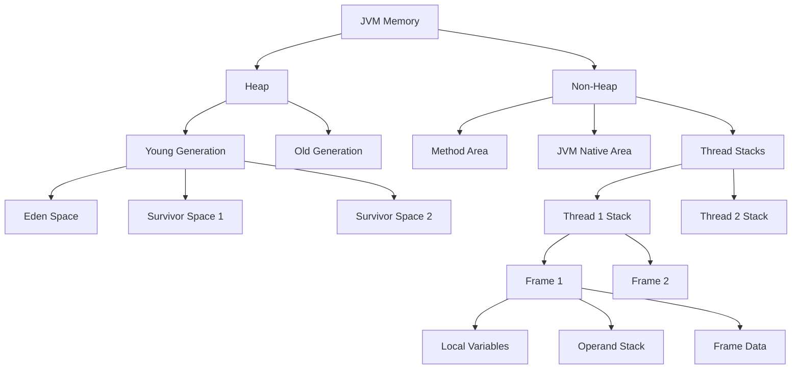
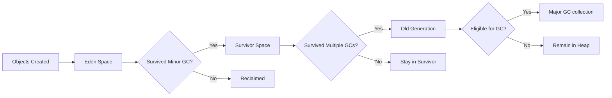

# Java Memory Model - Understanding JVM Memory Architecture

This file contains explanations and interview questions about the Java Memory Model (JMM), which is critical for understanding how Java manages memory, concurrent programming, and overall performance.

## Java Memory Architecture Fundamentals

### 1. Explain the Java Memory Model with a diagram.

**Answer:**

The Java Memory Model (JMM) defines how the Java Virtual Machine (JVM) works with computer memory. It specifies how and when different threads can see values written to shared variables by other threads, and how to synchronize access to shared variables when necessary.



**Explanation:**

1. **Heap Memory:**
   - Shared among all threads in the JVM
   - Created when the JVM starts
   - Where all Java objects and their instance variables are stored
   - Divided into:
     - Young Generation (for newly created objects)
       - Eden Space (where objects are initially created)
       - Survivor Spaces (where objects that survive minor GC are moved)
     - Old Generation (for long-lived objects that survived multiple GC cycles)

2. **Non-Heap Memory:**
   - **Method Area:**
     - Stores class structures, method data, constant runtime pool
     - In older JVM versions, this was called "PermGen"
     - In Java 8+, this is implemented as "Metaspace"
   
   - **JVM Native Area:**
     - Used for JVM's internal data structures
   
   - **Thread Stacks:**
     - Each thread has its own stack
     - Contains frames for each method being executed
     - Each frame contains:
       - Local Variables (method parameters and local variables)
       - Operand Stack (used for calculations)
       - Frame Data (references to constant pool and more)

### 2. What is the difference between Stack and Heap memory in Java?

```java
public class StackVsHeap {
    public static void main(String[] args) {
        int localVar = 42;                 // Stack memory
        Person person = new Person("John"); // 'person' reference in stack, actual Person object in heap
        
        calculate(10);                     // New frame on stack
    }
    
    public static void calculate(int param) {
        int result = param * 2;            // Stack memory
        String message = "Result is: " + result; // 'message' reference in stack, String object in heap
    }
}

class Person {
    private String name;
    
    public Person(String name) {
        this.name = name;                 // 'name' instance variable stored in heap with the Person object
    }
}
```

**Answer:**

| Stack Memory | Heap Memory |
|--------------|-------------|
| Thread-specific (each thread has its own stack) | Shared across all threads |
| Stores method frames, local variables, partial results, and call information | Stores all objects, instance variables, arrays |
| Memory allocation and deallocation is automatic (LIFO order) | Managed by Garbage Collector |
| Faster access compared to heap | Slower access than stack |
| Limited in size (typically smaller) | Usually larger than stack memory |
| Stack overflow error occurs if size exceeds limit | OutOfMemoryError occurs if size exceeds limit |
| Variables have a specific lifecycle tied to method execution | Objects persist beyond method execution until no references exist |

**Explanation:**
- Stack memory is used for execution of thread and stores method-specific values that are short-lived
- Heap memory is used for dynamic memory allocation of Java objects and JRE classes
- Primitive types and references are stored in the stack
- Actual objects, their instance variables, and arrays are stored in the heap
- When a method is called, a new block is created in the stack memory for local variables
- When a method completes, its stack frame is removed, but heap objects remain until no references point to them

### 3. How does Garbage Collection work in the JVM?

**Answer:**

Java's Garbage Collection (GC) automatically reclaims memory occupied by unused objects. It's based on the concept that most objects become eligible for garbage collection soon after creation (the "weak generational hypothesis").



**Explanation:**

1. **Garbage Collection Process:**
   - **Mark**: GC identifies which objects are in use (live) and which are not
   - **Sweep**: GC removes unused objects
   - **Compact**: GC compacts remaining objects to reduce fragmentation (in some collectors)

2. **Types of Garbage Collectors:**
   - **Serial GC**: Single-threaded, stops all application threads during GC
   - **Parallel GC**: Uses multiple threads for GC but still stops application threads
   - **Concurrent Mark Sweep (CMS)**: Minimizes pauses by doing most work concurrently
   - **G1 (Garbage First)**: Server-style collector that replaces CMS, divides heap into regions
   - **ZGC**: Low-latency collector that can handle heaps from 8MB to 16TB with pauses under 10ms

3. **Minor GC vs Major GC:**
   - **Minor GC**: Collects Young Generation, relatively fast, happens frequently
   - **Major GC**: Collects Old Generation, slower, less frequent
   - **Full GC**: Collects entire heap and usually method area, slowest

4. **Object Lifecycle:**
   - New objects go into Eden space
   - Objects surviving a minor GC move to Survivor spaces
   - After surviving multiple GCs, objects move to Old Generation
   - Objects with no live references are eligible for GC

### 4. What is a Memory Leak in Java and how can it occur?

```java
public class MemoryLeakExample {
    private static final List<Object> leakyList = new ArrayList<>();
    
    public void processData(String data) {
        // Process the data
        Object processedData = new Object(); // Some complex object
        
        // Adding to static list but never removing
        leakyList.add(processedData);
    }
}
```

**Answer:**

A memory leak in Java occurs when objects are no longer needed but still referenced, preventing garbage collection from reclaiming memory. This leads to increased memory usage over time and eventually can cause OutOfMemoryError.

**Common causes of memory leaks in Java:**

1. **Static Fields**: Objects referenced by static fields remain in memory for the lifetime of the application
2. **Unclosed Resources**: Not closing streams, connections, or other resources that hold references to memory
3. **Improper equals/hashCode Implementation**: Objects that can't be retrieved from collections but remain due to incorrect implementations
4. **Inner Classes & Anonymous Classes**: They maintain implicit references to their enclosing classes
5. **ThreadLocal Variables**: Not removing ThreadLocal variables when no longer needed
6. **Caching without Bounds**: Using unlimited caches without eviction policies
7. **JNI Memory Leaks**: Native code allocations not properly freed

**Ways to detect and fix memory leaks:**

1. **Use Profiling Tools**: Tools like VisualVM, JProfiler, or YourKit to identify memory usage patterns
2. **Heap Dumps**: Take and analyze heap dumps to find objects with excessive retention
3. **WeakReference/SoftReference**: Use these reference types for caches or non-critical references
4. **Use try-with-resources**: Ensures resources are automatically closed
5. **Limit Collection Sizes**: Use bounded collections or implement size limits
6. **Avoid Excessive Static References**: Minimize use of static collections and references
7. **Proper Cleanup**: Explicitly null references when they're no longer needed

### 5. What happens when you execute 'new' in Java?

```java
public class NewOperationDemo {
    public static void main(String[] args) {
        // Let's see what happens when 'new' is executed
        MyClass obj = new MyClass();
    }
}

class MyClass {
    private int number = 42;
    private String text = "Hello";
}
```

**Answer:**

When the `new` operator is executed in Java, several important steps occur:

1. **Memory Allocation**:
   - JVM allocates memory from the heap for the new object
   - This includes memory for the object's instance variables
   - For the example, memory is allocated for the 'number' (int) and 'text' (String reference)

2. **Object Initialization**:
   - Default values are assigned to instance variables (0, false, null)
   - Instance initializer blocks are executed (if any)
   - Instance variables are initialized with their explicit values (number = 42, text reference pointing to String object "Hello")
   - The constructor is called to complete initialization

3. **Reference Assignment**:
   - A reference to the new object is returned by the 'new' operator
   - This reference is stored in the variable (obj)

**Additional Details:**
- If insufficient memory is available, an OutOfMemoryError is thrown
- The object remains in memory until there are no more references to it
- The memory for String literals like "Hello" is typically stored in the String pool (in heap or method area depending on JVM version)
- The memory allocation policy depends on the specific JVM implementation and garbage collector settings

## Memory Model and Concurrency

### 6. Explain the relationship between Java Memory Model and concurrency.

```java
public class MemoryModelConcurrency {
    private static boolean flag = false;
    private static int value = 0;
    
    public static void main(String[] args) throws InterruptedException {
        Thread t1 = new Thread(() -> {
            value = 42;
            flag = true; // Without proper synchronization, thread t2 might see flag=true but value=0
        });
        
        Thread t2 = new Thread(() -> {
            if (flag) { // Read of flag
                System.out.println(value); // Read of value - might print 0 or 42 without synchronization
            }
        });
        
        t1.start();
        t2.start();
        t1.join();
        t2.join();
    }
}
```

**Answer:**

The Java Memory Model (JMM) provides rules for how changes made by one thread become visible to other threads, which is fundamental to concurrent programming in Java.

**Key concepts in JMM related to concurrency:**

1. **Happens-Before Relationship**:
   - Defines when one memory operation is visible to another
   - Establishes ordering constraints between operations
   - If action A happens-before action B, then A's effects are visible to B

2. **Memory Visibility**:
   - Without proper synchronization, changes made by one thread may not be immediately visible to others
   - Each thread may have its own cached copy of variables

3. **Atomicity**:
   - Operations that appear to take effect all at once
   - Not all operations are atomic (e.g., long/double assignments may not be)

4. **Reordering**:
   - JVM and processors may reorder instructions for optimization
   - Reordering is constrained by happens-before rules

**Synchronization mechanisms and their effects on JMM:**

1. **synchronized keyword**:
   - Establishes happens-before relationship between synchronized blocks
   - Ensures memory visibility and prevents reordering
   - Provides mutual exclusion

2. **volatile keyword**:
   - Guarantees visibility of changes to the variable
   - Prevents reordering of operations involving the variable
   - Does NOT provide atomicity for compound operations

3. **final fields**:
   - Special JMM rules ensure properly initialized final fields are visible without synchronization

4. **Concurrency utilities (java.util.concurrent)**:
   - Atomic classes provide atomic operations
   - Locks establish happens-before relationships
   - Thread-safe collections handle synchronization internally

**Practical implications:**
- Without proper synchronization, threads might see "stale" data
- Instructions may be reordered in ways that aren't intuitive
- Race conditions and visibility issues can cause subtle, hard-to-reproduce bugs

Understanding the JMM is crucial for writing correct concurrent code in Java and avoiding synchronization-related issues.
