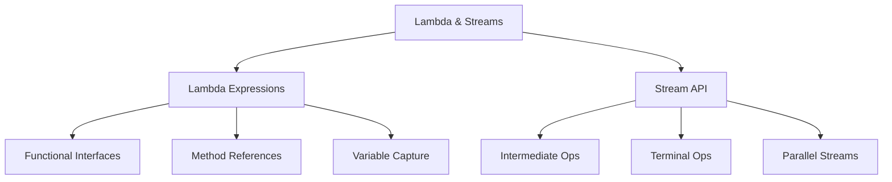

# 🚀 Java Lambda Expressions & Streams - Complete Guide



## 🎯 Lambda Expressions

### 1. Basic Syntax
```java
// Single parameter with type
(String s) -> s.length()

// Single parameter with inferred type
s -> s.length()

// Multiple parameters
(a, b) -> a + b
// No parameters
() -> System.out.println("Hello")
// Multiple statements
(name) -> {
    String greeting = "Hello " + name;
    System.out.println(greeting);
    return greeting.length();
}
```

### 2. Functional Interfaces

| Interface | Method | Description | Common Use |
|-----------|--------|-------------|------------|
| `Predicate<T>` | `boolean test(T t)` | Tests a condition | Filtering |
| `Function<T,R>` | `R apply(T t)` | Transforms input | Mapping |
| `Consumer<T>` | `void accept(T t)` | Performs side effect | For-each operations |
| `Supplier<T>` | `T get()` | Provides a value | Lazy generation |
| `UnaryOperator<T>` | `T apply(T t)` | Unary operation | Updating elements |
| `BinaryOperator<T>` | `T apply(T t1, T t2)` | Binary operation | Reduction |
| `BiFunction<T,U,R>` | `R apply(T t, U u)` | Two-arg function | Complex transformations |
| `BiPredicate<T,U>` | `boolean test(T t, U u)` | Two-arg predicate | Complex conditions |

### 3. Variable Capture
```java
int base = 10;
IntUnaryOperator addBase = x -> x + base;  // Captures base
// base = 20;  // Error: must be effectively final
```
- Can capture:
  - Local variables (must be final or effectively final)
  - Instance variables (stored in the instance)
  - Static variables (stored in the class)

## 🔄 Method References

### 1. Types of Method References

| Type | Syntax | Lambda Equivalent |
|------|--------|-------------------|
| Static | `ClassName::staticMethod` | `(args) -> ClassName.staticMethod(args)` |
| Instance (bound) | `instance::method` | `(args) -> instance.method(args)` |
| Instance (unbound) | `ClassName::instanceMethod` | `(obj, args) -> obj.instanceMethod(args)` |
| Constructor | `ClassName::new` | `(args) -> new ClassName(args)` |
| Array | `TypeName[]::new` | `(size) -> new TypeName[size]` |

### 2. Common Examples
```java
// Static method
Function<String, Integer> parseInt = Integer::parseInt;

// Bound instance method
String greeting = "Hello";
Supplier<Integer> length = greeting::length;

// Unbound instance method
Function<String, String> toUpper = String::toUpperCase;
BiFunction<String, String, Boolean> contains = String::contains;

// Constructor
Supplier<List<String>> listSupplier = ArrayList::new;
Function<Integer, String[]> arrayCreator = String[]::new;

// Array constructor
IntFunction<int[]> arrayCreator = int[]::new;
```

### 3. When to Use Method References
- Improve readability
- Method name clearly describes the operation
- The method is already defined
- No need for additional logic beyond the method call

## Stream API

### Creating Streams
```java
// From Collection
List<String> list = Arrays.asList("a", "b", "c");
Stream<String> stream = list.stream();

// From values
Stream<String> stream = Stream.of("a", "b", "c");

// From array
String[] array = {"a", "b", "c"};
Stream<String> stream = Arrays.stream(array);

// Empty stream
Stream<String> emptyStream = Stream.empty();

// Infinite streams
Stream<Integer> infinite = Stream.iterate(0, n -> n + 2);
Stream<Double> randoms = Stream.generate(Math::random);
```

### Intermediate Operations
```java
List<String> names = Arrays.asList("John", "Alice", "Bob", "Charlie");

// Filter
List<String> result = names.stream()
    .filter(name -> name.length() > 3)
    .collect(Collectors.toList());

// Map
List<Integer> lengths = names.stream()
    .map(String::length)
    .collect(Collectors.toList());

// FlatMap
List<String> words = Arrays.asList("Hello", "World");
List<String> chars = words.stream()
    .flatMap(word -> Arrays.stream(word.split("")))
    .collect(Collectors.toList());

// Sorted
List<String> sorted = names.stream()
    .sorted()
    .collect(Collectors.toList());

// Distinct
List<String> unique = names.stream()
    .distinct()
    .collect(Collectors.toList());

// Limit/Skip
List<String> limited = names.stream()
    .skip(1)
    .limit(2)
    .collect(Collectors.toList());
```

### Terminal Operations
```java
// forEach
names.stream().forEach(System.out::println);

// collect
List<String> list = names.stream().collect(Collectors.toList());
Set<String> set = names.stream().collect(Collectors.toSet());
String joined = names.stream().collect(Collectors.joining(", "));
Map<Integer, List<String>> grouped = names.stream()
    .collect(Collectors.groupingBy(String::length));

// reduce
Optional<String> concat = names.stream()
    .reduce((a, b) -> a + ", " + b);

// min/max/count
Optional<String> min = names.stream().min(String::compareTo);
Optional<String> max = names.stream().max(String::compareTo);
long count = names.stream().count();

// anyMatch/allMatch/noneMatch
boolean anyMatch = names.stream().anyMatch(s -> s.startsWith("A"));
boolean allMatch = names.stream().allMatch(s -> s.length() > 2);
boolean noneMatch = names.stream().noneMatch(s -> s.isEmpty());

// findFirst/findAny
Optional<String> first = names.stream().findFirst();
Optional<String> any = names.parallelStream().findAny();
```

### Parallel Streams
```java
List<String> names = Arrays.asList("John", "Alice", "Bob", "Charlie");

// Create parallel stream
List<String> result = names.parallelStream()
    .map(String::toUpperCase)
    .collect(Collectors.toList());

// Convert sequential to parallel
List<String> result = names.stream()
    .parallel()
    .map(String::toUpperCase)
    .collect(Collectors.toList());
```

## 🎓 Advanced Stream Operations

### 1. Custom Collectors
```java
// Custom collector to join strings with a delimiter
Collector<String, StringJoiner, String> stringJoiner =
    Collector.of(
        () -> new StringJoiner(", "),  // supplier
        (j, s) -> j.add(s),             // accumulator
        (j1, j2) -> j1.merge(j2),       // combiner
        StringJoiner::toString          // finisher
    );

String result = names.stream().collect(stringJoiner);
```

### 2. Stream Concatenation
```java
Stream<String> stream1 = Stream.of("A", "B", "C");
Stream<String> stream2 = Stream.of("X", "Y", "Z");
Stream<String> combined = Stream.concat(stream1, stream2);

// For multiple streams
Stream<String> merged = Stream.of(stream1, stream2, stream3)
    .flatMap(Function.identity());
```

### 3. Primitive Streams
```java
// IntStream, LongStream, DoubleStream
IntStream.range(1, 10).forEach(System.out::println);
DoubleStream.generate(Math::random).limit(5).forEach(System.out::println);

// Converting between stream types
List<String> strings = Arrays.asList("1", "2", "3");
int sum = strings.stream()
    .mapToInt(Integer::parseInt)
    .sum();
```

### 4. Parallel Stream Gotchas
```java
// When to use parallel streams
List<String> result = largeList.parallelStream()
    .filter(s -> s.length() > 10)
    .collect(Collectors.toList());

// Common pitfalls
// 1. Stateful operations can be expensive
// 2. Ordering matters with findFirst() vs findAny()
// 3. Shared mutable state causes race conditions
// 4. Not always faster - test performance!
```

## 🏆 Common Interview Questions

### 1. Lambda vs Anonymous Class
**Q: When would you use a lambda over an anonymous class?**

| Feature | Lambda | Anonymous Class |
|---------|--------|-----------------|
| Syntax | Concise | Verbose |
| `this` | Refers to enclosing class | Refers to itself |
| State | Stateless (effectively final vars) | Can have instance variables |
| Use Case | Functional interfaces | Any interface/class |
| Compilation | Invokedynamic | Regular class file |

### 2. Stream Processing
**Q: Explain the difference between these operations:**
```java
// 1. map() vs flatMap()
List<List<String>> listOfLists = ...;
List<String> flatList = listOfLists.stream()
    .flatMap(List::stream)
    .collect(Collectors.toList());

// 2. reduce() vs collect()
// reduce: immutable reduction
int sum = numbers.stream().reduce(0, Integer::sum);
// collect: mutable reduction
List<String> filtered = stream.filter(s -> s.length() > 3)
    .collect(Collectors.toList());
```

### 3. Parallel Streams
**Q: When should you use parallel streams?**
- Large datasets
- CPU-intensive operations
- Stateless operations
- Non-ordered operations
- Operations that are already thread-safe

**Example:**
```java
// Good candidate for parallel processing
long count = largeList.parallelStream()
    .filter(s -> s.length() > 10)
    .count();
```

### 4. Advanced Collectors
**Q: How would you implement a custom collector?**
```java
public static <T> Collector<T, ?, Map<Boolean, List<T>>> partitionBy(Predicate<T> predicate) {
    return Collector.of(
        () -> new HashMap<Boolean, List<T>>() {{
            put(true, new ArrayList<>());
            put(false, new ArrayList<>());
        }},
        (map, item) -> map.get(predicate.test(item)).add(item),
        (map1, map2) -> {
            map1.get(true).addAll(map2.get(true));
            map1.get(false).addAll(map2.get(false));
            return map1;
        }
    );
}
```

### 5. Performance Considerations
**Q: How would you optimize this stream pipeline?**
```java
List<String> result = list.stream()
    .map(String::toLowerCase)
    .filter(s -> s.length() > 10)
    .sorted()
    .collect(Collectors.toList());
```

**Optimization Tips:**
1. Add `parallel()` for large datasets
2. Filter before mapping if possible
3. Use appropriate collection sizes
4. Consider primitive streams
5. Use `unordered()` when order doesn't matter

### 6. Common Pitfalls
**Q: What's wrong with this code?**
```java
List<String> results = new ArrayList<>();
stream.forEach(item -> {
    results.add(process(item));  // Stateful side-effect!
});
```

**Issues:**
1. Non-thread-safe operation in parallel streams
2. Mutable state in lambda
3. Better to use `collect()`

### 7. Advanced Stream Operations
**Q: How would you implement a sliding window operation?**
```java
public static <T> Stream<List<T>> sliding(List<T> list, int size) {
    if (size > list.size()) {
        return Stream.empty();
    }
    return IntStream.range(0, list.size() - size + 1)
        .mapToObj(i -> list.subList(i, i + size));
}
```

### 8. Real-world Use Cases
**Q: How would you process a large CSV file efficiently?**
```java
try (Stream<String> lines = Files.lines(Paths.get("large.csv"))) {
    Map<String, Long> counts = lines
        .skip(1)  // header
        .parallel()
        .map(line -> line.split(","))
        .filter(fields -> fields.length > 2)
        .collect(Collectors.groupingBy(
            fields -> fields[1],  // group by column
            Collectors.counting()
        ));
} catch (IOException e) {
    e.printStackTrace();
}
```

## 🛠️ Best Practices & Patterns

### 1. Code Organization
```java
// Instead of long lambda chains
List<String> result = data.stream()
    .map(this::transformData)
    .filter(this::isValid)
    .collect(Collectors.toList());

private String transformData(Data d) {
    // Complex transformation
}

private boolean isValid(String s) {
    // Validation logic
}
```

### 2. Exception Handling
```java
// Handle checked exceptions in streams
List<Result> results = inputs.stream()
    .map(input -> {
        try {
            return processSafely(input);
        } catch (Exception e) {
            throw new RuntimeException(e);
        }
    })
    .collect(Collectors.toList());
```

### 3. Performance Optimization
- Use primitive streams when possible
- Prefer `filter()` before `map()`
- Use `collect(Collectors.toCollection(ArrayList::new))` for specific collection types
- Consider `Stream.iterate()` vs `IntStream.range()`

### 4. Testing Streams
```java
@Test
void testStreamOperation() {
    List<String> input = Arrays.asList("a", "bb", "ccc");
    List<String> result = input.stream()
        .filter(s -> s.length() > 1)
        .collect(Collectors.toList());
        
    assertThat(result).containsExactly("bb", "ccc");
}
```

### 5. Debugging Streams
```java
// Using peek() for debugging
List<String> result = stream
    .peek(e -> System.out.println("Before filter: " + e))
    .filter(s -> s.length() > 3)
    .peek(e -> System.out.println("After filter: " + e))
    .collect(Collectors.toList());
```

## 📚 Real-world Examples

### 1. Data Processing Pipeline
```java
// Process orders and generate report
Map<Category, DoubleSummaryStatistics> stats = orders.stream()
    .filter(Order::isValid)
    .collect(Collectors.groupingBy(
        Order::getCategory,
        Collectors.summarizingDouble(Order::getAmount)
    ));
```

### 2. Web Application
```java
// Process form submissions
public CompletableFuture<Response> handleRequest(Request request) {
    return request.getUsers().stream()
        .filter(User::isActive)
        .map(user -> userService.processAsync(user))
        .collect(Collectors.collectingAndThen(
            Collectors.toList(),
            futures -> CompletableFuture.allOf(
                futures.toArray(new CompletableFuture[0])
            )
        ))
        .thenApply(v -> new Response("Processed"));
}
```

### 3. Batch Processing
```java
// Process items in batches
List<Result> results = Stream.iterate(0, i -> i + BATCH_SIZE)
    .map(offset -> getBatch(offset, BATCH_SIZE))
    .takeWhile(batch -> !batch.isEmpty())
    .flatMap(batch -> processBatch(batch).stream())
    .collect(Collectors.toList());
```

## 🎓 Final Tips for Interviews

1. **Know the Stream Pipeline**
   - Source → Intermediate Ops → Terminal Op
   - Lazy evaluation
   - Short-circuiting operations

2. **Master Collectors**
   - `groupingBy`, `partitioningBy`
   - `toMap`, `toConcurrentMap`
   - Custom collectors

3. **Understand Performance**
   - When to use parallel streams
   - Stateful vs stateless operations
   - Memory efficiency

4. **Practice Common Patterns**
   - Finding max/min
   - Grouping and partitioning
   - Joining strings
   - Flattening nested collections

5. **Be Ready for Tricky Questions**
   - Infinite streams
   - Custom spliterators
   - Streams with I/O operations
   - Exception handling in streams
8. Be aware of the performance characteristics of intermediate operations
