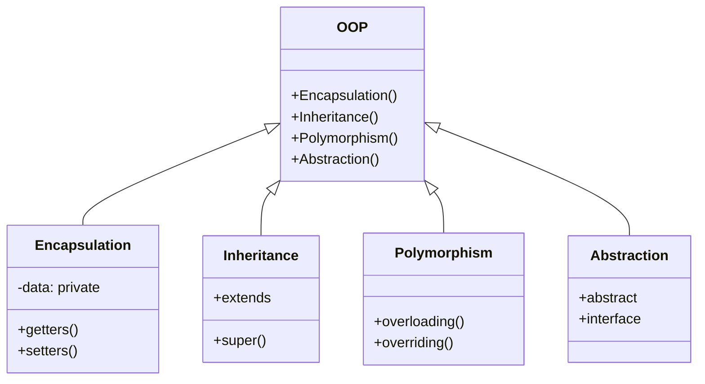
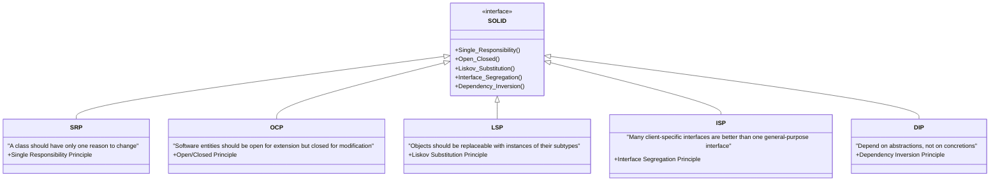
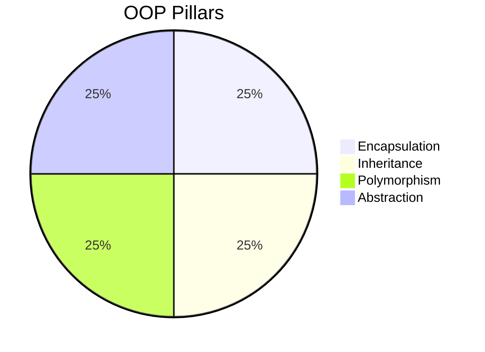
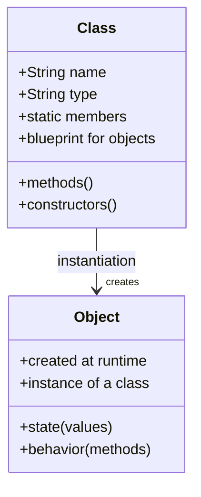
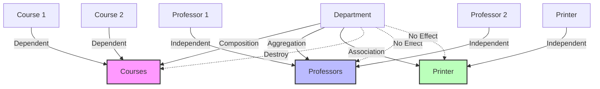

# 🚀 Java OOP Concepts - Complete Interview Guide

> *"Mastering Object-Oriented Programming for Technical Interviews"*

This comprehensive guide covers all aspects of Object-Oriented Programming (OOP) in Java, specifically designed for interview preparation. It includes visual aids, code examples, and detailed explanations of key concepts.

## 🔍 Key Features
- **Visual Class Diagrams** for better understanding
- **Comparison Tables** for quick reference
- **Common Interview Questions** with detailed answers
- **Practical Code Examples** with explanations
- **Best Practices** and **Common Pitfalls**

## 🏗️ OOP Pillars Overview



## 📋 Table of Contents
1. [OOP Fundamentals](#oop-fundamentals)
2. [Classes and Objects](#classes-and-objects)
3. [Inheritance](#inheritance)
4. [Polymorphism](#polymorphism)
5. [Encapsulation](#encapsulation)
6. [Abstraction](#abstraction)
7. [Interfaces and Abstract Classes](#interfaces-and-abstract-classes)
8. [Association, Aggregation, and Composition](#association-aggregation-and-composition)
9. [Method Overriding and Overloading](#method-overriding-and-overloading)
10. [SOLID Principles](#solid-principles)
11. [Advanced OOP Concepts](#advanced-oop-concepts)
    - [Static vs Instance Members](#static-vs-instance-members)
    - [Final Keyword](#final-keyword)
    - [Common Design Patterns](#common-design-patterns)
12. [Best Practices](#best-practices)
13. [Common Pitfalls](#common-pitfalls)
14. [Interview Tips](#interview-tips)

## 🏆 SOLID Principles

SOLID is an acronym for five design principles that make software designs more understandable, flexible, and maintainable. These principles were introduced by Robert C. Martin (Uncle Bob) and are fundamental to object-oriented programming and design.



### 1. Single Responsibility Principle (SRP)

**Definition**: A class should have only one reason to change, meaning it should have only one job or responsibility.

**Violation Example**:
```java
class User {
    void login(String username, String password) { /* ... */ }
    void sendEmail(String content) { /* ... */ }
    void saveToDatabase(User user) { /* ... */ }
}
```

**Refactored**:
```java
class User {
    void login(String username, String password) { /* ... */ }
}

class EmailService {
    void sendEmail(String content) { /* ... */ }
}

class UserRepository {
    void save(User user) { /* ... */ }
}
```

### 2. Open/Closed Principle (OCP)

**Definition**: Software entities should be open for extension but closed for modification.

**Violation Example**:
```java
class Rectangle {
    double width;
    double height;
}

class AreaCalculator {
    double calculateArea(Object shape) {
        if (shape instanceof Rectangle) {
            Rectangle r = (Rectangle) shape;
            return r.width * r.height;
        } else if (shape instanceof Circle) {
            Circle c = (Circle) shape;
            return Math.PI * c.radius * c.radius;
        }
        throw new IllegalArgumentException("Unknown shape");
    }
}
```

**Refactored**:
```java
interface Shape {
    double calculateArea();
}

class Rectangle implements Shape {
    private double width;
    private double height;
    
    @Override
    public double calculateArea() {
        return width * height;
    }
}

class Circle implements Shape {
    private double radius;
    
    @Override
    public double calculateArea() {
        return Math.PI * radius * radius;
    }
}
```

### 3. Liskov Substitution Principle (LSP)

**Definition**: Objects of a superclass should be replaceable with objects of its subclasses without breaking the application.

**Violation Example**:
```java
class Bird {
    void fly() { /* ... */ }
}

class Ostrich extends Bird {  // Ostrich can't fly!
    @Override
    void fly() {
        throw new UnsupportedOperationException("Can't fly!");
    }
}
```

**Refactored**:
```java
class Bird {
    // Base class with common bird behaviors
}

interface Flyable {
    void fly();
}

class Sparrow extends Bird implements Flyable {
    @Override
    public void fly() { /* ... */ }
}

class Ostrich extends Bird {
    // No fly method, which is correct for an ostrich
}
```

### 4. Interface Segregation Principle (ISP)

**Definition**: Clients should not be forced to depend on interfaces they don't use.

**Violation Example**:
```java
interface Worker {
    void work();
    void eat();
    void sleep();
}

class HumanWorker implements Worker {
    public void work() { /* ... */ }
    public void eat() { /* ... */ }
    public void sleep() { /* ... */ }
}

class RobotWorker implements Worker {
    public void work() { /* ... */ }
    public void eat() { /* Not applicable */ }
    public void sleep() { /* Not applicable */ }
}
```

**Refactored**:
```java
interface Workable {
    void work();
}

interface Eatable {
    void eat();
}

interface Sleepable {
    void sleep();
}

class HumanWorker implements Workable, Eatable, Sleepable {
    public void work() { /* ... */ }
    public void eat() { /* ... */ }
    public void sleep() { /* ... */ }
}

class RobotWorker implements Workable {
    public void work() { /* ... */ }
}
```

### 5. Dependency Inversion Principle (DIP)

**Definition**: High-level modules should not depend on low-level modules. Both should depend on abstractions.

**Violation Example**:
```java
class LightBulb {
    void turnOn() { /* ... */ }
    void turnOff() { /* ... */ }
}

class Switch {
    private LightBulb bulb;
    
    public Switch() {
        this.bulb = new LightBulb();  // Direct dependency
    }
    
    void operate() {
        // ...
        bulb.turnOn();
    }
}
```

**Refactored**:
```java
interface Switchable {
    void turnOn();
    void turnOff();
}

class LightBulb implements Switchable {
    public void turnOn() { /* ... */ }
    public void turnOff() { /* ... */ }
}

class Switch {
    private Switchable device;
    
    public Switch(Switchable device) {
        this.device = device;  // Dependency injection
    }
    
    void operate() {
        // ...
        device.turnOn();
    }
}
```

**Benefits of SOLID Principles**:
1. **Maintainability**: Easier to understand and modify code
2. **Scalability**: New features can be added with minimal changes
3. **Testability**: Easier to write unit tests
4. **Reusability**: Components can be reused in different contexts
5. **Reduced Coupling**: Components are less dependent on each other

**Common Interview Questions**:
1. Can you explain each SOLID principle with an example?
2. How do you apply SOLID principles in your daily coding?
3. What's the difference between dependency injection and dependency inversion?
4. Can you give an example where following SOLID principles improved your code?
5. How do SOLID principles relate to design patterns?

## 🔥 Common Interview Questions

### Q1: What are the four pillars of OOP?

Object-Oriented Programming is built on four fundamental principles:



1. **Encapsulation**: 
   - Bundling data and methods that operate on that data within a single unit (class)
   - Controlling access to the internal state of objects
   - Example: Private fields with public getters/setters

2. **Inheritance**:
   - Mechanism to create a new class using properties of an existing class
   - Promotes code reusability and establishes relationships
   - Example: `class Dog extends Animal`

3. **Polymorphism**:
   - Ability of objects to take many forms
   - Same interface with different implementations
   - Example: Method overloading and overriding

4. **Abstraction**:
   - Hiding complex implementation details
   - Showing only necessary features
   - Example: Abstract classes and interfaces

### Q2: What is the difference between a class and an object in Java?



**Class**:
- A blueprint or template for creating objects
- Logical entity that doesn't occupy memory
- Defines structure (fields) and behavior (methods)
- Created using the `class` keyword

**Object**:
- An instance of a class
- Runtime entity that occupies memory
- Has state (field values) and behavior (methods)
- Created using the `new` keyword

**Example**:
```java
// Class definition (blueprint)
class Car {
    // Fields
    String color;
    String model;
    
    // Method
    void drive() {
        System.out.println("Driving " + model);
    }
}

// Creating objects
Car car1 = new Car();  // car1 is an object of type Car
Car car2 = new Car();  // car2 is another object
```

**Key Differences**:

| Aspect        | Class                          | Object                          |
|---------------|--------------------------------|---------------------------------|
| Type          | Logical entity                 | Physical entity                 |
| Memory        | No memory allocation          | Memory allocated when created   |
| Declaration   | Once                           | Multiple times                 |
| Nature        | Template/Blueprint            | Instance of a class             |
| Components    | Methods, variables, blocks    | State and behavior             |
| Creation      | Using `class` keyword         | Using `new` keyword            |
| Storage       | Method area                   | Heap memory                    |

### Q1: What is the difference between a class and an object in Java?

In Java, a class and an object are fundamental concepts of Object-Oriented Programming:

**Class**:
- A class is a blueprint or template that defines the structure and behavior of objects
- It defines fields (attributes) and methods (behaviors) that objects of that class will have
- It's a logical entity and doesn't occupy memory when defined
- It's declared using the `class` keyword

**Object**:
- An object is an instance of a class
- It's a runtime entity that occupies memory
- It has state (values of its fields) and behavior (methods it can execute)
- It's created using the `new` keyword

Example:
```java
// Class definition
public class Car {
    // Fields (attributes)
    String brand;
    String model;
    int year;
    
    // Constructor
    public Car(String brand, String model, int year) {
        this.brand = brand;
        this.model = model;
        this.year = year;
    }
    
    // Method (behavior)
    public void drive() {
        System.out.println(brand + " " + model + " is driving");
    }
}

// Creating objects (instances) of the Car class
Car car1 = new Car("Toyota", "Camry", 2020);
Car car2 = new Car("Honda", "Accord", 2021);

// Using object methods
car1.drive();  // Output: Toyota Camry is driving
car2.drive();  // Output: Honda Accord is driving
```

### Q2: What are the main principles of Object-Oriented Programming?

Object-Oriented Programming (OOP) is based on four main principles:

1. **Encapsulation**:
   - The bundling of data (fields) and methods that operate on that data within a single unit (class)
   - Hiding the internal state of objects and requiring all interaction to be performed through an object's methods
   - Implemented in Java using access modifiers (private, protected, public)

2. **Inheritance**:
   - The mechanism by which a class can inherit properties and behaviors from a parent class
   - Enables code reuse and establishes a relationship between classes
   - Implemented in Java using the `extends` keyword

3. **Polymorphism**:
   - The ability of different objects to respond to the same method call in different ways
   - Includes method overloading (compile-time polymorphism) and method overriding (runtime polymorphism)
   - Enables flexibility and extensibility in code

4. **Abstraction**:
   - The concept of hiding complex implementation details and showing only the necessary features
   - Focuses on what an object does rather than how it does it
   - Implemented in Java using abstract classes and interfaces

Example demonstrating all four principles:
```java
// Abstraction: Abstract class defining a common interface
abstract class Vehicle {
    // Encapsulation: Private fields
    private String brand;
    private String model;
    
    // Constructor
    public Vehicle(String brand, String model) {
        this.brand = brand;
        this.model = model;
    }
    
    // Encapsulation: Public getters
    public String getBrand() { return brand; }
    public String getModel() { return model; }
    
    // Abstraction: Abstract method (to be implemented by subclasses)
    public abstract void start();
    
    // Concrete method
    public void stop() {
        System.out.println("Vehicle stopped");
    }
}

// Inheritance: Car class inherits from Vehicle
class Car extends Vehicle {
    private int numDoors;
    
    public Car(String brand, String model, int numDoors) {
        super(brand, model);
        this.numDoors = numDoors;
    }
    
    // Polymorphism: Method overriding
    @Override
    public void start() {
        System.out.println(getBrand() + " " + getModel() + " car started with key");
    }
    
    public int getNumDoors() { return numDoors; }
}

// Inheritance: Motorcycle class inherits from Vehicle
class Motorcycle extends Vehicle {
    private boolean hasSidecar;
    
    public Motorcycle(String brand, String model, boolean hasSidecar) {
        super(brand, model);
        this.hasSidecar = hasSidecar;
    }
    
    // Polymorphism: Method overriding
    @Override
    public void start() {
        System.out.println(getBrand() + " " + getModel() + " motorcycle started with button");
    }
    
    public boolean hasSidecar() { return hasSidecar; }
}

// Usage
public class Main {
    public static void main(String[] args) {
        // Polymorphism: Using different objects through a common interface
        Vehicle car = new Car("Toyota", "Camry", 4);
        Vehicle motorcycle = new Motorcycle("Harley-Davidson", "Street 750", false);
        
        car.start();  // Toyota Camry car started with key
        motorcycle.start();  // Harley-Davidson Street 750 motorcycle started with button
        
        car.stop();  // Vehicle stopped
        motorcycle.stop();  // Vehicle stopped
    }
}
```

### Q3: What is the difference between `==` and `.equals()` in Java?

```mermaid
graph TD
    A[== Operator] --> B[Primitive Types: Compares values]
    A --> C[Reference Types: Compares memory addresses]
    
    D[.equals() Method] --> E[Default: Same as == (compares references)]
    D --> F[Can be overridden to compare object content]
    D --> G[Used for logical equality]
    
    H[Best Practices] --> I[Use == for primitives and enum constants]
    H --> J[Use .equals() for objects]
    H --> K[Override .equals() with hashCode()]
```

In Java, `==` and `.equals()` are used for comparison but serve different purposes:

| Aspect | `==` Operator | `.equals()` Method |
|--------|--------------|-------------------|
| **Type** | Operator | Method (Object class) |
| **Usage** | Primitives and references | Objects only |
| **Comparison** | Compares values (primitives) or references (objects) | Compares object contents (if overridden) |
| **Override** | Cannot be overridden | Can be overridden |
| **Performance** | Faster | Potentially slower (depends on implementation) |
| **Null Handling** | Works with null | Throws NullPointerException if not checked |

**Key Points**:
1. For primitive types (int, char, boolean, etc.), `==` compares their values
2. For reference types, `==` checks if both references point to the same object in memory
3. `.equals()` by default behaves like `==` (reference comparison)
4. Classes like String, Integer, etc., override `.equals()` to compare content

**Example**:
```java
String s1 = "hello";
String s2 = "hello";
String s3 = new String("hello");
String s4 = new String("hello");
String s5 = null;

System.out.println(s1 == s2);        // true (string pool)
System.out.println(s1 == s3);        // false (different objects)
System.out.println(s1.equals(s3));   // true (same content)
System.out.println(s3 == s4);        // false (different objects)
System.out.println(s3.equals(s4));   // true (same content)
// System.out.println(s5.equals(s1)); // NullPointerException
System.out.println(s1.equals(s5));   // false (safe to call on literal)

// Custom class with equals()
class Person {
    private String name;
    private int age;
    
    public Person(String name, int age) {
        this.name = name;
        this.age = age;
    }
    
    @Override
    public boolean equals(Object o) {
        if (this == o) return true;
        if (o == null || getClass() != o.getClass()) return false;
        Person person = (Person) o;
        return age == person.age && 
               Objects.equals(name, person.name);
    }
    
    @Override
    public int hashCode() {
        return Objects.hash(name, age);
    }
}
```

**Best Practices**:
1. Always override `hashCode()` when you override `equals()`
2. Use `Objects.equals()` for null-safe object comparison
3. For enum types, you can use `==` for comparison
4. Consider using `instanceof` in `equals()` for better inheritance support

In Java, `==` and `.equals()` are used for comparison but serve different purposes:

**`==` Operator**:
- Compares object references (memory addresses) for reference types
- Compares actual values for primitive types
- Checks if two references point to the same object in memory
- Cannot be overridden

**`.equals()` Method**:
- Defined in the `Object` class and can be overridden by subclasses
- By default (if not overridden), behaves like `==` comparing object references
- Typically overridden to compare the content or state of objects
- Used to define custom equality logic for a class

Example:
```java
// String comparison
String str1 = "Hello";
String str2 = "Hello";
String str3 = new String("Hello");

System.out.println(str1 == str2);       // true (same string pool reference)
System.out.println(str1 == str3);       // false (different objects)
System.out.println(str1.equals(str3));  // true (same content)

// Custom class example
class Person {
    private String name;
    private int age;
    
    public Person(String name, int age) {
        this.name = name;
        this.age = age;
    }
    
    // Override equals method
    @Override
    public boolean equals(Object obj) {
        if (this == obj) return true;
        if (obj == null || getClass() != obj.getClass()) return false;
        
        Person person = (Person) obj;
        return age == person.age && 
               (name == null ? person.name == null : name.equals(person.name));
    }
    
    // Best practice: Always override hashCode when overriding equals
    @Override
    public int hashCode() {
        int result = name != null ? name.hashCode() : 0;
        result = 31 * result + age;
        return result;
    }
}

Person p1 = new Person("John", 30);
Person p2 = new Person("John", 30);
Person p3 = p1;

System.out.println(p1 == p2);       // false (different objects)
System.out.println(p1 == p3);       // true (same object)
System.out.println(p1.equals(p2));  // true (same content due to overridden equals)
```

### Q10: What is inheritance in Java and what are its types?

Inheritance is a fundamental OOP concept where a class (subclass/child class) can inherit properties and behaviors from another class (superclass/parent class). It promotes code reuse and establishes an "is-a" relationship between classes.

**Types of Inheritance in Java**:

1. **Single Inheritance**:
   - A class inherits from only one superclass
   - Most common form of inheritance in Java
   - Example: `class Dog extends Animal`

2. **Multilevel Inheritance**:
   - A class inherits from a class which itself inherits from another class
   - Creates a chain of inheritance
   - Example: `class Animal`, `class Mammal extends Animal`, `class Dog extends Mammal`

3. **Hierarchical Inheritance**:
   - Multiple classes inherit from a single superclass
   - Example: `class Dog extends Animal`, `class Cat extends Animal`

4. **Multiple Inheritance (through interfaces only)**:
   - Java doesn't support multiple inheritance of classes (to avoid the "diamond problem")
   - A class can implement multiple interfaces
   - Example: `class Bird implements Flyable, Eatable`

**Key Features of Inheritance in Java**:

1. **`extends` keyword**: Used to establish inheritance between classes
2. **`super` keyword**: Used to refer to the superclass's members or constructor
3. **Method Overriding**: Subclasses can provide specific implementations of methods defined in the superclass
4. **Constructor Chaining**: Subclass constructors implicitly or explicitly call superclass constructors

Example of inheritance:
```java
// Superclass
class Animal {
    protected String name;
    
    public Animal(String name) {
        this.name = name;
    }
    
    public void eat() {
        System.out.println(name + " is eating");
    }
    
    public void sleep() {
        System.out.println(name + " is sleeping");
    }
}

// Single inheritance
class Dog extends Animal {
    private String breed;
    
    public Dog(String name, String breed) {
        super(name);  // Call to superclass constructor
        this.breed = breed;
    }
    
    public void bark() {
        System.out.println(name + " is barking");
    }
    
    // Method overriding
    @Override
    public void eat() {
        System.out.println(name + " the " + breed + " is eating dog food");
    }
}

// Hierarchical inheritance
class Cat extends Animal {
    public Cat(String name) {
        super(name);
    }
    
    public void meow() {
        System.out.println(name + " is meowing");
    }
    
    @Override
    public void eat() {
        System.out.println(name + " is eating cat food");
    }
}

// Usage
public class Main {
    public static void main(String[] args) {
        Dog dog = new Dog("Buddy", "Golden Retriever");
        Cat cat = new Cat("Whiskers");
        
        dog.eat();    // Buddy the Golden Retriever is eating dog food
        dog.sleep();  // Buddy is sleeping (inherited from Animal)
        dog.bark();   // Buddy is barking
        
        cat.eat();    // Whiskers is eating cat food
        cat.sleep();  // Whiskers is sleeping
        cat.meow();   // Whiskers is meowing
    }
}
```

### Q20: What is polymorphism in Java and what are its types?

Polymorphism is one of the core principles of OOP that allows objects of different classes to be treated as objects of a common superclass. The word "polymorphism" means "many forms," and it occurs when we have many classes related by inheritance.

**Types of Polymorphism in Java**:

1. **Compile-time Polymorphism (Static Binding)**:
   - Achieved through method overloading
   - The compiler determines which method to call based on the method signature
   - Resolved during compilation

2. **Runtime Polymorphism (Dynamic Binding)**:
   - Achieved through method overriding
   - The JVM determines which method to call at runtime based on the actual object type
   - Resolved during execution

**Method Overloading (Compile-time Polymorphism)**:
- Multiple methods in the same class with the same name but different parameters
- Differs in number, type, or order of parameters
- Return type alone is not sufficient for method overloading

Example of method overloading:
```java
class Calculator {
    // Method overloading
    public int add(int a, int b) {
        return a + b;
    }
    
    public double add(double a, double b) {
        return a + b;
    }
    
    public int add(int a, int b, int c) {
        return a + b + c;
    }
}

Calculator calc = new Calculator();
System.out.println(calc.add(5, 10));        // Calls first method: 15
System.out.println(calc.add(5.5, 10.5));    // Calls second method: 16.0
System.out.println(calc.add(5, 10, 15));    // Calls third method: 30
```

**Method Overriding (Runtime Polymorphism)**:
- Subclass provides a specific implementation of a method already defined in its superclass
- Method signature must be the same (name, parameters, return type)
- Requires inheritance relationship between classes
- Uses the `@Override` annotation (recommended but not required)

Example of method overriding:
```java
class Animal {
    public void makeSound() {
        System.out.println("Animal makes a sound");
    }
}

class Dog extends Animal {
    @Override
    public void makeSound() {
        System.out.println("Dog barks");
    }
}

class Cat extends Animal {
    @Override
    public void makeSound() {
        System.out.println("Cat meows");
    }
}

// Runtime polymorphism
public class Main {
    public static void main(String[] args) {
        Animal animal1 = new Dog();  // Dog object referred by Animal reference
        Animal animal2 = new Cat();  // Cat object referred by Animal reference
        
        animal1.makeSound();  // Dog barks
        animal2.makeSound();  // Cat meows
        
        // Polymorphic array
        Animal[] animals = {new Animal(), new Dog(), new Cat()};
        for (Animal animal : animals) {
            animal.makeSound();  // Different behavior based on actual object type
        }
    }
}
```

**Benefits of Polymorphism**:
1. Code reusability and flexibility
2. Implementation of generic algorithms that work with objects of different types
3. Extensibility - new classes can be added with minimal code changes
4. Simplifies code maintenance

### Q30: What is encapsulation in Java?

Encapsulation is one of the four fundamental OOP concepts that involves bundling the data (fields) and methods that operate on the data within a single unit (class) and restricting direct access to some of the object's components.

**Key aspects of encapsulation**:

1. **Data Hiding**:
   - Making fields private so they cannot be accessed directly from outside the class
   - Controlling access through public methods (getters and setters)
   - Protecting the internal state of an object from corruption

2. **Access Control**:
   - Using access modifiers (private, protected, public) to control the visibility of class members
   - Implementing validation logic in setter methods to ensure data integrity

3. **Implementation Hiding**:
   - Hiding the implementation details from the users of the class
   - Allowing the implementation to change without affecting the code that uses the class

**Benefits of Encapsulation**:

1. **Data Protection**: Prevents unauthorized access to data
2. **Flexibility**: Implementation can change without affecting the interface
3. **Maintainability**: Easier to maintain and modify code
4. **Testing**: Easier to test individual components

Example of encapsulation:
```java
public class BankAccount {
    // Private fields (data hiding)
    private String accountNumber;
    private String accountHolder;
    private double balance;
    
    // Constructor
    public BankAccount(String accountNumber, String accountHolder, double initialBalance) {
        this.accountNumber = accountNumber;
        this.accountHolder = accountHolder;
        
        // Validation in constructor
        if (initialBalance < 0) {
            throw new IllegalArgumentException("Initial balance cannot be negative");
        }
        this.balance = initialBalance;
    }
    
    // Getter methods (controlled access to data)
    public String getAccountNumber() {
        return accountNumber;
    }
    
    public String getAccountHolder() {
        return accountHolder;
    }
    
    public double getBalance() {
        return balance;
    }
    
    // Setter method with validation
    public void setAccountHolder(String accountHolder) {
        if (accountHolder == null || accountHolder.trim().isEmpty()) {
            throw new IllegalArgumentException("Account holder name cannot be empty");
        }
        this.accountHolder = accountHolder;
    }
    
    // No setter for account number (immutable after creation)
    
    // Business methods that operate on the data
    public void deposit(double amount) {
        if (amount <= 0) {
            throw new IllegalArgumentException("Deposit amount must be positive");
        }
        balance += amount;
        System.out.println(amount + " deposited. New balance: " + balance);
    }
    
    public void withdraw(double amount) {
        if (amount <= 0) {
            throw new IllegalArgumentException("Withdrawal amount must be positive");
        }
        if (amount > balance) {
            throw new IllegalArgumentException("Insufficient funds");
        }
        balance -= amount;
        System.out.println(amount + " withdrawn. New balance: " + balance);
    }
}

// Usage
public class Main {
    public static void main(String[] args) {
        BankAccount account = new BankAccount("123456789", "John Doe", 1000.0);
        
        // Accessing data through getters
        System.out.println("Account Holder: " + account.getAccountHolder());
        System.out.println("Account Number: " + account.getAccountNumber());
        System.out.println("Current Balance: " + account.getBalance());
        
        // Modifying data through methods
        account.deposit(500.0);
        account.withdraw(200.0);
        
        // This would cause an error:
        // account.balance = -1000;  // Cannot access private field
    }
}
```

### Q40: What is abstraction in Java?

Abstraction is one of the core principles of OOP that focuses on hiding complex implementation details and showing only the necessary features of an object. It helps in reducing programming complexity and effort.

**Key aspects of abstraction in Java**:

1. **Abstract Classes**:
   - Declared with the `abstract` keyword
   - Cannot be instantiated directly
   - May contain abstract methods (methods without a body)
   - May also contain concrete methods (methods with implementation)
   - Subclasses must implement all abstract methods or be declared abstract themselves

2. **Interfaces**:
   - Declared with the `interface` keyword
   - Contains only abstract methods (before Java 8)
   - Since Java 8, can contain default and static methods with implementations
   - Since Java 9, can contain private methods
   - All methods are implicitly public and abstract (if not default, static, or private)
   - All fields are implicitly public, static, and final

3. **Implementation Hiding**:
   - Exposing only what is necessary and hiding the internal details
   - Focusing on what an object does rather than how it does it

**Benefits of Abstraction**:

1. **Simplicity**: Users only need to know what the object does, not how it does it
2. **Maintainability**: Implementation can change without affecting the interface
3. **Security**: Internal details are hidden from users
4. **Reusability**: Abstract classes and interfaces promote code reuse

Example using abstract class:
```java
// Abstract class
abstract class Shape {
    // Abstract method (no implementation)
    public abstract double calculateArea();
    
    // Concrete method (with implementation)
    public void display() {
        System.out.println("This is a shape with area: " + calculateArea());
    }
}

// Concrete subclasses
class Circle extends Shape {
    private double radius;
    
    public Circle(double radius) {
        this.radius = radius;
    }
    
    @Override
    public double calculateArea() {
        return Math.PI * radius * radius;
    }
}

class Rectangle extends Shape {
    private double length;
    private double width;
    
    public Rectangle(double length, double width) {
        this.length = length;
        this.width = width;
    }
    
    @Override
    public double calculateArea() {
        return length * width;
    }
}

// Usage
public class Main {
    public static void main(String[] args) {
        // Shape shape = new Shape();  // Error: Cannot instantiate abstract class
        
        Shape circle = new Circle(5.0);
        Shape rectangle = new Rectangle(4.0, 6.0);
        
        circle.display();     // This is a shape with area: 78.53981633974483
        rectangle.display();  // This is a shape with area: 24.0
    }
}
```

Example using interface:
```java
// Interface
interface Drawable {
    void draw();  // Abstract method
    
    // Default method (Java 8+)
    default void display() {
        System.out.println("Displaying the drawable object");
    }
    
    // Static method (Java 8+)
    static void info() {
        System.out.println("Drawable interface for drawing objects");
    }
}

// Implementing classes
class Circle implements Drawable {
    private double radius;
    
    public Circle(double radius) {
        this.radius = radius;
    }
    
    @Override
    public void draw() {
        System.out.println("Drawing a circle with radius: " + radius);
    }
}

class Rectangle implements Drawable {
    private double length;
    private double width;
    
    public Rectangle(double length, double width) {
        this.length = length;
        this.width = width;
    }
    
    @Override
    public void draw() {
        System.out.println("Drawing a rectangle with length: " + length + " and width: " + width);
    }
    
    // Override default method
    @Override
    public void display() {
        System.out.println("Displaying a custom rectangle");
    }
}

// Usage
public class Main {
    public static void main(String[] args) {
        Drawable circle = new Circle(5.0);
        Drawable rectangle = new Rectangle(4.0, 6.0);
        
        circle.draw();      // Drawing a circle with radius: 5.0
        circle.display();   // Displaying the drawable object (default method)
        
        rectangle.draw();   // Drawing a rectangle with length: 4.0 and width: 6.0
        rectangle.display(); // Displaying a custom rectangle (overridden method)
        
        Drawable.info();    // Drawable interface for drawing objects (static method)
    }
}
```

### Q50: What is the difference between an interface and an abstract class?

Both interfaces and abstract classes are used to achieve abstraction in Java, but they have several key differences:

**Abstract Class**:
1. **Declaration**: Declared with the `abstract` keyword
2. **Methods**: Can have both abstract (without implementation) and concrete (with implementation) methods
3. **Variables**: Can have instance variables, static variables, constants
4. **Constructors**: Can have constructors (though cannot be instantiated directly)
5. **Access Modifiers**: Methods can have any access modifier (public, protected, private)
6. **Inheritance**: A class can extend only one abstract class (single inheritance)
7. **Implementation**: Subclasses use the `extends` keyword
8. **Purpose**: Used when classes that extend it have a common base implementation or state

**Interface**:
1. **Declaration**: Declared with the `interface` keyword
2. **Methods**: 
   - Before Java 8: Only abstract methods
   - Java 8+: Can have default and static methods with implementations
   - Java 9+: Can have private methods
3. **Variables**: Can only have constants (public static final)
4. **Constructors**: Cannot have constructors
5. **Access Modifiers**: All methods are implicitly public (if not private in Java 9+)
6. **Inheritance**: A class can implement multiple interfaces (achieving a form of multiple inheritance)
7. **Implementation**: Classes use the `implements` keyword
8. **Purpose**: Used to define a contract that implementing classes must fulfill

**When to use an abstract class**:
- When you want to share code among closely related classes
- When classes that extend your abstract class have many common methods or fields
- When you need to declare non-static or non-final fields
- When you want to provide a common base implementation

**When to use an interface**:
- When unrelated classes would implement your interface
- When you want to specify the behavior of a class without concerning yourself with who implements it
- When you want a class to be able to implement multiple behaviors
- When you want to take advantage of multiple inheritance of type

Example comparing both:
```java
// Abstract class
abstract class Animal {
    // Instance variable
    protected String name;
    
    // Constructor
    public Animal(String name) {
        this.name = name;
    }
    
    // Concrete method
    public void sleep() {
        System.out.println(name + " is sleeping");
    }
    
    // Abstract method
    public abstract void makeSound();
}

// Interface
interface Swimmable {
    // Constant
    int MAX_DEPTH = 100;  // implicitly public static final
    
    // Abstract method
    void swim();
    
    // Default method (Java 8+)
    default void float() {
        System.out.println("Floating on water");
    }
}

// Class extending abstract class
class Dog extends Animal {
    public Dog(String name) {
        super(name);
    }
    
    @Override
    public void makeSound() {
        System.out.println(name + " barks");
    }
}

// Class implementing interface
class Fish implements Swimmable {
    private String species;
    
    public Fish(String species) {
        this.species = species;
    }
    
    @Override
    public void swim() {
        System.out.println(species + " is swimming");
    }
}

// Class extending abstract class and implementing interface
class Duck extends Animal implements Swimmable {
    public Duck(String name) {
        super(name);
    }
    
    @Override
    public void makeSound() {
        System.out.println(name + " quacks");
    }
    
    @Override
    public void swim() {
        System.out.println(name + " is swimming");
    }
}

// Usage
public class Main {
    public static void main(String[] args) {
        Dog dog = new Dog("Buddy");
        dog.makeSound();  // Buddy barks
        dog.sleep();      // Buddy is sleeping
        
        Fish fish = new Fish("Goldfish");
        fish.swim();      // Goldfish is swimming
        fish.float();     // Floating on water
        
        Duck duck = new Duck("Donald");
        duck.makeSound(); // Donald quacks
        duck.sleep();     // Donald is sleeping
        duck.swim();      // Donald is swimming
        duck.float();     // Floating on water
        
        // Polymorphism
        Animal animal = new Duck("Daffy");
        animal.makeSound(); // Daffy quacks
        
        Swimmable swimmer = new Duck("Daisy");
        swimmer.swim();     // Daisy is swimming
    }
}
```

### Q60: Explain association, aggregation, and composition in Java.

Association, aggregation, and composition are all forms of relationships between classes in object-oriented programming, representing different levels of coupling and ownership.

**1. Association**:
- A relationship where objects are aware of each other but have independent lifecycles
- Represents a "uses-a" relationship
- Can be one-to-one, one-to-many, many-to-one, or many-to-many
- Neither object owns the other

Example of association:
```java
class Teacher {
    private String name;
    
    public Teacher(String name) {
        this.name = name;
    }
    
    public String getName() {
        return name;
    }
}

class Student {
    private String name;
    
    public Student(String name) {
        this.name = name;
    }
    
    public String getName() {
        return name;
    }
    
    // Association: Student knows about Teacher
    public void attendClass(Teacher teacher) {
        System.out.println(name + " is attending " + teacher.getName() + "'s class");
    }
}

// Usage
Teacher teacher = new Teacher("Mr. Smith");
Student student = new Student("John");
student.attendClass(teacher);  // John is attending Mr. Smith's class
```

**2. Aggregation**:
- A specialized form of association where one class "has-a" another class
- Represents a "whole-part" relationship
- The "part" can exist independently of the "whole"
- Weak ownership: if the "whole" is destroyed, the "part" continues to exist

Example of aggregation:
```java
class Department {
    private String name;
    private List<Professor> professors;  // Aggregation
    
    public Department(String name) {
        this.name = name;
        this.professors = new ArrayList<>();
    }
    
    public void addProfessor(Professor professor) {
        professors.add(professor);
    }
    
    public void listProfessors() {
        System.out.println("Professors in " + name + " department:");
        for (Professor prof : professors) {
            System.out.println("- " + prof.getName());
        }
    }
}

class Professor {
    private String name;
    
    public Professor(String name) {
        this.name = name;
    }
    
    public String getName() {
        return name;
    }
}

// Usage
Department csDepartment = new Department("Computer Science");

// Create professors
Professor prof1 = new Professor("Dr. Smith");
Professor prof2 = new Professor("Dr. Johnson");

// Add professors to department
csDepartment.addProfessor(prof1);
csDepartment.addProfessor(prof2);

// List all professors in the department
csDepartment.listProfessors();

// Even if the department is deleted, professors still exist
csDepartment = null;
System.out.println("\nAfter department is deleted:");
System.out.println("Professor 1: " + prof1.getName());  // Still exists
System.out.println("Professor 2: " + prof2.getName());  // Still exists
```

**3. Composition**:
- A stronger form of aggregation where the lifetime of the "part" is controlled by the "whole"
- Represents a "whole-part" relationship where the "part" cannot exist without the "whole"
- Strong ownership: if the "whole" is destroyed, the "part" is also destroyed

Example of composition:
```java
class Car {
    private final Engine engine;  // Composition
    private final List<Wheel> wheels;  // Composition
    
    public Car() {
        this.engine = new Engine();  // Engine is created with the car
        this.wheels = new ArrayList<>();
        // Add 4 wheels to the car
        for (int i = 0; i < 4; i++) {
            wheels.add(new Wheel());
        }
    }
    
    public void start() {
        engine.start();
        System.out.println("Car started with " + wheels.size() + " wheels");
    }
    
    // When the car is destroyed, its engine and wheels are also destroyed
}

class Engine {
    public void start() {
        System.out.println("Engine started");
    }
}

class Wheel {
    public Wheel() {
        System.out.println("Wheel created");
    }
}

// Usage
Car myCar = new Car();
myCar.start();

// When myCar goes out of scope, both Engine and Wheel instances are garbage collected
```

### Key Differences Between Association, Aggregation, and Composition

| Feature | Association | Aggregation | Composition |
|---------|-------------|-------------|-------------|
| **Relationship** | "Uses" relationship | "Has-a" (weak ownership) | "Part-of" (strong ownership) |
| **Lifetime** | Independent | Independent of the container | Same as container |
| **Dependency** | No dependency | Container can exist without parts | Container manages parts |
| **Example** | Student uses Pen | Department has Professors | Car has Engine |
| **UML** | Simple line | Line with empty diamond | Line with filled diamond |
| **In Java** | Class member | Class member with independent lifecycle | Class member with same lifecycle |

### When to Use Each:

1. **Use Association** when:
   - Objects need to communicate with each other
   - No ownership is involved
   - Example: Student uses a Library

2. **Use Aggregation** when:
   - There's a whole-part relationship
   - Parts can exist independently
   - Example: University has Departments (departments can exist without university)

3. **Use Composition** when:
   - There's a strong whole-part relationship
   - Parts cannot exist without the whole
   - Example: Human has a Heart (heart cannot exist without human)

### Memory Management Implications:

- **Association**: No special memory management needed
- **Aggregation**: Parts must be managed separately from the whole
- **Composition**: The container is responsible for creating/destroying its parts

### Common Interview Questions:

1. What is the difference between aggregation and composition?
2. Can you give a real-world example of composition?
3. How would you implement a university-student relationship? (Aggregation)
4. What happens to the parts when the container is destroyed in composition vs aggregation?
5. How would you model a car-engine relationship in code?

### Best Practices:

1. Favor composition over inheritance when possible
2. Use aggregation when parts can be shared between containers
3. Use final fields for composition to ensure immutability
4. Document the relationship type in your code comments
5. Consider using the Builder pattern for complex object construction in composition

### Code Review Checklist:

- [ ] Relationships between classes are clearly defined
- [ ] Composition is used for strong "part-of" relationships
- [ ] Aggregation is used for weak "has-a" relationships
- [ ] No circular dependencies exist
- [ ] Memory management is handled appropriately
- [ ] The design follows the principle of least knowledge

## 🏢 Comprehensive Example: University Management System

Let's implement a complete example that demonstrates all three relationship types in a single scenario:

```java
import java.util.*;

// Association Example: University uses Printer (simple usage relationship)
class Printer {
    public void printDocument(String document) {
        System.out.println("Printing: " + document);
    }
}

// Composition Example: Department has Courses (strong lifecycle)
class Course {
    private String name;
    private int credits;
    
    public Course(String name, int credits) {
        this.name = name;
        this.credits = credits;
    }
    
    public String getName() { return name; }
    public int getCredits() { return credits; }
}

// Aggregation Example: Department has Professors (weak lifecycle)
class Professor {
    private String name;
    private String specialization;
    
    public Professor(String name, String specialization) {
        this.name = name;
        this.specialization = specialization;
    }
    
    public String getName() { return name; }
    public String getSpecialization() { return specialization; }
}

class Department {
    private String name;
    private List<Course> courses;  // Composition
    private List<Professor> professors;  // Aggregation
    private Printer printer;  // Association
    
    public Department(String name, Printer printer) {
        this.name = name;
        this.printer = printer;  // Association
        this.courses = new ArrayList<>();
        this.professors = new ArrayList<>();
    }
    
    // Composition: Department creates and manages Courses
    public void addCourse(String name, int credits) {
        courses.add(new Course(name, credits));
    }
    
    // Aggregation: Department uses Professors (but doesn't create them)
    public void addProfessor(Professor professor) {
        professors.add(professor);
    }
    
    // Association: Using the Printer
    public void printDepartmentReport() {
        String report = "Department: " + name + "\n";
        report += "Courses: " + courses.size() + "\n";
        report += "Professors: " + professors.size() + "\n";
        
        printer.printDocument(report);
    }
    
    // When Department is destroyed, its Courses are destroyed (composition)
    // but Professors continue to exist (aggregation)
}

public class UniversityManagement {
    public static void main(String[] args) {
        // Create a printer (used via association)
        Printer printer = new Printer();
        
        // Create professors first (independent objects)
        Professor prof1 = new Professor("Dr. Smith", "Computer Science");
        Professor prof2 = new Professor("Dr. Johnson", "Mathematics");
        
        // Create CS department (with composition and aggregation)
        Department csDept = new Department("Computer Science", printer);
        
        // Add courses (composition - created and managed by department)
        csDept.addCourse("Data Structures", 4);
        csDept.addCourse("Algorithms", 4);
        
        // Add professors (aggregation - professors exist independently)
        csDept.addProfessor(prof1);
        csDept.addProfessor(prof2);
        
        // Print department report (using association)
        csDept.printDepartmentReport();
        
        // Demonstrate independent lifecycles
        csDept = null;  // Department is destroyed
        
        // Professors still exist after department is destroyed
        System.out.println("\nAfter department is destroyed:");
        System.out.println("Professor 1: " + prof1.getName());  // Still exists
        
        // Note: Courses created by the department are garbage collected with it
        
        // Force garbage collection to demonstrate lifecycle (for educational purposes only)
        System.gc();
        
        // Small delay to allow GC to run (not recommended in production code)
        try {
            Thread.sleep(1000);
        } catch (InterruptedException e) {
            Thread.currentThread().interrupt();
        }
        
        // Demonstrate finalization behavior
        System.out.println("\nAfter garbage collection:");
        System.out.println("- Professor 1 still exists: " + prof1.getName());
        // The courses are now garbage collected with the department
        
        // Final note: In a real application, you wouldn't call System.gc() or rely on finalization.
        // This is just for demonstration purposes to show the different lifecycles.
    }
    
    // Finalizer to demonstrate object cleanup (deprecated in Java 9+, shown for educational purposes)
    @Override
    protected void finalize() throws Throwable {
        System.out.println("\nFinalizing Department: " + name);
        super.finalize();
    }
}

// Add finalizers to demonstrate cleanup (for educational purposes only)
class Course {
    private String name;
    
    public Course(String name, int credits) {
        this.name = name;
    }
    
    @Override
    protected void finalize() {
        System.out.println("Finalizing Course: " + name);
    }
    
    // ... rest of Course class remains the same
}

class Professor {
    private String name;
    
    public Professor(String name, String specialization) {
        this.name = name;
    }
    
    @Override
    protected void finalize() {
        System.out.println("Finalizing Professor: " + name);
    }
    
    // ... rest of Professor class remains the same
}

class Printer {
    @Override
    protected void finalize() {
        System.out.println("Finalizing Printer");
    }
    
    // ... rest of Printer class remains the same
}

## 🎯 Interview Questions: OOP Relationships

### Q1: Explain the difference between Association, Aggregation, and Composition with real-world examples.

**Answer:**

1. **Association**:
   - A relationship where objects are connected but have independent lifecycles
   - Example: `Student` uses `Pen` - The pen exists independently of the student
   ```java
   class Student {
       void write(Pen pen) {
           pen.use();
       }
   }
   ```

2. **Aggregation**:
   - A "has-a" relationship where the child can exist independently
   - Example: `Department` has `Professor` - Professors can exist without a department
   ```java
   class Department {
       private List<Professor> professors;
   }
   ```

3. **Composition**:
   - A strong "part-of" relationship where the child cannot exist without the parent
   - Example: `House` has `Room` - Rooms don't exist without the house
   ```java
   class House {
       private List<Room> rooms = new ArrayList<>();
       
       public House() {
           rooms.add(new Room("Living Room"));
           rooms.add(new Room("Bedroom"));
       }
   }
   ```

### Q2: How would you implement a car-rental system using these relationships?

**Answer:**

```java
// Association: Customer uses RentalService
class Customer {
    void rentCar(RentalService service, Car car) {
        service.rent(car, this);
    }
}

// Aggregation: RentalAgency has Cars
class RentalAgency {
    private List<Car> availableCars;
    
    public void addCar(Car car) {
        availableCars.add(car);
    }
}

// Composition: Car has Engine
class Car {
    private final Engine engine;
    private List<Seat> seats;
    
    public Car() {
        this.engine = new Engine();
        this.seats = new ArrayList<>();
        // Add seats
        for (int i = 0; i < 5; i++) {
            seats.add(new Seat());
        }
    }
}
```

### Q3: What happens to the memory in each relationship type when the parent object is garbage collected?

**Answer:**

1. **Association**:
   - No impact on the associated object
   - Example: If a `Student` is garbage collected, the `Pen` remains

2. **Aggregation**:
   - The aggregated objects continue to exist
   - Example: If a `Department` is garbage collected, `Professor` objects remain

3. **Composition**:
   - The composed objects are also garbage collected
   - Example: If a `Car` is garbage collected, its `Engine` and `Seat` objects are also collected

### Q4: How would you implement a university management system using these relationships?

**Answer:**

```java
// Association: Student uses Library
class Student {
    void borrowBook(Library library, Book book) {
        library.issueBook(this, book);
    }
}

// Aggregation: University has Departments
class University {
    private List<Department> departments;
    
    public void addDepartment(Department dept) {
        departments.add(dept);
    }
}

// Composition: Department has Courses
class Department {
    private List<Course> courses = new ArrayList<>();
    
    public void createCourse(String name, int credits) {
        courses.add(new Course(name, credits));
    }
}
```

### Q5: How do these relationships affect unit testing?

**Answer:**

1. **Association**:
   - Easier to test in isolation using mocks
   - Example: Mock the `Printer` when testing `Document`

2. **Aggregation**:
   - Can test components independently
   - Example: Test `Professor` without a `Department`

3. **Composition**:
   - Requires testing the parent with its components
   - Example: Test `Car` with its `Engine`

### Q6: What are the performance implications of each relationship type?

**Answer:**

1. **Association**:
   - Minimal overhead
   - Objects are loosely coupled

2. **Aggregation**:
   - Slight overhead for managing collections
   - Need to handle lifecycle of aggregated objects

3. **Composition**:
   - More memory usage (parent + children)
   - Better performance for tightly coupled objects
   - Single allocation/deallocation point

### Q7: How would you refactor a class that violates these relationship principles?

**Answer:**

**Before (Violation):**
```java
class Order {
    private List<Item> items = new ArrayList<>();
    private Customer customer;
    private Database db;  // Direct dependency
    
    void save() {
        db.save(this);
    }
}
```

**After (Refactored):**
```java
// Composition
class Order {
    private List<Item> items = new ArrayList<>();
    private Customer customer;
}

// Association
class OrderService {
    private OrderRepository repository;
    
    void saveOrder(Order order) {
        repository.save(order);
    }
}
```

### Q8: How do these relationships affect serialization in Java?

**Answer:**

1. **Association**:
   - Use `transient` to avoid serializing associated objects
   - Example: `transient Printer printer;`

2. **Aggregation**:
   - Mark aggregated objects as `Serializable`
   - Handle circular references carefully

3. **Composition**:
   - Composed objects are automatically serialized with parent
   - Use `transient` for non-serializable components

### Q9: How would you implement a shopping cart system using these relationships?

**Answer:**

```java
// Association: Customer uses ShoppingCart
class Customer {
    private ShoppingCart cart;
    
    public void addToCart(Product product) {
        cart.addItem(product);
    }
}

// Composition: ShoppingCart has CartItems
class ShoppingCart {
    private List<CartItem> items = new ArrayList<>();
    
    public void addItem(Product product) {
        items.add(new CartItem(product, 1));
    }
}

// Aggregation: Order has Payment
class Order {
    private Payment payment;
    
    public void setPayment(Payment payment) {
        this.payment = payment;
    }
}
```

### Q10: How do these relationships affect database design?

**Answer:**

1. **Association**:
   - Foreign key relationship
   - Example: `Student` table has `pen_id`

2. **Aggregation**:
   - Separate tables with foreign keys
   - Example: `Department` and `Professor` tables

3. **Composition**:
   - Child table with foreign key and CASCADE delete
   - Example: `Order` and `OrderItem` tables

## 🏁 Conclusion

Understanding the differences between Association, Aggregation, and Composition is crucial for designing robust object-oriented systems. Each relationship serves a specific purpose:

- Use **Association** for loose coupling between independent objects
- Use **Aggregation** for "has-a" relationships where parts can exist independently
- Use **Composition** for strong "part-of" relationships

Remember that these relationships have implications for:
- Memory management
- Object lifecycle
- Code maintainability
- Testing
- Database design

Always choose the relationship type that best models your domain and meets your system's requirements.
```

### Key Takeaways from the Example:

1. **Association (Department - Printer)**:
   - Department uses a Printer
   - No ownership relationship
   - Printer exists independently

2. **Aggregation (Department - Professor)**:
   - Department has Professors
   - Weak "has-a" relationship
   - Professors can exist without the Department

3. **Composition (Department - Course)**:
   - Department creates and manages Courses
   - Strong "part-of" relationship
   - Courses cannot exist without the Department

### Memory Management Visualization:



This comprehensive example demonstrates how these relationships work together in a real-world scenario, showing their different lifecycles and dependencies.