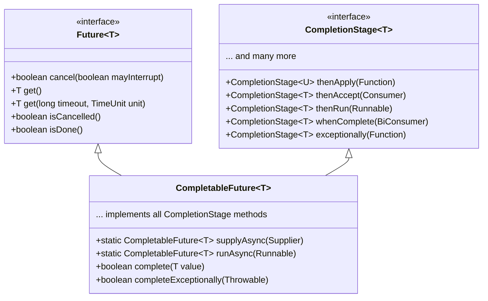

### Q16: How does CompletableFuture work and how is it different from Future?

CompletableFuture, introduced in Java 8, is an extension of the Future API that supports composable asynchronous programming. It provides a rich set of methods for chaining, combining, and handling errors in asynchronous computations.



**Key Features of CompletableFuture**:

1. **Completion Methods**:
   - `complete(T value)`: Completes this CompletableFuture with the given value
   - `completeExceptionally(Throwable ex)`: Completes this CompletableFuture with an exception

2. **Creation Methods**:
   - `supplyAsync(Supplier<U> supplier)`: Asynchronously completes with the value from the supplier
   - `runAsync(Runnable runnable)`: Asynchronously runs the given task

3. **Composition Methods**:
   - `thenApply(Function<T,U> fn)`: Applies a function to the result when complete
   - `thenAccept(Consumer<T> action)`: Performs an action on the result when complete
   - `thenRun(Runnable action)`: Runs an action when complete

4. **Combining Methods**:
   - `thenCombine(CompletionStage<U> other, BiFunction<T,U,V> fn)`: Combines two CompletableFutures
   - `allOf(CompletableFuture<?>... cfs)`: Waits for all of the CompletableFutures to complete
   - `anyOf(CompletableFuture<?>... cfs)`: Waits for any of the CompletableFutures to complete

5. **Error Handling**:
   - `exceptionally(Function<Throwable,T> fn)`: Handles exceptions
   - `handle(BiFunction<T,Throwable,U> fn)`: Handles both success and failure

**Comparison with Future**:

| Feature | Future | CompletableFuture |
|---------|--------|-------------------|
| Completion | Cannot be manually completed | Can be explicitly completed |
| Composition | Not chainable | Supports chaining operations |
| Error Handling | Limited (via get() exceptions) | Comprehensive (exceptionally, handle) |
| Callback Support | None | Extensive with thenApply, thenAccept, etc. |
| Combining Results | None | allOf, anyOf, thenCombine |
| Default Executor | N/A | ForkJoinPool.commonPool() |

**Real-World Scenario: Service Orchestration**

CompletableFuture is ideal for orchestrating multiple service calls in a microservices architecture:

```java
public class ServiceOrchestrator {
    private final UserService userService;
    private final OrderService orderService;
    private final PaymentService paymentService;
    private final NotificationService notificationService;
    
    // Constructor injection...
    
    public CompletableFuture<OrderSummary> processOrder(OrderRequest request) {
        return userService.getUser(request.getUserId()) // Get user details
            .thenCompose(user -> {
                // Validate user in parallel with creating the order
                CompletableFuture<Boolean> validationFuture = 
                    userService.validateUserCredit(user.getId());
                    
                CompletableFuture<Order> orderFuture = 
                    orderService.createOrder(user, request.getItems());
                    
                // Combine validation and order creation results
                return validationFuture.thenCombine(orderFuture, 
                    (isValid, order) -> {
                        if (!isValid) {
                            throw new CreditValidationException("Insufficient credit");
                        }
                        return order;
                    });
            })
            .thenCompose(order -> 
                // Process payment
                paymentService.processPayment(order)
            )
            .thenCompose(paymentResult -> 
                // Update order with payment information
                orderService.updateOrderWithPayment(paymentResult)
            )
            .thenApply(order -> {
                // Create order summary
                OrderSummary summary = new OrderSummary(order);
                
                // Send notification asynchronously, but don't wait for it
                notificationService.sendOrderConfirmation(order)
                    .exceptionally(ex -> {
                        // Log notification failure but don't fail the order process
                        log.error("Failed to send notification", ex);
                        return null;
                    });
                    
                return summary;
            })
            .exceptionally(ex -> {
                if (ex instanceof CreditValidationException) {
                    log.warn("Order failed credit validation", ex);
                } else {
                    log.error("Failed to process order", ex);
                }
                throw new OrderProcessingException("Order processing failed", ex);
            });
    }
}
```

**Advanced Example: Implementing Timeout and Rate Limiting**

```java
public class ResilientService {
    private final ExecutorService executor = Executors.newCachedThreadPool();
    private final Semaphore rateLimiter = new Semaphore(10); // Max 10 concurrent calls
    
    public <T> CompletableFuture<T> executeWithResilience(
            Supplier<CompletableFuture<T>> task, 
            long timeout, 
            TimeUnit unit,
            T fallbackValue) {
            
        CompletableFuture<T> future = new CompletableFuture<>();
        
        // Try to acquire rate limiting permit
        if (!rateLimiter.tryAcquire()) {
            CompletableFuture<T> fallback = CompletableFuture.completedFuture(fallbackValue);
            return fallback.thenApply(result -> {
                log.warn("Rate limit exceeded, using fallback value");
                return result;
            });
        }
        
        try {
            // Execute the actual task with timeout
            CompletableFuture<T> taskFuture = task.get();
            
            // Add timeout
            CompletableFuture<T> timeoutFuture = taskFuture.orTimeout(timeout, unit)
                .exceptionally(ex -> {
                    if (ex instanceof TimeoutException) {
                        log.warn("Operation timed out after {} {}", timeout, unit);
                        return fallbackValue;
                    }
                    throw new CompletionException(ex);
                });
                
            // Register a callback to release the permit when done
            timeoutFuture.whenComplete((result, ex) -> rateLimiter.release());
            
            return timeoutFuture;
        } catch (Exception e) {
            rateLimiter.release();
            future.completeExceptionally(e);
            return future;
        }
    }
    
    // Example usage
    public CompletableFuture<ProductInfo> getProductInfo(long productId) {
        return executeWithResilience(
            () -> callExternalProductService(productId),
            500, TimeUnit.MILLISECONDS,
            ProductInfo.fallback(productId)
        );
    }
    
    private CompletableFuture<ProductInfo> callExternalProductService(long productId) {
        // Real implementation would call an external service
        return CompletableFuture.supplyAsync(() -> {
            // Simulate variable response time
            try {
                Thread.sleep(new Random().nextInt(1000));
            } catch (InterruptedException e) {
                Thread.currentThread().interrupt();
            }
            return new ProductInfo(productId, "Product " + productId, 99.99);
        }, executor);
    }
}
```

**Best Practices**:

1. **Handle Exceptions**: Always add error handling with `exceptionally()` or `handle()`
2. **Specify Executors**: Explicitly provide an executor rather than using the default common pool for production code
3. **Use Non-Blocking Operations**: Ensure operations passed to CompletableFuture are non-blocking
4. **Use Timeouts**: Add timeouts to prevent indefinite waiting
5. **Avoid Blocking Methods**: Do not call `get()` or `join()` unless necessary, as they block the current thread
6. **Clean Up Resources**: Use `whenComplete()` to ensure resources are released
7. **Use Generics Properly**: Leverage type parameters to ensure type safety
8. **Consider Async Methods**: Use methods with the 'Async' suffix for operations that should run on a different thread
